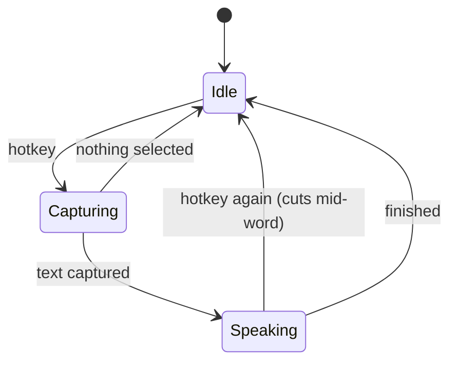

Select some text anywhere. Press a hotkey. Hear it read aloud.

Lector is [Vox](/projects/vox/) pointed the other way. Vox turns speech into text with a global hotkey; Lector turns text into speech with one. Same shape, same constraint underneath: **everything runs on your machine.**

<div class="dl-wrap">
  <a class="dl-btn" href="https://github.com/devops-monk/lector/releases">Download Lector ↗</a>
  <p class="dl-note">macOS (Intel &amp; Apple Silicon) · Windows · Linux · v0.2.2</p>
</div>

## What it is

| Piece | What it is |
|---|---|
| **Backend** | Rust — synthesis, audio output, selection capture, tray |
| **Frontend** | One HTML file, one stylesheet, 210 lines of DOM calls |
| **Speech engine** | [sherpa-onnx](https://github.com/k2-fsa/sherpa-onnx), linked statically |
| **Voices** | 181, across 12 models and three engine families |
| **Platforms** | macOS (Intel + Apple Silicon), Windows, Linux |
| **Default hotkey** | `Option+Shift+Space` |
| **Network calls** | None, after a voice is downloaded |

Two entry points, one implementation: the global hotkey, and — on macOS — a right-click → **Services** → *Speak with Lector*. They differ only in where the text comes from. A second surface should be a second *caller*, never a second implementation.

## Why no Python

"Local TTS" usually means a Python sidecar. Of the ten local voice apps I read before starting, most shipped one: a virtualenv, a `requirements.txt`, a subprocess to spawn and supervise, and a first-run experience that involves downloading an interpreter.

Lector has none of that, and the reason is one dependency:

```toml
# Its build script downloads a prebuilt static lib, so this costs no cmake and
# no C++ compile. espeak-ng is inside that archive, which is why there is no
# phonemizer subprocess either.
sherpa-onnx = "=1.13.8"
```

That archive contains `libonnxruntime.a`, `libespeak-ng.a` and `libpiper_phonemize.a`. Inference *and* phonemization link directly into the binary. There is no interpreter, no sidecar, no port to bind, and nothing to supervise. The whole app is one process.

The cost is honest: **25 MB on the binary**, and an onnxruntime crash takes the app down where a sidecar would have contained it. For a tray app that relaunches in a second, that is the right side of the trade.

## Choosing the engine

Three options, and the comparison is worth keeping because the reasoning generalises.

| | `sherpa-onnx` | `piper-rs` | raw `ort` + espeak |
|---|---|---|---|
| Models | Kokoro, Piper, Kitten, and four more families | Piper only | whatever you wire up |
| Phonemizer | statically linked | linked, needs a data path | **a subprocess** |
| Streaming | per-sentence callback with early stop | no — returns the whole utterance | you write the loop |
| Code you own | ~100 lines of config | ~460 | ~450, plus a hand-written IPA→id table |

`piper-rs` costs you Kokoro, and for a *listening* app Kokoro's quality is the product. Raw `ort` costs you a phonemizer you have to ship and shell out to — which is the process boundary I was trying to avoid in the first place.

### A measured trap

One number worth carrying away. On Apple silicon, Kokoro's **int8 build is slower than its fp32 build** — RTF 0.96 against 0.41 — because ARM pays a dequantisation tax the smaller weights never earn back. Piper is the opposite: int8 is both smaller and faster.

So the obvious optimisation ("ship int8, save 200 MB") halves your throughput. Measured on an M1 Pro:

| | Real-time factor | First audio | Download |
|---|---|---|---|
| **Piper** (int8) | 0.15 | ~470 ms | 21 MB |
| **Kokoro** (fp32) | 0.27 | ~800 ms | 349 MB |

Both beat real time comfortably. Piper is the default because first-audio latency is what a hotkey *feels* like.

## The core loop



The hotkey toggles. Pressing it while Lector is speaking stops it — **mid-word, not at the end of the sentence.** That turned out to be one of the two things worth getting right on day one.

## Streaming, and the version that compiled but wasn't

`generate_with_config` takes an optional callback:

```rust
F: FnMut(&[f32], f32) -> bool + 'static
```

It fires **once per sentence**, so audio can start while the rest is still being generated. Returning `false` aborts mid-utterance.

My first implementation collected the callback's output into a channel and drained it after generation finished. It compiled. It ran. It sounded fine. And it had quietly thrown the streaming away — nothing played until the whole chunk was synthesized, which is exactly what the callback exists to prevent.

The reason I wrote it that way is instructive: the callback must be `'static`, so it cannot borrow the actor that owns the audio output. The channel was the path of least resistance. The fix was to share the player through `Rc<RefCell<_>>` — sound, because both live on the same thread — so the callback writes into the ring buffer the sound card is draining, as it fires.

**A pipeline that produces correct output is not necessarily a pipeline that streams.** The tests passed either way; only the measurement showed the difference.

## Cancellation is a counter, not a flag

The obvious design for "stop" is an `AtomicBool`. It is wrong, and the reason is specific.

Press the hotkey while Lector is speaking: that one gesture means *cancel what is playing* **and** *start this new thing*. A bool cannot express both. Set it and the new utterance cancels itself; clear it and a late result from the old one resurrects.

A generation counter says it exactly:

```rust
let generation = self.generation.fetch_add(1, Ordering::AcqRel) + 1;
```

Every job carries the generation it was enqueued under. The synthesis callback compares it once per sentence and returns `false` the moment they differ; the ring writer checks it too. Anything arriving with a stale generation is dropped. Measured: an interrupt is accepted in 55 ms.

## Why playback lives in Rust

The tempting design is to send audio to the webview and let `<audio>` play it. Every reference implementation I read did some version of that, and every one of them has scar tissue from it — autoplay policy flags that must match byte-for-byte across windows, background timer throttling, an inaudible keep-alive tone to stop the page being suspended, PCM marshalled over IPC.

Two of Lector's four planned surfaces have **no window at all**. There is no `<audio>` element to use.

So one thread owns the model and the audio device. They have to share a thread anyway — `cpal::Stream` is `!Send` on macOS — and pairing them makes the hot path lock-free: the model's callback resamples straight into the ring the device is draining. **Audio never crosses an IPC boundary.** The webview receives only events: state, level, and which sentence is currently audible.

The output stream is opened once and never stops, feeding silence when idle. Restarting a stream per sentence is what lets Bluetooth fade-in swallow the first word — on AirPods that costs the opening ~200 ms of every sentence.

## Making text worth listening to

Raw markdown read aloud is unbearable. A code fence becomes a minute of punctuation; a file path becomes twenty seconds of "slash Users slash". So text goes through a transform before it reaches the model:

- a fenced code block becomes the spoken words **"Code block."**, announced once per run rather than once per fence
- a markdown table becomes **"Table omitted."** — reading one cell by cell is worse than skipping it
- `/Users/me/src/main.rs` becomes `main.rs`; `https://www.example.com/a/b` becomes `example.com`
- headings and list items get a terminal full stop, so the engine gives them falling intonation instead of running them into the next line

Which rules apply is per-context. They are right for narrating an agent's output and wrong for a script someone wrote to be spoken.

### The chunking rule

Two pressures pull opposite ways:

- **A sentence synthesized alone gets no prosodic context.** A bare "Okay." lands as a clipped bark. This argues for merging short sentences — a floor of about 100 characters.
- **The first chunk sets the latency you feel.** This argues for sending the first sentence immediately, however short.

Both are right, so the first chunk is exempt from the floor and everything after it honours it. On a typical document the first chunk is a 14-character heading, which at RTF 0.15 is effectively instant.

Chunk edges are trimmed of the model's baked-in silence, faded 10 ms at the cut, and DC-corrected, then followed by a deliberate 150 ms gap. Per-chunk peak normalisation is **deliberately absent**: it pumps loudness between sentences by boosting a quiet one to match a loud one. Only clip protection is applied.

## Models: a negative contract

The installer's contract is expressed in what *doesn't* happen. Download, verify, unpack — in that order and never any other. A model that fails its checksum installs **nothing**: no directory, no `.part`, no `.tmp`. The tests assert those absences, because the absence is the part that protects the user.

Two bugs came out of adding models, and both had been invisible until then.

**A published hash is not a verified hash.** I seeded the catalog with Kokoro's checksum copied from another project. It was already stale — upstream had re-uploaded the asset — and the installer refused it. That is the mechanism working, but it caught *my* carelessness rather than a corrupt download. Every hash is now verified against the live asset before being added, and `scripts/verify-catalog.sh` re-checks them.

**Stripping a path component is not stripping a directory.** Extraction removed the archive's top-level directory by skipping the first path component. Some archives prefix every entry with `./` — so it skipped *that*, and the model unpacked one level too deep, unable to find its own `tokens.txt`. It had worked only because no archive so far used the prefix.

There was a third, caught before it shipped: engine detection sniffed the directory, and "a `voices.bin` means Kokoro" is false — Kitten ships one too. The catalog now declares the engine rather than having it guessed.

## 181 voices

sherpa-onnx publishes 644 TTS assets across seven engine families. Lector ships twelve models:

| Model | Voices | Size |
|---|---|---|
| **Kitten Nano** | 8 expressive | 29 MB |
| **Piper** (×7) | 1 each — American, Scottish, northern English, GLaDOS | ~21 MB |
| **VCTK** | 109 English speakers | 144 MB |
| **Kokoro** v1.0 / v1.1 | 28 English each | ~349 MB |

Kokoro's speaker ids are positions in a binary table and are not guessable, so all 28 were read out of the model's own `id2speaker` metadata rather than transcribed from a README. With this many voices, **every one has a play button that auditions it without switching to it** — having to adopt a voice to hear it would make the list useless.

## The permission problem that wasn't a permission problem

This one cost an afternoon and generalises to any unsigned macOS app.

Lector needs Accessibility permission to read your selection. Grant it, rebuild, and the app asks again — while System Settings still shows it enabled. Toggling it off and on doesn't help.

macOS identifies apps in the privacy database by **code signature**, not by name, path or bundle id. An ad-hoc signature has no certificate, so the identity is a hash of the binary:

```
designated => cdhash H"..."
```

That hash changes on **every build**. So each rebuild is, to the system, a different application — one that was never granted anything. The row left in System Settings refers to a signature that no longer exists. Deleting and reinstalling does the same thing, and running a copy from `target/release/bundle/` while having granted the one in `/Applications` produces the same symptom for the same reason.

The fix is a stable identity. A self-signed certificate — free, no Apple account — changes the requirement to:

```
designated => identifier "com.devopsmonk.lector" and certificate leaf = H"..."
```

which is stable for the life of the certificate. Verified by building twice and comparing: byte-different binaries, identical designated requirement.

It does not make Gatekeeper trust the app. Only a paid Developer ID does that, which is why downloaded releases still quarantine on first launch.

## A crash worth reading a stack trace for

Pressing the hotkey killed the app outright:

```
_dispatch_assert_queue_fail
dispatch_assert_queue
islGetInputSourceListWithAdditions      ← HIToolbox
TSMGetInputSourceProperty
enigo::macos_impl::get_layoutdependent_keycode
lector::selection::selected_text
```

To read the selection, Lector synthesizes Command-C. The input library resolves the character `c` to a keycode by asking the Text Services Manager what the current layout maps — and `TSMGetInputSourceProperty` **asserts it is on the main thread**.

The hotkey handler deliberately is not on the main thread: synthesizing a keystroke *from* the main thread deadlocks against the event tap that delivered the hotkey. So the comment in my code explaining why I spawned a thread was correct, and it walked straight into a different failure. Both constraints are real; the library cannot satisfy both on macOS.

Posting the event directly with `CGEvent` needs no layout lookup and is thread-safe. Nothing is lost by skipping the translation — keycode 8 is the key in the C position on every layout, and Command-C binds to the position, not the letter.

## Design decisions worth defending

**Playback in Rust, not the webview.** Two of four planned surfaces have no window. Routing audio through a webview would mean creating a hidden one purely to own an `<audio>` element, and inheriting every autoplay and throttling quirk that comes with it.

**A generation counter rather than a cancel flag.** It is the difference between "stop" meaning *now* and meaning *at the end of this sentence*, and it costs one atomic read per sentence.

**No synthesis cache in v1.** Both reference implementations that cache do so because their engines are network-backed. At RTF 0.15, synthesis is faster than playback — a cache would add invalidation and disk-growth bugs to buy latency that does not exist.

**A static, compiled-in model catalog.** A model list that can change under you is a model list that can serve you a different binary tomorrow. For an app whose whole pitch is that nothing leaves your machine, a remote catalog would be the one phone-home.

**No framework in the window.** The UI is one HTML file and 210 lines of DOM calls, which keeps Node out of CI entirely. The window holds no state beyond what is being typed — every change re-reads a snapshot from Rust, so the two cannot disagree.

**Only English voices, for now.** Kokoro and VCTK carry other languages and sherpa publishes hundreds more. Each is a checksum someone has to keep correct, and shipping a voice nobody has heard is not shipping a feature.

## Where it's going

v0.2.2 covers the hotkey surface: tray, window, voice browser, 181 voices, macOS Services. The roadmap, in rough order:

| Phase | What lands |
|---|---|
| **3** | Narrate an agent — speak Claude Code's output by tailing its transcripts |
| **4** | Long-form listening — EPUB and Markdown import, queue, resume, bookmarks |
| **5** | Studio — script editor, per-paragraph voices, export to WAV |
| **6** | Signing and notarisation, auto-updater |

Deliberately out of scope: voice cloning, which needs a model class that would break the no-Python rule; speech-to-text, which is Vox's job; and any cloud fallback tier, which would contradict the entire premise.

## Get it

<div class="dl-wrap">
  <a class="dl-btn" href="https://github.com/devops-monk/lector/releases">Download Lector ↗</a>
  <p class="dl-note">Latest release on GitHub</p>
</div>

Builds are published for macOS (Intel and Apple Silicon), Windows and Linux.

**Platform support is uneven, and worth stating plainly.** The engine is portable and CI builds and tests all four targets, but Lector has only been *used* on macOS. The Services menu is macOS-only, and the Windows and Linux builds compile and pass tests without having been run by a human.

**On first launch, expect a Gatekeeper or SmartScreen warning** — builds are unsigned, and notarisation is a later phase. On macOS you will also be asked for **Accessibility** permission, which is what lets Lector read the text you have selected in another app. The Services menu entry needs no permission at all.

Source, issues and the full build instructions are on [GitHub](https://github.com/devops-monk/lector).
