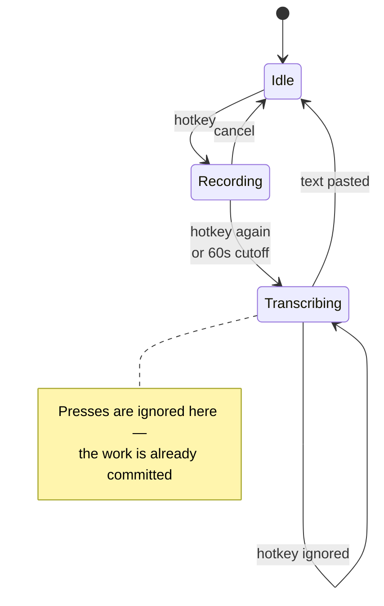
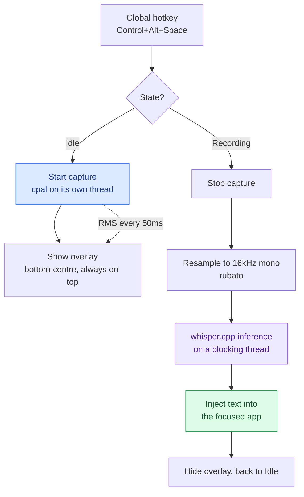
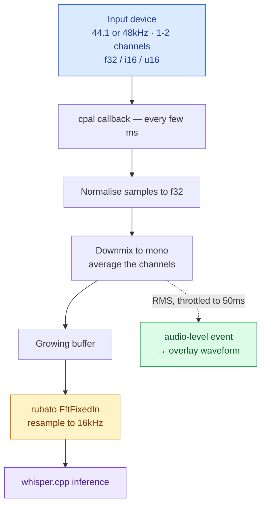
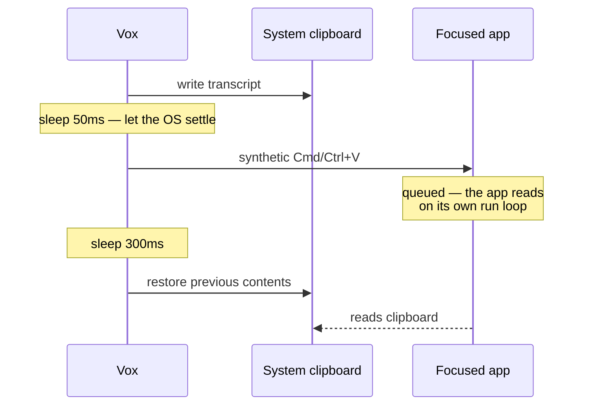

Press a hotkey. Speak. The text appears in whatever app you're focused on.

That's the whole product. What makes it worth writing about is the constraint underneath it: **everything runs on your machine.** No cloud API, no account, no network call — the audio never leaves your laptop, because there is nowhere for it to go.

  <a class="dl-btn" href="https://github.com/devops-monk/vox/releases">Download Vox ↗</a>
  
macOS (Intel &amp; Apple Silicon) · Windows · Linux · v0.1.0

## What it is

Vox is a [Tauri](https://tauri.app) desktop app — a Rust backend with a React/TypeScript frontend — that turns speech into text through a bundled [whisper.cpp](https://github.com/ggerganov/whisper.cpp) model.

| Piece | What it is |
|---|---|
| **Backend** | Rust — audio capture, inference, input injection, tray |
| **Frontend** | React 19 + TypeScript + Tailwind, in two windows |
| **Speech model** | whisper.cpp via `whisper-rs`, bundled at build time |
| **Platforms** | macOS (Intel + Apple Silicon), Windows, Linux |
| **Default hotkey** | `Control+Alt+Space` |
| **Network calls** | None, for transcription |

It runs **tray-first**: no dock icon, no window on launch. You'll find it in the menu bar, and most of the time you never open it at all — you press the hotkey and keep working.

## Why local-first

Dictation is an unusually personal input stream. It captures whatever is on the microphone, which in practice means meetings, half-formed thoughts, and whatever someone nearby happens to say. Sending that to a third-party API is a meaningful decision, and most dictation tools make it for you silently.

Running the model locally removes the decision entirely:

- **Nothing to leak.** There is no upload path in the code.
- **No account, no subscription, no rate limit.**
- **It works on a plane.** Offline is the normal case, not a degraded one.
- **Latency is yours to control** — it depends on your CPU and your chosen model, not on someone's queue.

The cost is real and worth stating: **you pay for it in CPU and disk.** A better model is a bigger download and a slower transcription. That trade is the central tension in the design, and the model manager exists to let you place yourself on it.

## The core loop

Everything in the app hangs off one state machine with three states. The hotkey toggles it.

That last transition is a small decision with a large effect. **A hotkey press during transcription does nothing at all**, rather than queuing or cancelling. Once inference has started the audio is already captured and the CPU is already spent, so the only honest options are "finish" or "throw away work you've paid for". Ignoring the press is the least surprising.

The full path from keypress to text:

There is a **60-second cutoff**, enforced in two places: the audio thread stops itself, and an app-level watchdog fires two seconds later in case it didn't. The watchdog checks a **generation counter** before acting, so a stale timer from an earlier recording can't terminate a new one that started in the meantime.

## Audio capture

The capture path has more engineering in it than you'd expect, because Whisper wants exactly one thing and audio hardware provides everything but.

**Whisper needs 16 kHz mono `f32` PCM.** Your microphone offers whatever it feels like — 44.1 or 48 kHz, one or two channels, in `f32`, `i16` or `u16`. Every mismatch has to be fixed before inference.

Three details in there were each worth the trouble:

**The cpal stream lives on its own dedicated thread**, for its entire lifetime. Platform stream handles aren't safely movable between threads once built, so the thread builds it, blocks on a stop channel, and tears it down in the same place.

**The waveform is throttled to one event every 50 ms.** The audio callback fires every few milliseconds; emitting an event per callback would flood the frontend with far more updates than a 20-bar waveform can use. RMS is computed in the callback, then gained by 6× — speech RMS sits well below 1.0, and without the gain the waveform barely moves at normal talking volume.

**Resampling has to be fed in fixed chunks.** `rubato`'s fixed-input resamplers expect repeated small chunks, not one giant buffer. Passing the whole recording in a single call produced *empty output with no error* — a silent failure that looks exactly like a broken microphone.

## Getting text into the other app

This is the part that sounds trivial and isn't. Vox has to insert text into an application it has no relationship with, and the right method depends on the app.

Three methods ship, and the setting is exposed because **no single one works everywhere**:

| Method | How it works | When it's right |
|---|---|---|
| **Direct** *(default)* | Types the text as simulated keystrokes | Never touches your clipboard — nothing to restore, nothing to lose |
| **Ctrl/Cmd+V** | Writes the clipboard, sends the paste shortcut, restores the old clipboard | Apps that reject synthetic keystrokes for text entry |
| **Clipboard only** | Writes the clipboard and stops | You paste it yourself, where and when you want |

The clipboard method hides a genuine race condition, and it's the kind of bug that only appears under load:

**The synthetic paste is only queued, not performed.** The target app reads the clipboard whenever its run loop gets around to it — which can lag noticeably right after the CPU spike from inference. Restore too early and you win the race: the app pastes *whatever was on the clipboard before*, usually something the user copied ten minutes ago. The 300 ms delay is what keeps that from happening.

There's also a platform trap worth knowing if you ever build something similar. **On macOS, the paste must happen on the main thread.** `enigo`'s macOS backend resolves layout-dependent keycodes through TSM/HIToolbox, which assert they're called on the main thread — calling from a Tokio worker doesn't fail, it **crashes the entire app**. The transcription result gets marshalled back to the main thread through a oneshot channel before any keystroke is simulated.

## The model manager

The bundled model is Base (English), around 141 MB — enough to be useful immediately without a first-run download. Everything beyond that is opt-in.

The catalog covers **every whisper.cpp GGML checkpoint** published upstream — five size tiers, English-only and multilingual variants, and the quantized builds alongside each full-precision one. That last part matters more than it sounds:

| Tier | F16 | Q5 | Q8 |
|---|---|---|---|
| Tiny | 74 MB | 31 MB | 42 MB |
| Base | 141 MB | 57 MB | 78 MB |
| Small | 465 MB | 181 MB | 252 MB |
| Medium | 1463 MB | 514 MB | 785 MB |
| Large v3 Turbo | 1549 MB | 547 MB | 834 MB |

**Quantization is the most useful axis and the least understood.** Large v3 Turbo at Q8_0 is 834 MB against 1549 MB for the full checkpoint, with near-identical accuracy — roughly half the disk for an accuracy difference you are unlikely to notice in dictation. That is a far better trade than dropping a whole size tier, which is what people usually do when a model feels too big.

Models resolve from two places, checked in order: the **bundled resource directory** for the shipped default, then the **app-data directory** for anything downloaded. Downloads stream to disk with progress events, so the UI can show a real progress bar rather than a spinner.

Multilingual checkpoints recognise **99 languages**. `.en`-suffixed ones are English-only and ignore the language setting entirely. There's a subtlety here that's easy to get wrong: whisper.cpp defaults to `"en"` when no language is specified, so a *multilingual* model with no explicit language will silently mistranscribe non-English speech rather than detecting it. Vox passes `None` for auto-detect explicitly.

## The interface

Two windows, and one of them you'll barely see.

**The overlay** is 380×72, undecorated, transparent, always on top, and skips the taskbar. It appears bottom-centre of whichever monitor you're on when recording starts, shows a live 20-bar waveform and elapsed time, and offers one action — cancel. Then it disappears.

**The settings window** is the one in the screenshot: General, Models, About. It's hidden rather than destroyed when you close it, because the tray menu looks the window up by label to reopen it — destroy it on close and "Settings…" becomes a silent no-op.

Both windows are the same React bundle, routed by URL fragment.

## Design decisions worth defending

**Toggle, not push-to-talk.** Hold-to-talk needs reliable key-up handling, which is where cross-platform hotkey libraries are weakest. Toggle mode works identically on all three platforms today; push-to-talk is a later phase, once the mechanism is proven.

**A fixed 60-second cutoff instead of voice activity detection.** VAD — stopping automatically when you stop speaking — is the better experience and it's the top of the roadmap. But it's an extra model, an extra inference loop and an extra failure mode, and shipping it in v1 would have delayed proving the harder bet: that local STT and input injection work reliably on three operating systems.

**Direct typing as the default paste method.** It never touches the clipboard, so there is no race to lose and nothing of yours to overwrite. Clipboard paste is more reliable in some apps, so it's one setting away — but the default should be the method that can't damage anything.

**CI builds every platform natively.** Cross-compiling a Tauri app with native audio, GPU and GTK dependencies from one host isn't practical. GitHub Actions builds on macOS ARM, macOS Intel, Ubuntu and Windows runners, and publishes the installers as a draft release.

## Where it's going

v0.1.0 is the MVP: one bundled model, toggle recording, three paste methods, the full model catalog. The roadmap, in rough order:

| Phase | What lands |
|---|---|
| **2** | VAD auto-stop, push-to-talk, SQLite history with search |
| **3** | Optional local LLM cleanup — punctuation, filler removal, tone |
| **4** | Localised UI, custom word dictionary, accessibility |
| **5** | Auto-updater, code signing and notarisation, portable mode |

The ordering is deliberate: prove the hardest technical bet first, then fix the biggest UX gap it left behind.

## Get it

  <a class="dl-btn" href="https://github.com/devops-monk/vox/releases">Download Vox ↗</a>
  
Latest release on GitHub

Builds are published for macOS (Intel and Apple Silicon), Windows and Linux.

**On first launch, expect a Gatekeeper or SmartScreen warning** — v0.1.0 builds are unsigned, and signing is a later phase. On macOS you'll also be asked for two permissions: **Microphone**, for obvious reasons, and **Accessibility**, which is required both to register the global hotkey and to simulate the keystroke that delivers your text.

Source, issues and the full build instructions are on [GitHub](https://github.com/devops-monk/vox).
