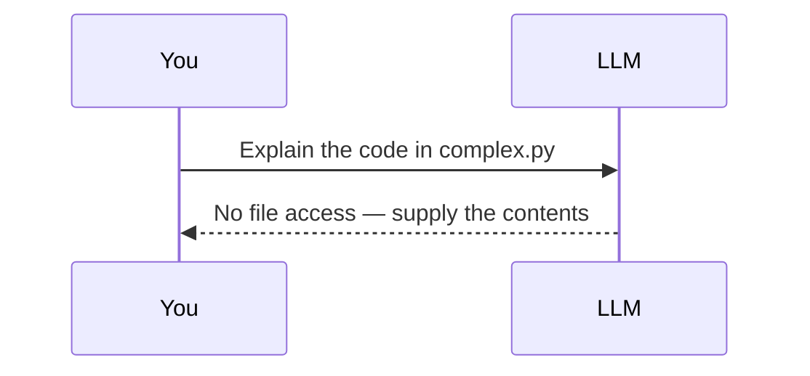
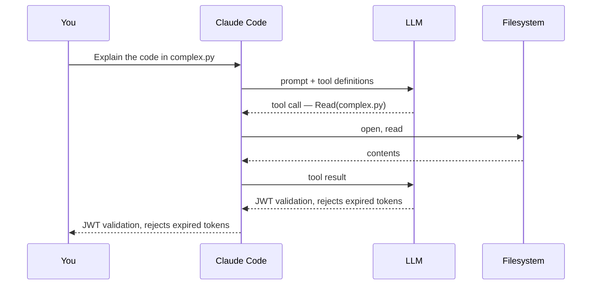
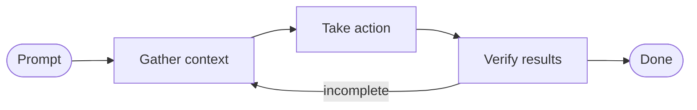

## Overview

This chapter covers:

- Why a language model on its own cannot read your files, and what Claude Code adds to close that gap
- The agentic loop — gather, act, verify — and why every step is conditioned on the last result
- The five categories of tool, and the single rule that decides which of them stop to ask you
- What a session can see, and why a 40,000-file repository does not cost 40,000 files of context
- Installing it, steering it mid-task, and the two commands worth knowing on day one

## The gap a model cannot cross

A language model is a text-to-text function. No filesystem handle, no shell, no network socket. Ask one to explain a file on your disk and the only correct answer is that it cannot read files.



Claude Code closes that gap. It is an **agentic harness**: it gives the model a set of tools, executes them on the model's behalf, and runs the whole thing in a loop.



The model never touches your disk. It emits a tool call; the harness executes it and hands back the result.

**That intermediary position is the whole design.** Every capability comes from a tool the harness offers, and every safety control comes from the harness being able to refuse one.

## The agentic loop

The harness repeats the exchange. Each iteration has three phases — **gather context**, **take action**, **verify results** — and the model picks the next action from the last result.



The phases describe what happens, they are not a fixed sequence. A codebase question may never leave *gather*. A refactor spends most of its time in *verify*.

Here is "fix the failing tests" as it actually runs:

<div class="al-demo"> <div class="al-head"> <span class="al-task">Task: <strong>fix the failing tests</strong></span> <div class="al-phases"> <span class="al-phase" data-phase="gather">Gather context</span> <span class="al-phase" data-phase="act">Take action</span> <span class="al-phase" data-phase="verify">Verify results</span> </div> </div> <ol class="al-log" id="al-log"></ol> <div class="al-controls"> <button type="button" id="al-step" class="al-btn al-btn-primary">Next step</button> <button type="button" id="al-reset" class="al-btn">Reset</button> <span class="al-count" id="al-count">0 of 6</span> </div> </div> <script> (function () { var steps = [ { phase: "act", tool: "Bash", text: "npm test", note: "No idea what is broken yet. Find out." }, { phase: "gather", tool: "Read", text: "the test output", note: "Two failures, both in auth.test.js, both a TypeError." }, { phase: "gather", tool: "Grep", text: "search for validateToken", note: "The stack trace named it. Where does it live?" }, { phase: "gather", tool: "Read", text: "src/auth/token.js", note: "It returns undefined when the header is missing." }, { phase: "act", tool: "Edit", text: "src/auth/token.js", note: "Guard the missing-header case and return null." }, { phase: "verify", tool: "Bash", text: "npm test", note: "Green. The fix is proven, not assumed." } ]; var log = document.getElementById("al-log"), stepBtn = document.getElementById("al-step"), resetBtn = document.getElementById("al-reset"), count = document.getElementById("al-count"), phases = document.querySelectorAll(".al-phase"), i = 0; function render() { count.textContent = i + " of " + steps.length; stepBtn.disabled = i >= steps.length; stepBtn.textContent = i >= steps.length ? "Task complete" : "Next step"; var active = i > 0 ? steps[i - 1].phase : null; Array.prototype.forEach.call(phases, function (p) { p.classList.toggle("on", p.getAttribute("data-phase") === active); }); } function add() { var s = steps[i]; var li = document.createElement("li"); li.className = "al-item al-" + s.phase; li.innerHTML = '<code class="al-tool">' + s.tool + '</code>' + '<span class="al-text">' + s.text + '</span>' + '<span class="al-note">' + s.note + '</span>'; log.appendChild(li); i++; render(); } stepBtn.addEventListener("click", function () { if (i < steps.length) add(); }); resetBtn.addEventListener("click", function () { log.innerHTML = ""; i = 0; render(); }); render(); })(); </script>

Two things to notice. The first call is an *action*, not context gathering — running the suite is how you find out what is broken. And every step after that exists only because of what the previous one returned: step 3 because step 2 produced a stack trace, step 6 because step 5 changed a file.

That dependency is the difference between an agent and a script.

### Steering it mid-flight

| Input | Effect |
|---|---|
| `Esc` | Cancels the running tool call immediately |
| Text + `Enter` | Does not interrupt. Read once the current tool call finishes, before the next action is chosen |

The second is the underused one: when the current command is harmless but the direction is wrong, you don't need to stop anything.

## Tools

Tools are what the harness exposes. Five categories:

| Category | What it covers |
|---|---|
| File operations | Read, edit, create, move |
| Search | Match files by pattern, search contents by regex |
| Execution | Shell commands, servers, tests, git |
| Web | Search, fetch URLs |
| Code intelligence | Type errors after edits, definitions, references |

There are 45 in total. You don't need to memorise them, but you do need the pattern in this column:

| Tool | Asks first? |
|---|---|
| `Read`, `Glob`, `Grep`, `LSP` | No |
| `Edit`, `Write`, `NotebookEdit` | **Yes** |
| `Bash`, `PowerShell`, `Monitor` | **Yes** |
| `WebSearch`, `WebFetch` | **Yes** |
| `Agent` (spawn a subagent) | No |
| `TodoWrite`, task and cron tools | No |

**Looking is free. Changing costs a question.** Reading, searching and listing never prompt; editing, executing and reaching the network do. Chapters 3 and 4 are refinements on that one rule, not departures from it.

The [tools reference](https://code.claude.com/docs/en/tools-reference) lists all 45 with the permission column for each.

Tools are extensible too — [skills](/guide/) add procedures, MCP adds external services, hooks add enforced behaviour, subagents add isolated context. Each gets a chapter.

## What a session can see

Running `claude` in a directory gives it:

- **Project files** — the working directory and below, plus anything added with `--add-dir`
- **Your shell** — any command you could run yourself
- **Git state** — branch, uncommitted changes, recent history
- **`CLAUDE.md`** — project instructions, loaded every session (Chapter 6)
- **Auto memory** — what Claude wrote down last time (Chapter 7)
- **Extensions** — MCP servers, skills, subagents, browser access

**Files are read on demand, not at startup.** A 40,000-file repository does not cost 40,000 files of context; it costs whatever Claude actually opened. This is the most common misconception about how it works.

Because the harness sees the project rather than one open buffer, a single request can span six files, a config change and a test run as one piece of work.

### Two mechanisms worth knowing early

**Session state is a local file.** Every message, tool call and result appends to a JSONL file under `~/.claude/projects/`. Resuming, forking and rewinding are operations on that transcript.

**Edits are snapshotted before they happen.** Checkpoints are separate from git and survive a resume. They cover file edits only — changes made by shell commands, and anything touching a remote system, are outside their scope. Chapter 9 covers both.

## Where it runs

The loop and the tools are identical everywhere. What changes is where code executes:

| Environment | Code runs on |
|---|---|
| Local | Your machine — the default |
| Cloud | Anthropic-managed VMs, or self-hosted runners |
| Remote Control | Your machine, driven from a browser |

Interfaces: terminal, VS Code, JetBrains, desktop app, `claude.ai/code`, mobile, Slack, and CI. They share your `CLAUDE.md`, settings and MCP config, so configuration done once applies everywhere. Chapter 20 covers them individually; this handbook uses the terminal.

## Getting started

You need a terminal, a project, and a Claude account — Pro, Max, Team or Enterprise, a Console account, or access via Bedrock, Google Cloud or Microsoft Foundry.

```bash
# macOS, Linux, WSL — auto-updates in the background
curl -fsSL https://claude.ai/install.sh | bash

# Windows PowerShell
irm https://claude.ai/install.ps1 | iex
```

Homebrew, WinGet and Linux package managers work too but do not auto-update — [setup](https://code.claude.com/docs/en/setup) covers those and version pinning.

```bash
claude --version     # prints a version followed by (Claude Code)
cd /path/to/project
claude               # browser auth on first run
```

Credentials persist; `/login` switches accounts later.

Two commands worth knowing on day one: **`/init`** generates a starting `CLAUDE.md` from your codebase, and **`/doctor`** diagnoses installation and configuration problems and offers to fix them.

> On native Windows, install [Git for Windows](https://git-scm.com/downloads/win) so the Bash tool works. Without it Claude Code falls back to PowerShell. WSL doesn't need it.

### One thing that will surprise you

On **Pro, Max and Team plans, interactive sessions start in auto mode** — a classifier reviews Claude's actions in the background instead of prompting you. On other plans you start in Manual and approve each action. `Shift+Tab` switches at any time, and Chapter 3 is entirely about what each mode lets through.

## Writing a good prompt

Specify the target and the symptom. Leave the procedure alone.

```text
The checkout flow fails for users with expired cards.
Relevant code is in src/payments/. Investigate and fix.
```

This is shorter than naming files and line numbers, and it doesn't bake in an assumption about where the bug is. If that assumption is wrong, a prescribed sequence sends Claude away from the actual problem.

Correcting mid-task also beats re-prompting: the context from the failed attempt is still there.

## Summary

- A model produces text. Claude Code supplies tools, executes them, and drives the model in a loop.
- The loop is gather → act → verify, with each step conditioned on the last result.
- **Read-only tools don't prompt; state-changing ones do.** The permission system is built on that asymmetry.
- Files load on demand — repository size doesn't dictate context usage.
- `Esc` cancels the running tool call; typed text steers without interrupting.

Chapter 2 covers the three ways to give Claude Code input, and why two of them never reach the model.
