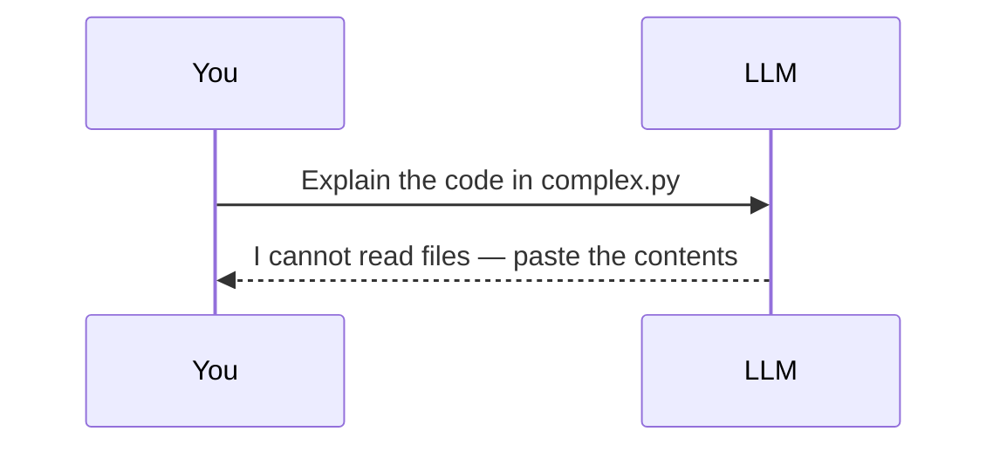
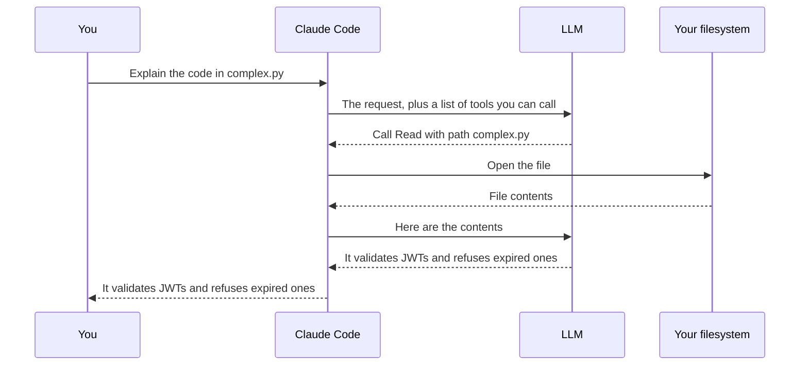
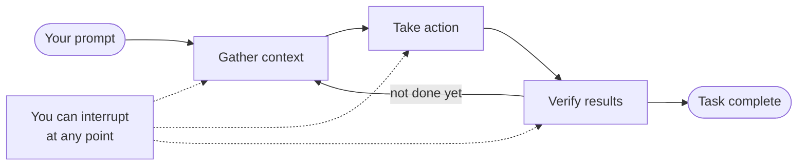

Ask a language model to explain a file on your disk and watch what happens.

> **You:** Can you explain the code in `complex.py`?
>
> **The model:** I'm sorry — I can't read files. Paste the contents and I'll take a look.

That is not the model being modest. It is the literal truth. A large language model takes text in and produces text out. It has no filesystem, no terminal, no network. It cannot open `complex.py` any more than a book can open a window.

Now run the same request through Claude Code and it just… answers. It found the file, read it, and told you the thing does JWT validation.

Nothing about the model changed. What changed is everything wrapped around it.



That gap is the whole subject of this chapter. Close it and the rest of the handbook — permissions, context windows, hooks, subagents — stops being a pile of unrelated features and becomes one coherent design.

## The one-sentence answer

**Claude Code is an agentic harness: a program that gives a language model tools, runs it in a loop, and manages what it knows.**

"Harness" is the load-bearing word. Claude Code is not a smarter model. It is the scaffolding that turns a model which can only produce text into something that can act on your machine.

Here is the same request with the harness in place:



The model never touched your disk. It asked for something, and the harness did the touching. Every capability in Claude Code is a variation on that exchange — and so is every safety mechanism, because the harness sits in the middle and can say no.

## The agentic loop

One tool call is a party trick. What makes this agentic is that the harness runs the exchange in a loop, and the model decides what happens next based on what came back.

The official framing has three phases: **gather context**, **take action**, **verify results**.



The phases blur in practice. A question about your codebase might never leave *gather*. A refactor might spend most of its time in *verify*. Claude picks what each step needs based on what the last step returned, chains dozens of actions together, and course-corrects when something surprises it.

Take a real task — "fix the failing tests" — and the loop looks like this:

1. Run the test suite to see what's actually failing
2. Read the error output
3. Search for the source files it names
4. Read those files
5. Edit them
6. Run the tests again

Nobody specified those steps. Step 3 only exists because step 2 produced a stack trace. Step 6 only exists because step 5 changed something that needs proving. That dependency — each step's existence justified by the previous step's result — is what separates an agent from a macro.

Step through it yourself:

<div class="al-demo"> <div class="al-head"> <span class="al-task">Task: <strong>fix the failing tests</strong></span> <div class="al-phases"> <span class="al-phase" data-phase="gather">Gather context</span> <span class="al-phase" data-phase="act">Take action</span> <span class="al-phase" data-phase="verify">Verify results</span> </div> </div> <ol class="al-log" id="al-log"></ol> <div class="al-controls"> <button type="button" id="al-step" class="al-btn al-btn-primary">Next step</button> <button type="button" id="al-reset" class="al-btn">Reset</button> <span class="al-count" id="al-count">0 of 6</span> </div> </div> <script> (function () { var steps = [ { phase: "act", tool: "Bash", text: "npm test", note: "No idea what is broken yet. Find out." }, { phase: "gather", tool: "Read", text: "the test output", note: "Two failures, both in auth.test.js, both a TypeError." }, { phase: "gather", tool: "Grep", text: "search for validateToken", note: "The stack trace named it. Where does it live?" }, { phase: "gather", tool: "Read", text: "src/auth/token.js", note: "It returns undefined when the header is missing." }, { phase: "act", tool: "Edit", text: "src/auth/token.js", note: "Guard the missing-header case and return null." }, { phase: "verify", tool: "Bash", text: "npm test", note: "Green. The fix is proven, not assumed." } ]; var log = document.getElementById("al-log"), stepBtn = document.getElementById("al-step"), resetBtn = document.getElementById("al-reset"), count = document.getElementById("al-count"), phases = document.querySelectorAll(".al-phase"), i = 0; function render() { count.textContent = i + " of " + steps.length; stepBtn.disabled = i >= steps.length; stepBtn.textContent = i >= steps.length ? "Task complete" : "Next step"; var active = i > 0 ? steps[i - 1].phase : null; Array.prototype.forEach.call(phases, function (p) { p.classList.toggle("on", p.getAttribute("data-phase") === active); }); } function add() { var s = steps[i]; var li = document.createElement("li"); li.className = "al-item al-" + s.phase; li.innerHTML = '<code class="al-tool">' + s.tool + '</code>' + '<span class="al-text">' + s.text + '</span>' + '<span class="al-note">' + s.note + '</span>'; log.appendChild(li); i++; render(); } stepBtn.addEventListener("click", function () { if (i < steps.length) add(); }); resetBtn.addEventListener("click", function () { log.innerHTML = ""; i = 0; render(); }); render(); })(); </script>

Notice that the first action comes *before* any context gathering. Claude ran the tests to find out what was wrong, because reading files at random would have been guesswork. The phases are a description, not a procedure.

**You are in this loop too.** You can interrupt at any point — and there are two different ways to do it, which matter more than people expect:

- **`Esc`** stops Claude immediately. The running tool call is cancelled and it waits for you.
- **Type a correction and press `Enter`** without stopping anything. Claude reads it as soon as the current action finishes and adjusts before choosing its next step.

The second one is the underused one. If Claude is heading somewhere wrong but the current command is harmless, you don't need to kill it — just say so, and it course-corrects at the next decision point.

## The tools

Tools are what make any of this possible. Without them, Claude can only produce text. With them, it can read, write, search, execute and fetch — and each result feeds back into the loop.

They fall into five broad categories:

| Category | What Claude can do |
|---|---|
| **File operations** | Read files, edit code, create files, rename and reorganise |
| **Search** | Find files by pattern, search contents with regex, explore a codebase |
| **Execution** | Run shell commands, start servers, run tests, use git |
| **Web** | Search the web, fetch documentation, look up error messages |
| **Code intelligence** | See type errors after edits, jump to definitions, find references |

That is the shape of it. The actual list is longer, and worth seeing in full once — partly because it is the best map of what Claude Code can do, and partly because the **Asks first?** column is your first glimpse of the permission system that Chapters 3 and 4 are about.

| Tool | What it does | Asks first? |
|---|---|---|
| `Read` | Read a file's contents | No |
| `Glob` | Find files by pattern | No |
| `Grep` | Search file contents | No |
| `Edit` | Make targeted edits to a file | **Yes** |
| `Write` | Create or overwrite a file | **Yes** |
| `NotebookEdit` | Modify Jupyter notebook cells | **Yes** |
| `Bash` | Execute shell commands | **Yes** |
| `PowerShell` | Execute PowerShell natively | **Yes** |
| `Monitor` | Run a command in the background, stream output back | **Yes** |
| `WebSearch` | Search the web | **Yes** |
| `WebFetch` | Fetch a URL | **Yes** |
| `LSP` | Language-server intelligence — definitions, references, type errors | No |
| `Agent` | Spawn a subagent with its own context window | No |
| `Skill` | Execute a skill in the main conversation | **Yes** |
| `Workflow` | Run a dynamic workflow orchestrating many subagents | **Yes** |
| `EnterPlanMode` / `ExitPlanMode` | Enter plan mode; present a plan for approval | No / **Yes** |
| `EnterWorktree` / `ExitWorktree` | Create and enter an isolated git worktree; leave it | **Yes** / No |
| `TodoWrite` | Manage the session checklist | No |
| `TaskCreate` / `TaskList` / `TaskGet` / `TaskUpdate` / `TaskOutput` / `TaskStop` | Create and manage background tasks | No |
| `CronCreate` / `CronList` / `CronDelete` | Schedule prompts within the session | No |
| `ScheduleWakeup` | Reschedule the next iteration of a self-paced `/loop` | No |
| `SendMessage` / `ListAgents` | Message other agents and sessions | No |
| `AskUserQuestion` | Ask you a multiple-choice question | No |
| `ToolSearch` | Load deferred tool definitions on demand | No |
| `ListMcpResourcesTool` / `ReadMcpResourceTool` / `WaitForMcpServers` | Work with MCP server resources | No |
| `Artifact` | Publish a page to claude.ai | **Yes** |
| `PushNotification` | Desktop notification and phone push | No |
| `SendUserFile` | Send a file from the session to your device | No |
| `RemoteTrigger` | Create and run Routines on claude.ai | No |
| `ReportFindings` | Report code-review findings as structured data | No |
| `SendFeedback` | Draft feedback about Claude Code | No |
| `ShareOnboardingGuide` | Upload `ONBOARDING.md` and return a share link | **Yes** |
| `EndConversation` | End the session after sustained abuse | No |

Read that column and the design philosophy falls out immediately. **Looking is free. Changing costs a question.** Reading, searching and listing never prompt. Editing, executing and reaching the network do. Everything in Chapters 3 and 4 is a refinement of that one rule.

And this is only the floor. You can add capabilities with [skills](/guide/), connect external services with MCP, enforce behaviour with hooks, and delegate work to subagents — all of which are chapters of their own.

## What Claude can actually see

Running `claude` in a directory hands it more than the files:

- **Your project** — everything in the directory and its subdirectories, plus anything else you explicitly permit
- **Your terminal** — any command you could run yourself: builds, git, package managers, scripts
- **Your git state** — current branch, uncommitted changes, recent history
- **Your `CLAUDE.md`** — project instructions loaded at the start of every session (Chapter 6)
- **Auto memory** — things Claude wrote down for itself last time. The first 200 lines or 25 KB of `MEMORY.md`, whichever comes first (Chapter 7)
- **Whatever you've plugged in** — MCP servers, skills, subagents, browser access

That last-but-one point is worth pausing on, because it is the most common misconception about how the memory works. Claude does not read your whole project at startup. It reads what it needs, when it needs it. A repository with forty thousand files does not cost forty thousand files' worth of context — it costs whatever Claude actually opened.

This is also why Claude Code behaves differently from an inline editor assistant. An autocomplete plugin sees the file you're in. Claude Code sees the project, so "fix the authentication bug" can span six files, a config change and a test run, in one coherent piece of work.

## Where it runs

The loop and the tools are identical everywhere. What changes is where the code executes and how you talk to it.

**Execution environments** — where the work actually happens:

| Environment | Code runs on | Use it for |
|---|---|---|
| **Local** | Your machine | The default. Full access to your files and tooling |
| **Cloud** | Anthropic-managed VMs, or self-hosted runners your org operates | Offloading long tasks, working on repos you don't have locally |
| **Remote Control** | Your machine, driven from a browser | The web UI while your files and execution stay local |

**Interfaces** — how you interact:

Terminal, [VS Code](https://code.claude.com/docs/en/vs-code), [JetBrains](https://code.claude.com/docs/en/jetbrains), the [desktop app](https://code.claude.com/docs/en/desktop), [claude.ai/code](https://claude.ai/code), the mobile app, [Slack](https://code.claude.com/docs/en/slack), and CI via GitHub Actions or GitLab.

They share your repo's `CLAUDE.md`, your settings and your MCP servers, so configuration you do once applies everywhere. Chapter 20 goes through each surface properly; this handbook uses the terminal throughout, because it is the one where everything is visible.

## Getting it running

**What you need:** basic programming knowledge in any language, comfort with a terminal, and a Claude account — Pro, Max, Team or Enterprise, a Claude Console account, or access through Bedrock, Google Cloud or Microsoft Foundry. You do not need any machine-learning background. If you can write a function and use git, you're ready.

**Install** — pick one:

```bash
# macOS, Linux, WSL — native install, auto-updates in the background
curl -fsSL https://claude.ai/install.sh | bash

# Windows PowerShell
irm https://claude.ai/install.ps1 | iex

# macOS via Homebrew — does NOT auto-update
brew install --cask claude-code
```

Homebrew offers two casks: `claude-code` tracks the stable channel, roughly a week behind and skipping releases with known regressions; `claude-code@latest` gets everything as it ships. Neither updates itself — you run `brew upgrade` yourself. The native installer does update in the background, which is why it's the recommended path. There's also `winget install Anthropic.ClaudeCode`, and apt/dnf/apk on Linux.

Confirm it worked:

```bash
claude --version
```

You should get a version number followed by `(Claude Code)`.

**Log in.** Start a session and it prompts you the first time:

```bash
cd /path/to/your/project
claude
```

Follow the browser flow. Credentials are stored, so this is a one-time step — `/login` inside a session switches accounts later. If you have `ANTHROPIC_API_KEY` set, Claude Code skips the login prompt and asks you to approve the key instead.

> On native Windows, install [Git for Windows](https://git-scm.com/downloads/win) so Claude Code can use the Bash tool. Without it, it falls back to PowerShell. WSL doesn't need it.

## Your first ten minutes

Resist the urge to ask for code. Ask for understanding first — it costs almost nothing and it is how you find out whether Claude has the shape of your project right before it starts changing things.

```text
what does this project do?
```

```text
what technologies does this project use?
```

```text
explain the folder structure
```

```text
where is the main entry point?
```

Then move to git, which is where the conversational framing first feels genuinely better than the alternative:

```text
what files have I changed?
```

```text
commit my changes with a descriptive message
```

Then a real change:

```text
add input validation to the user registration form
```

Claude locates the code, reads enough context to understand it, implements something, and runs your tests if you have them.

One thing to know before that first edit lands: **on Pro, Max and Team plans, interactive terminal sessions now start in auto mode**, where a classifier reviews Claude's actions in the background instead of stopping to ask you. On other plans you start in Manual mode and approve each action yourself. Either way, `Shift+Tab` switches between modes at any time, and Chapter 3 is entirely about what each one lets through.

Two commands worth knowing on day one:

- **`/init`** walks you through creating a `CLAUDE.md` for your project
- **`/doctor`** runs a setup checkup, diagnoses installation and configuration problems, and can fix them

And a genuinely useful trick: **Claude Code can teach you Claude Code.** "How do I set up hooks?" and "what's the best way to structure my CLAUDE.md?" are questions it answers well, because the documentation is something it can go and read.

## Two habits that change your results

**Delegate, don't dictate.** The instinct is to specify every step. Resist it. Compare:

```text
Open src/payments/card.js, look at line 47, change the expiry
check to use Date.now(), then run npm test
```

against:

```text
The checkout flow is broken for users with expired cards.
The relevant code is in src/payments/. Can you investigate and fix it?
```

The second is shorter *and* better. The first assumes you already know where the bug is — and if you're wrong, you've just steered Claude away from the actual problem. The second gives direction and a starting point and lets the loop do what the loop is for. Say what you want and where to look; let Claude work out which files to read.

**It's a conversation, not a prompt.** You don't need to get it right first time.

```text
Fix the login bug
```

*Claude investigates, tries something, misses.*

```text
That's not quite right — the issue is in the session handling.
```

*Claude adjusts.*

That correction cost you eight words. Rewriting a perfect prompt from scratch would have cost you a paragraph and lost everything Claude had already learned about your codebase.

## What to take away

- An LLM produces text. **Claude Code is the harness** that gives it tools, runs it in a loop, and manages what it knows.
- The loop is **gather context → take action → verify results**, repeating, with each step's existence justified by what the last one returned.
- **Looking is free, changing costs a question.** Read, search and list never prompt; edit, execute and network access do. That single rule is the seed of the entire permission system.
- Claude reads **what it needs, when it needs it** — not your whole repository.
- You are inside the loop. `Esc` stops Claude; typing a correction steers it without stopping it.

Next: the three completely different ways of talking to Claude Code, and why the difference between typing `!npm test` and asking it to run your tests is bigger than it looks.
