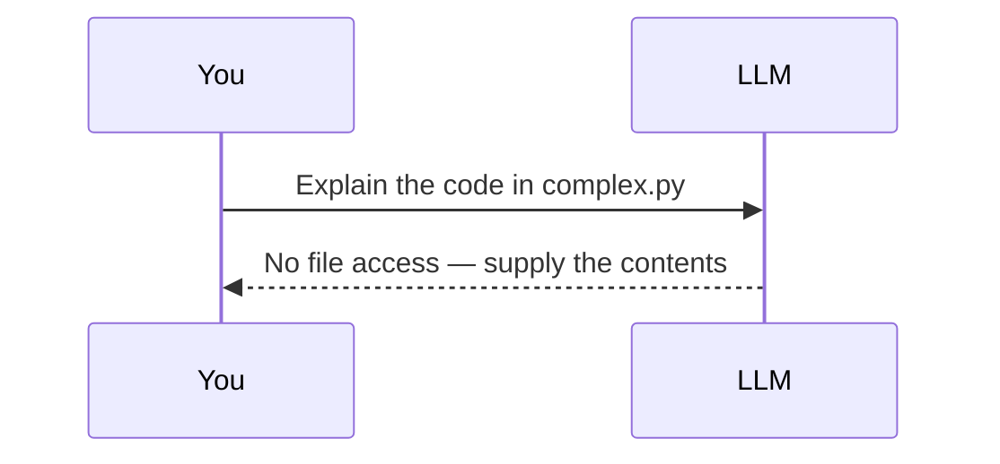
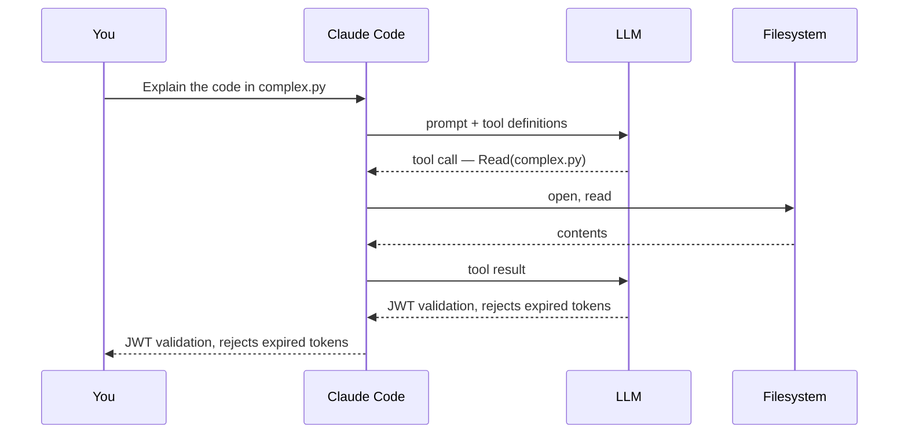

A language model is a text-to-text function. It has no filesystem handle, no shell, no network socket. Given "explain the code in `complex.py`", the only correct response is that it cannot read files.



Claude Code is the process that closes that gap. It is an **agentic harness**: it supplies tools, executes them on the model's behalf, and drives the model in a loop until the task is done.



The model never touches the disk. It emits a tool call; the harness executes it and returns the result. Every capability and every safety control in Claude Code is a property of that intermediary position.

## The agentic loop

The harness runs the exchange repeatedly. Each iteration has three phases — **gather context**, **take action**, **verify results** — and the model chooses the next action from the previous result.


The phases are descriptive, not sequential. A codebase question may never leave *gather*; a refactor spends most of its iterations in *verify*.

For the task "fix the failing tests", a typical trace is six tool calls:

<div class="al-demo"> <div class="al-head"> <span class="al-task">Task: <strong>fix the failing tests</strong></span> <div class="al-phases"> <span class="al-phase" data-phase="gather">Gather context</span> <span class="al-phase" data-phase="act">Take action</span> <span class="al-phase" data-phase="verify">Verify results</span> </div> </div> <ol class="al-log" id="al-log"></ol> <div class="al-controls"> <button type="button" id="al-step" class="al-btn al-btn-primary">Next step</button> <button type="button" id="al-reset" class="al-btn">Reset</button> <span class="al-count" id="al-count">0 of 6</span> </div> </div> <script> (function () { var steps = [ { phase: "act", tool: "Bash", text: "npm test", note: "No idea what is broken yet. Find out." }, { phase: "gather", tool: "Read", text: "the test output", note: "Two failures, both in auth.test.js, both a TypeError." }, { phase: "gather", tool: "Grep", text: "search for validateToken", note: "The stack trace named it. Where does it live?" }, { phase: "gather", tool: "Read", text: "src/auth/token.js", note: "It returns undefined when the header is missing." }, { phase: "act", tool: "Edit", text: "src/auth/token.js", note: "Guard the missing-header case and return null." }, { phase: "verify", tool: "Bash", text: "npm test", note: "Green. The fix is proven, not assumed." } ]; var log = document.getElementById("al-log"), stepBtn = document.getElementById("al-step"), resetBtn = document.getElementById("al-reset"), count = document.getElementById("al-count"), phases = document.querySelectorAll(".al-phase"), i = 0; function render() { count.textContent = i + " of " + steps.length; stepBtn.disabled = i >= steps.length; stepBtn.textContent = i >= steps.length ? "Task complete" : "Next step"; var active = i > 0 ? steps[i - 1].phase : null; Array.prototype.forEach.call(phases, function (p) { p.classList.toggle("on", p.getAttribute("data-phase") === active); }); } function add() { var s = steps[i]; var li = document.createElement("li"); li.className = "al-item al-" + s.phase; li.innerHTML = '<code class="al-tool">' + s.tool + '</code>' + '<span class="al-text">' + s.text + '</span>' + '<span class="al-note">' + s.note + '</span>'; log.appendChild(li); i++; render(); } stepBtn.addEventListener("click", function () { if (i < steps.length) add(); }); resetBtn.addEventListener("click", function () { log.innerHTML = ""; i = 0; render(); }); render(); })(); </script>

Note that the first call is an action, not context gathering: running the suite is how the failure set is determined. Step 3 exists only because step 2 returned a stack trace; step 6 exists only because step 5 modified a file. Each call is conditioned on the previous result — that dependency is what distinguishes an agent from a scripted sequence.

### Interrupt semantics

Two mechanisms, with different effects:

| Input | Effect |
|---|---|
| `Esc` | Cancels the in-flight tool call immediately and returns control |
| Text + `Enter` | Does not interrupt. Read after the current tool call completes, before the next action is chosen |

The second is the one to use when the current command is harmless but the direction is wrong.

## Tools

Tools are the harness's exposed capabilities. They fall into five categories:

| Category | Capability |
|---|---|
| File operations | Read, edit, create, move files |
| Search | Match files by pattern, search contents by regex |
| Execution | Shell commands, servers, tests, git |
| Web | Search, fetch URLs |
| Code intelligence | Type errors after edits, definitions, references |

Forty-five tools are available. The complete set, with the column that determines Chapters 3 and 4:

| Tool | Function | Permission required |
|---|---|---|
| `Read` | Read file contents | No |
| `Glob` | Match files by pattern | No |
| `Grep` | Search file contents | No |
| `LSP` | Definitions, references, type errors via language servers | No |
| `Edit` | Targeted edit to an existing file | **Yes** |
| `Write` | Create or overwrite a file | **Yes** |
| `NotebookEdit` | Modify Jupyter notebook cells | **Yes** |
| `Bash` | Execute a shell command | **Yes** |
| `PowerShell` | Execute PowerShell natively | **Yes** |
| `Monitor` | Background command, streams output lines back | **Yes** |
| `WebSearch` | Web search | **Yes** |
| `WebFetch` | Fetch a URL | **Yes** |
| `Agent` | Spawn a subagent with its own context window | No |
| `Skill` | Execute a skill in the main conversation | **Yes** |
| `Workflow` | Run a dynamic workflow orchestrating many subagents | **Yes** |
| `EnterPlanMode` | Switch to plan mode | No |
| `ExitPlanMode` | Present a plan for approval and exit plan mode | **Yes** |
| `EnterWorktree` | Create an isolated git worktree and switch into it | **Yes** |
| `ExitWorktree` | Leave a worktree, return to the original directory | No |
| `TodoWrite` | Session checklist | No |
| `TaskCreate` | Create a task | No |
| `TaskList` | List tasks and status | No |
| `TaskGet` | Retrieve one task's detail | No |
| `TaskUpdate` | Update status, dependencies, detail; delete tasks | No |
| `TaskOutput` | Retrieve output from a background task | No |
| `TaskStop` | Stop a running background task | No |
| `CronCreate` | Schedule a recurring or one-shot prompt in-session | No |
| `CronList` | List scheduled tasks | No |
| `CronDelete` | Cancel a scheduled task | No |
| `ScheduleWakeup` | Reschedule the next iteration of a self-paced `/loop` | No |
| `SendMessage` | Message another agent or session | No |
| `ListAgents` | List agents reachable via `SendMessage` | No |
| `AskUserQuestion` | Ask a multiple-choice question | No |
| `ToolSearch` | Load deferred tool definitions on demand | No |
| `ListMcpResourcesTool` | List MCP server resources | No |
| `ReadMcpResourceTool` | Read an MCP resource by URI | No |
| `WaitForMcpServers` | Wait for MCP servers still connecting | No |
| `Artifact` | Publish an HTML or Markdown page to claude.ai | **Yes** |
| `PushNotification` | Desktop notification and phone push | No |
| `SendUserFile` | Send a file from the session to your device | No |
| `RemoteTrigger` | Create, update, run and list Routines | No |
| `ReportFindings` | Report code-review findings as structured data | No |
| `SendFeedback` | Draft a feedback report | No |
| `ShareOnboardingGuide` | Upload `ONBOARDING.md`, return a share link | **Yes** |
| `EndConversation` | End the session after sustained abusive input | No |

The permission column follows one rule: **read-only operations do not prompt; state-changing and network operations do.** Reading, searching and listing are unrestricted. Editing, executing and network access require approval. The permission system in Chapters 3 and 4 is a set of refinements on that rule, not a departure from it.

Tool coverage is extensible: [skills](/guide/) add procedures, MCP adds external services, hooks add enforced behaviour, and subagents add isolated context. Each has its own chapter.

## What a session loads

Starting `claude` in a directory gives the session access to:

| Source | Detail |
|---|---|
| Project files | The working directory and subdirectories; others via `--add-dir` |
| Shell | Any command the invoking user can run |
| Git state | Current branch, uncommitted changes, recent history |
| `CLAUDE.md` | Project instructions, loaded at session start (Chapter 6) |
| Auto memory | First 200 lines or 25 KB of `MEMORY.md`, whichever comes first (Chapter 7) |
| Extensions | MCP servers, skills, subagents, browser access |

Files are read on demand, not at startup. A repository's size does not determine context consumption; the number of files actually opened does.

Because the harness sees the whole project rather than one open buffer, a single request can span multiple files, a configuration change and a test run in one unit of work.

### Session state on disk

The conversation is written locally as it happens: every message, tool call and result appends to a plaintext JSONL file under `~/.claude/projects/`. That file is what makes resuming, forking and rewinding possible — they are operations on a transcript, not on a server-side session.

Separately, before Claude edits a file, the harness snapshots the current contents. Checkpoints are independent of git and survive across resumes. They cover file edits only: changes made by shell commands, and anything affecting remote systems, are outside their scope. Chapter 9 covers both mechanisms.

### Context window

The context window holds conversation history, file contents, command output, `CLAUDE.md`, auto memory, loaded skills and system instructions. As it fills, Claude Code clears older tool output first, then summarises the conversation. Requests and key code survive; detailed instructions given early in a conversation may not — which is the argument for putting durable rules in `CLAUDE.md` rather than in chat. `/context` reports current usage. Chapter 8 covers the mechanics.

MCP tool definitions are deferred by default and loaded on demand through tool search, so connected servers cost only their tool names until a specific tool is used.

### Models

The harness is model-agnostic within the Claude family. Sonnet handles most coding work; Opus provides stronger reasoning for architectural decisions. Select with `--model <alias>` at launch or `/model` during a session, and set reasoning depth with `--effort` or `/effort`. Chapter 5 covers the selection and its cost implications.

## Execution environments and interfaces

The loop and the tool set are identical across all of them. What varies is where code executes:

| Environment | Execution host | Use |
|---|---|---|
| Local | Your machine | Default; full access to local files and tooling |
| Cloud | Anthropic-managed VMs, or self-hosted runners | Long tasks, repositories not checked out locally |
| Remote Control | Your machine, driven from a browser | Web UI with local execution |

Interfaces: terminal, VS Code, JetBrains, desktop app, `claude.ai/code`, mobile, Slack, and CI via GitHub Actions or GitLab. All read the same `CLAUDE.md`, settings and MCP configuration. Chapter 20 covers them individually; this handbook uses the terminal.

## Installation and authentication

Requirements: a terminal, a project, and a Claude subscription (Pro, Max, Team, Enterprise), a Claude Console account, or access via Amazon Bedrock, Google Cloud or Microsoft Foundry.

```bash
# macOS, Linux, WSL — auto-updates in the background
curl -fsSL https://claude.ai/install.sh | bash

# Windows PowerShell
irm https://claude.ai/install.ps1 | iex

# Homebrew — does not auto-update; run brew upgrade yourself
brew install --cask claude-code
```

Homebrew provides two casks: `claude-code` tracks the stable channel (roughly a week behind, skipping releases with known regressions) and `claude-code@latest` tracks current. `winget install Anthropic.ClaudeCode` and apt/dnf/apk are also available.

Verify and authenticate:

```bash
claude --version     # prints a version followed by (Claude Code)
cd /path/to/project
claude               # browser auth flow on first run
```

Credentials persist; `/login` switches accounts later. Setting `ANTHROPIC_API_KEY` skips the login prompt and asks you to approve the key instead. On native Windows, install [Git for Windows](https://git-scm.com/downloads/win) so the Bash tool is available; without it Claude Code falls back to PowerShell. WSL does not need it.

Two commands to know at setup time: `/init` generates a starting `CLAUDE.md` from the codebase, and `/doctor` runs a configuration checkup that diagnoses and offers to fix installation and settings problems.

## Permission mode at first run

On Pro, Max and Team plans, interactive terminal and VS Code sessions start in **auto mode**, where a classifier reviews actions in the background instead of prompting you. On other plans the starting mode is Manual, which prompts before edits and shell commands. `Shift+Tab` changes mode at any point. Chapter 3 covers all six modes and the classifier's rules.

## Prompt construction

Specify the target and the symptom; leave the procedure unspecified. The harness derives the procedure from tool results, and a prescribed sequence discards that.

```text
The checkout flow fails for users with expired cards.
Relevant code is in src/payments/. Investigate and fix.
```

This is shorter than naming files and line numbers, and it does not encode an assumption about where the defect is. Corrections mid-task are cheaper than re-prompting: the accumulated context from the failed attempt is retained.

## Summary

- A language model produces text. Claude Code supplies tools, executes them, and drives the model in a loop.
- The loop is gather → act → verify, with each call conditioned on the previous result.
- Read-only tools do not prompt; state-changing and network tools do. That asymmetry is the basis of the permission system.
- Files load on demand; repository size does not dictate context usage.
- `Esc` cancels the in-flight tool call; typed text is read at the next decision point without interrupting.

Chapter 3 covers the six permission modes, the auto-mode classifier, and the thresholds at which it stops trusting itself.
