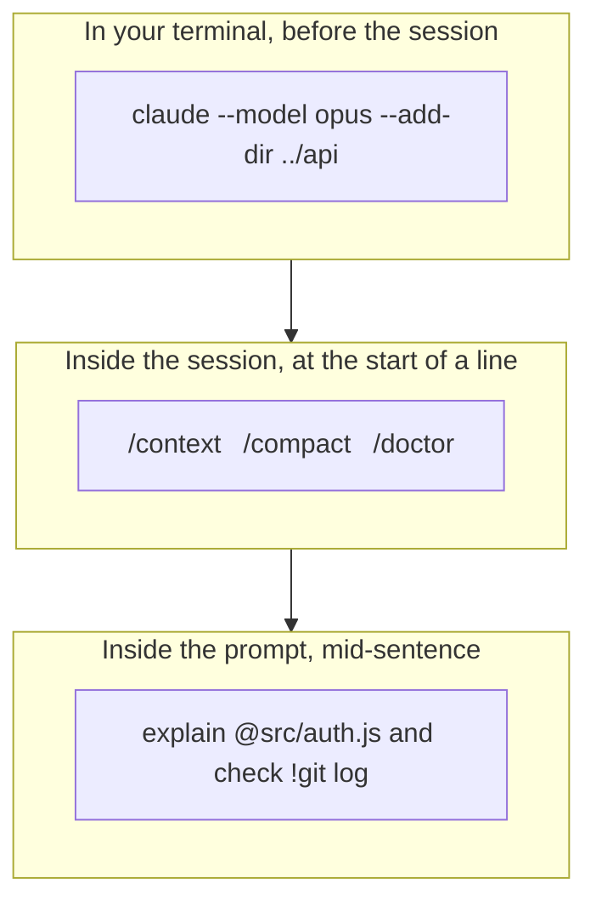
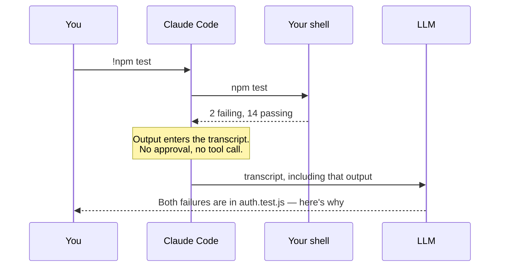
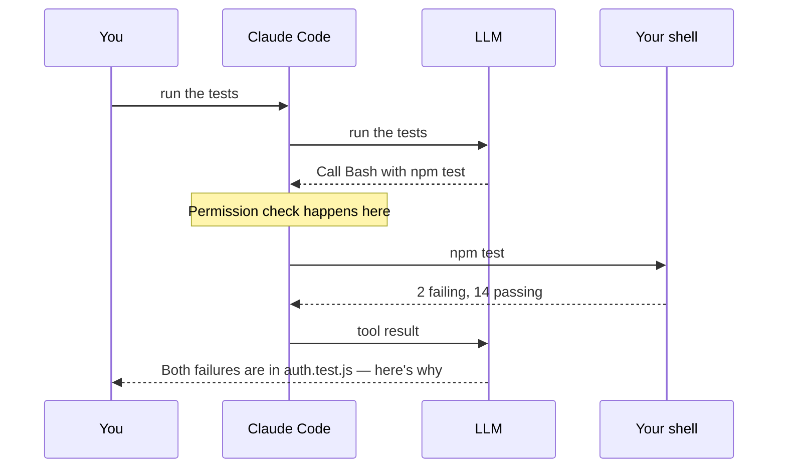

Watch someone use Claude Code for the first week and you'll see them type English at it, exclusively. Which works. It's also like owning a car and only ever using first gear.

There are **three separate channels** for talking to Claude Code, and they are genuinely different things — different syntax, different timing, and different costs. Two of them don't involve the model at all.



Get these three straight and everything else in this handbook has somewhere to live.

## Channel 1 — CLI flags, before the session

These are what you type in your shell to *start* Claude Code. They configure the session before it exists, so they can set things no in-session command can.

The five you'll actually use:

```bash
claude                          # start an interactive session
claude "fix the login bug"      # start with an opening prompt
claude -p "explain this file"   # one-shot: answer, then exit
claude -c                       # continue the most recent conversation here
claude -r                       # resume — pick from a list
```

`-p` is the interesting one. It's *print mode*: no interactive session, no REPL, just an answer on stdout. Which means Claude Code composes with everything else in your shell:

```bash
cat error.log | claude -p "what went wrong?"
git diff main --name-only | claude -p "review these for security issues"
tail -200 app.log | claude -p "flag anything anomalous"
```

That last one is the whole Unix philosophy applied to an AI agent, and it's the foundation of every CI integration in Chapter 16.

Beyond the basics, the flags worth knowing on day one:

| Flag | What it does |
|---|---|
| `--model <alias>` | `sonnet`, `opus`, `haiku`, `fable`, or a full model name |
| `--effort <level>` | `low`, `medium`, `high`, `xhigh`, `max` |
| `--add-dir <path>…` | Give the session access to directories outside the current one |
| `--permission-mode <mode>` | Start in `default`, `acceptEdits`, `plan`, `auto`, `dontAsk`, `bypassPermissions` |
| `--append-system-prompt "…"` | Bolt an instruction onto the system prompt for this session |
| `--fork-session` | With `--resume`/`--continue`, branch instead of appending |
| `-n "name"` | Name the session so `--resume` shows something human |
| `--safe-mode` | Start with every customisation disabled — the first move when something's broken |
| `--bare` | Skip auto-discovery of hooks, skills, commands, subagents, plugins, MCP, memory and CLAUDE.md |

`--safe-mode` and `--bare` deserve a bookmark. When Claude Code starts behaving strangely, the cause is almost always something *you* added, and these two tell you that in one command. Chapter 22 leans on both.

There are also `claude` subcommands that aren't sessions at all — `claude doctor`, `claude mcp`, `claude plugin`, `claude update`, `claude auth status`. They run and exit.

## Channel 2 — slash commands, during the session

Type `/` at the start of a line inside a session and you get the command menu. These run inside Claude Code and mostly never reach the model.

You do not need to memorise them. Type `/` and browse — that is the intended discovery mechanism, and the list is long enough that browsing beats remembering. But these are the ones that earn their keep:

**Finding out what's going on**

| Command | What it does |
|---|---|
| `/help` | The commands available to you right now |
| `/status` | Session status, and which settings source is winning |
| `/context` | What's eating your context window, as a coloured grid |
| `/usage` (or `/cost`) | What you've spent |
| `/doctor` | A setup checkup that diagnoses problems and offers fixes |

**Managing the conversation**

| Command | What it does |
|---|---|
| `/clear` | Start fresh with an empty context |
| `/compact` | Summarise the conversation to reclaim space |
| `/rewind` | Roll code and conversation back to a checkpoint |
| `/resume` | Return to an earlier conversation |
| `/branch` | Branch this conversation to try a different direction |

**Configuring things**

| Command | What it does |
|---|---|
| `/config` | The settings interface |
| `/permissions` | Allow, ask and deny rules |
| `/model`, `/effort`, `/fast` | Change model, reasoning effort, fast mode |
| `/memory` | Edit CLAUDE.md files, toggle auto memory |
| `/init` | Generate a starting CLAUDE.md for the project |
| `/hooks`, `/agents`, `/mcp`, `/plugin` | The extension points — Chapters 11 through 17 |

Three more that are easy to miss and genuinely good:

- **`/btw`** — ask a side question without polluting the conversation. "By the way, what does `--fork-session` do?" doesn't need to live in your context for the next two hours.
- **`/diff`** — review the changes in your working tree, in a panel, without leaving the session.
- **`/powerup`** — interactive lessons that teach features by making you use them.

The `/` menu also contains your own skills, which is why Chapter 11 can add `/deploy` to this list just by creating a directory.

## Channel 3 — sigils, inside the prompt

The third channel isn't a command at all. It's a handful of characters you type *inside* a sentence.

| Sigil | Where | What it does |
|---|---|---|
| `@` | anywhere in the prompt | Reference a file — Claude reads it immediately |
| `!` | start of the line | Shell mode: run the command yourself |
| `:` | anywhere | Emoji shortcode |
| `?` | empty input | Toggle the keyboard shortcut help panel |
| `/` | start of the line | The command menu from Channel 2 |

`@` is the one that changes your day-to-day most. Compare:

```text
Look at the auth middleware and tell me why tokens expire early
```

```text
Why do tokens expire early in @src/auth/middleware.ts?
```

The first makes Claude search for the file. The second hands it over. Tab-completion works as you type the path, so it's usually *faster* to type than the vague version, and it removes an entire round of guessing.

### Shell mode, and the thing the tutorials get wrong

Prefix a line with `!` and the command runs in your terminal. Claude doesn't interpret it, doesn't approve it, and doesn't decide whether to run it — you did.

```text
!npm test
!git status
!ls -la
```

Shell mode has a few conveniences worth knowing: `Tab` completes from your previous `!` commands in this project, and typing a token with a forward slash (`./src/`, `~/`) pops up a file-path dropdown — forward slashes on Windows too, since the dropdown triggers on `/`, not `\`. `Ctrl+B` backgrounds a long-running command. `Esc`, `Backspace` or `Ctrl+U` on an empty prompt gets you out.

Now the part that a lot of older material still gets wrong.

> **You will read that shell mode is free. It isn't, and hasn't been since v2.1.186.**

The old behaviour was: the command runs, the output lands silently in context, no model call. The current behaviour is that **Claude responds to the output automatically** — which means `!npm test` costs the same as sending a normal prompt.

That is usually what you want. Run `!npm test`, get an explanation of the failures, no second prompt needed. But if you're running `!git status` twenty times an hour purely to look at it yourself, you're paying for twenty responses you never read. Set `respondToBashCommands` to `false` in `settings.json` to get the silent behaviour back.

Here's what actually happens either way:



Contrast that with asking in English:



Same destination. The difference is a model round-trip and a permission check. Use `!` when you already know the exact command; use English when deciding *which* command is the actual work.

### What happened to `#`

Older guides list a fourth sigil: `#` to jot something into Claude's memory. **It is no longer in the documentation.** The documented way to save something now is to say so:

```text
remember that we use pnpm, not npm
```

```text
save to memory that the API tests need a local Redis instance
```

Auto memory picks that up and writes it down. `/memory` browses and edits what it saved. That's Chapter 7 — for now, just know that if you've seen `#` recommended somewhere, the mechanism it belonged to has been replaced by something better.

### Sort them yourself

<div class="sorter" id="ct-demo"> <div class="ct-head"> <span class="ct-q" id="ct-q">Where does this go?</span> <span class="ct-score" id="ct-score">0 / 0</span> </div> <div class="ct-item" id="ct-item">—</div> <div class="ct-choices"> <button type="button" class="ct-btn" data-a="cli">CLI flag<small>before the session</small></button> <button type="button" class="ct-btn" data-a="slash">Slash command<small>during the session</small></button> <button type="button" class="ct-btn" data-a="sigil">Sigil<small>inside the prompt</small></button> </div> <p class="ct-feedback" id="ct-feedback">Pick a channel.</p> <button type="button" class="ct-reset" id="ct-reset">Start over</button> </div> <script> (function () { var items = [ { t: "--add-dir ../backend", a: "cli", why: "Working directories are fixed when the session starts. There is a /add-dir too, but the flag is the one that runs before anything loads." }, { t: "/compact", a: "slash", why: "Reclaims context space mid-session. There is no way to compact a session that has not started yet." }, { t: "@src/auth/middleware.ts", a: "sigil", why: "A file reference typed inside a sentence. Claude reads the file immediately instead of hunting for it." }, { t: "-p 'explain this function'", a: "cli", why: "Print mode. It is the flag that means there is no session at all — one answer on stdout, then exit." }, { t: "!npm test", a: "sigil", why: "Shell mode. You run it, not Claude. The output lands in the transcript and Claude responds to it." }, { t: "/doctor", a: "slash", why: "The setup checkup. There is also a claude doctor subcommand outside a session — the same check, from the other side." }, { t: "--permission-mode plan", a: "cli", why: "Sets the mode the session starts in. Shift+Tab changes it later, but the flag decides where you begin." }, { t: "/model", a: "slash", why: "Switches model mid-session. --model does the same job from the terminal before you start." }, { t: "?", a: "sigil", why: "Typed on an empty prompt, it toggles the keyboard shortcut panel. Not a command — a single character." } ]; var order = [], idx = 0, right = 0, done = 0, locked = false; var qEl = document.getElementById("ct-q"), itemEl = document.getElementById("ct-item"), fbEl = document.getElementById("ct-feedback"), scoreEl = document.getElementById("ct-score"), btns = document.querySelectorAll(".ct-btn"); function shuffle(n) { var a = []; for (var i = 0; i < n; i++) a.push(i); for (var i = a.length - 1; i > 0; i--) { var j = Math.floor(Math.random() * (i + 1)); var t = a[i]; a[i] = a[j]; a[j] = t; } return a; } function show() { locked = false; Array.prototype.forEach.call(btns, function (b) { b.className = "ct-btn"; b.disabled = false; }); if (idx >= order.length) { qEl.textContent = "Done"; itemEl.textContent = right === order.length ? "All nine." : right + " of " + order.length + " right."; fbEl.textContent = right === order.length ? "You have the taxonomy." : "The ones you missed are the ones worth re-reading."; fbEl.className = "ct-feedback"; return; } qEl.textContent = "Where does this go?"; itemEl.textContent = items[order[idx]].t; fbEl.textContent = "Pick a channel."; fbEl.className = "ct-feedback"; } function answer(choice, btn) { if (locked || idx >= order.length) return; locked = true; var it = items[order[idx]]; var ok = choice === it.a; if (ok) right++; done++; scoreEl.textContent = right + " / " + done; btn.className = "ct-btn " + (ok ? "ok" : "no"); Array.prototype.forEach.call(btns, function (b) { b.disabled = true; if (b.getAttribute("data-a") === it.a && !ok) b.className = "ct-btn ok-faint"; }); fbEl.textContent = (ok ? "Correct. " : "Not quite. ") + it.why; fbEl.className = "ct-feedback " + (ok ? "good" : "bad"); setTimeout(function () { idx++; show(); }, 2600); } Array.prototype.forEach.call(btns, function (b) { b.addEventListener("click", function () { answer(b.getAttribute("data-a"), b); }); }); document.getElementById("ct-reset").addEventListener("click", function () { order = shuffle(items.length); idx = 0; right = 0; done = 0; scoreEl.textContent = "0 / 0"; show(); }); order = shuffle(items.length); show(); })(); </script>

## The keyboard, properly

Claude Code's prompt is a readline-style editor, and it rewards learning about six keys.

**The ones that will save you the most time:**

| Key | What it does |
|---|---|
| `Esc` | Interrupt Claude, or close a dialog |
| `Esc` `Esc` | Clear the input draft — or open rewind |
| `Ctrl+R` | Reverse-search your command history |
| `Ctrl+O` | Toggle the transcript viewer |
| `Ctrl+G` (or `Ctrl+X` `Ctrl+E`) | Open the prompt in your `$EDITOR` |
| `Shift+Tab` | Cycle permission modes — Chapter 3 |
| `?` on empty input | Show every shortcut, so you can stop reading this table |

**Writing a long prompt** — four ways to get a newline without submitting:

| Method | Keys |
|---|---|
| Quick escape | `\` then `Enter` |
| Option key | `Option+Enter` |
| Shift+Enter | `Shift+Enter` |
| Control sequence | `Ctrl+J` |

If `Shift+Enter` doesn't work in your terminal, that's a terminal configuration issue, not a Claude Code one — the [terminal config guide](https://code.claude.com/docs/en/terminal-config) has the fix per terminal. `Ctrl+G` sidesteps the whole question by opening a real editor.

**Line editing** is standard readline: `Ctrl+A` start of line, `Ctrl+E` end, `Ctrl+K` delete to end, `Ctrl+U` delete to start, `Ctrl+W` delete a word back, `Ctrl+Y` paste it back. `Alt+B` and `Alt+F` move by word. On macOS these `Alt`/`Option` bindings need Option configured as Meta in your terminal.

There's also a **vim mode** if you want it, with normal/insert modes, motions, text objects and visual mode.

**Two shortcuts nobody finds on their own:**

- **`Ctrl+V`** pastes an *image* from your clipboard. Screenshot a broken UI, paste it, ask what's wrong.
- **`Ctrl+S`** stashes the prompt you're halfway through writing, so you can do something else and restore it.

### Type while Claude is working

This is the most underused feature in the whole CLI.

Press `Enter` while Claude is mid-turn and your message doesn't interrupt anything — it **queues**. Claude Code lists the queued entries above the input box and sends them when the current turn finishes.

Which means the loop from Chapter 1 has a third mode of steering:

- **`Esc`** — stop now. The running tool call is cancelled.
- **Type and `Enter`** — queue it. Claude picks it up at the end of the turn.
- **Type a correction mid-tool** — Claude reads it as soon as the current action completes and adjusts before choosing its next step.

You can queue `!` shell commands and most slash commands too. The exceptions are commands like `/status` that Claude Code runs the instant you send them.

## Speaking instead of typing

People talk roughly three times faster than they type, and a good prompt is a paragraph. So dictate it.

```text
/voice
```

`/voice` toggles dictation. It has two modes:

- **Hold** (default) — hold `Space`, speak, release. There's a brief warm-up while Claude Code detects the held key, shown as `keep holding…` then `listening…`.
- **Tap** — `/voice tap`. Tap `Space` to start, tap again to stop and send. No warm-up. It only auto-submits when the transcript is at least three words, so a stray tap doesn't send a stray word.

Your words appear in the prompt as you speak, dimmed until finalised, and land at the cursor — so you can type half a sentence, dictate the middle, and type the end. Transcription is tuned for coding vocabulary, and your project and branch names are fed in as recognition hints automatically.

**What it costs: nothing.** Transcription doesn't consume messages or tokens and doesn't count toward the limits in `/usage`.

**What it needs:**

- A **Claude.ai account.** Dictation is unavailable if Claude Code is wired to an Anthropic API key directly, Amazon Bedrock, Google Cloud's Agent Platform, or Microsoft Foundry.
- A **local microphone.** It doesn't work over SSH or on Claude Code on the web — the audio has to come from the machine you're sitting at.
- On WSL, **WSLg** (included with WSL2 from the Microsoft Store).

Audio streams to Anthropic's servers for transcription; nothing runs locally. Twenty languages are supported, set via the same `language` setting that controls Claude's response language. And if `Space` is the wrong key for you, `voice:pushToTalk` is rebindable in `~/.claude/keybindings.json` — a modifier combination like `meta+k` skips the hold warm-up entirely.

## Choosing a channel

Three questions settle it every time:

1. **Does the session exist yet?** No → CLI flag.
2. **Am I asking Claude Code to do something, or asking Claude?** Claude Code → slash command.
3. **Do I already know the exact command or file?** Yes → `!` or `@`.

The failure mode this prevents is the common one: typing a paragraph of English to accomplish something a slash command does instantly, and paying a model round-trip for it. "Can you show me how much context we've used?" is a prompt. `/context` is an answer.

## What to take away

- Three channels: **CLI flags before**, **slash commands during**, **sigils inside the prompt**. Only the third mixes with English.
- `claude -p` makes Claude Code a Unix filter. `cat error.log | claude -p "what went wrong?"` is the seed of every CI integration later in this handbook.
- `@file` beats describing a file. Tab-completion makes it faster to type as well as more precise.
- **Shell mode is no longer free.** Since v2.1.186 Claude responds to `!` output automatically and that response costs a normal prompt. `respondToBashCommands: false` restores the silent behaviour.
- **`#` for memory is gone from the docs.** Just say "remember that…".
- Pressing `Enter` while Claude works **queues** rather than interrupts — the gentlest of the three ways to steer.
- `/voice` is free, needs a Claude.ai login and a local mic, and has hold and tap modes.
- When something breaks, `--safe-mode` and `--bare` tell you whether it's you or the tool.

Next: the six permission modes, the classifier that reviews Claude's actions in auto mode, and the dead-man's switch that stops it running away with your repository.
