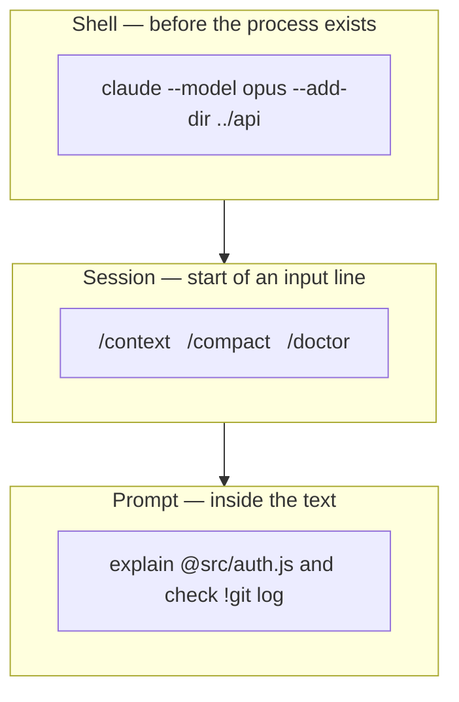
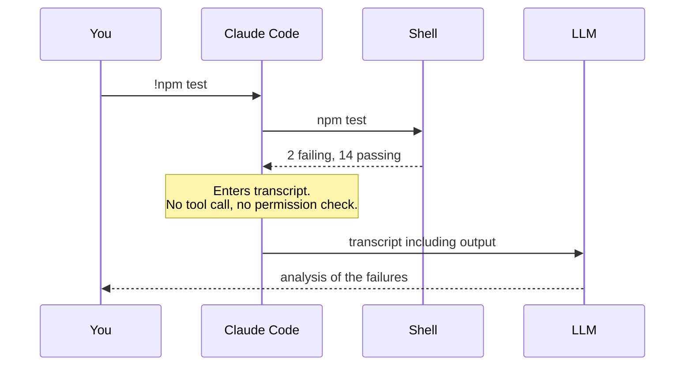
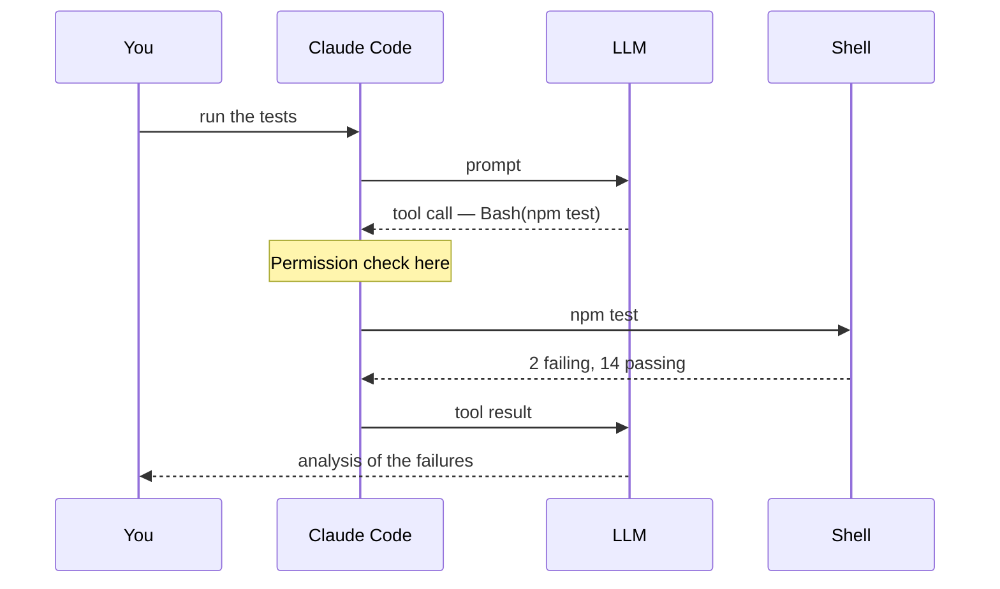

Claude Code accepts input through three distinct channels. They differ in when they are parsed, what parses them, and whether the input reaches the model at all.

| Channel | Parsed | Reaches the model | Example |
|---|---|---|---|
| CLI arguments | By the shell, before the process starts | No | `claude --model opus --add-dir ../api` |
| Slash commands | By Claude Code, at the start of an input line | Mostly no | `/context` |
| Sigils | By Claude Code, inside the prompt text | Depends on the sigil | `explain @src/auth.ts` |



Two of the three do not consume model calls. That is the practical consequence: work done through channels 1 and 2 is free of inference cost and latency.

## Channel 1 — CLI arguments

These configure the session before it exists, so they control things no in-session command can — the starting permission mode, the working directory set, the system prompt.

### Invocation forms

```bash
claude                          # interactive session
claude "fix the login bug"      # interactive, with an initial prompt
claude -p "explain this file"   # print mode: one response on stdout, then exit
claude -c                       # continue the most recent conversation in this directory
claude -r                       # resume: interactive picker
claude -r "auth-refactor" "..."  # resume by session ID or name, with a prompt
```

Print mode (`-p`) has no REPL and no session UI. It reads stdin and writes to stdout, which makes Claude Code composable with the rest of the shell:

```bash
cat error.log | claude -p "what went wrong?"
git diff main --name-only | claude -p "review these for security issues"
tail -200 app.log | claude -p "flag anything anomalous"
```

This is the mechanism behind every CI integration in Chapter 16.

### Flags

Session and mode:

| Flag | Effect |
|---|---|
| `-c`, `--continue` | Load the most recent conversation in this directory |
| `-r`, `--resume "<session>"` | Resume by ID or name, or open the picker |
| `--fork-session` | With `--resume`/`--continue`, branch to a new session ID instead of appending |
| `--session-id "<uuid>"` | Use a specific session ID |
| `-n`, `--name "<name>"` | Set the session display name |
| `--bg`, `--background` | Start as a background agent and return immediately |

Model and reasoning:

| Flag | Effect |
|---|---|
| `--model <alias\|name>` | `sonnet`, `opus`, `haiku`, `fable`, or a full model ID |
| `--effort <level>` | `low`, `medium`, `high`, `xhigh`, `max`, `ultracode` |
| `--fallback-model <models>` | Comma-separated fallback chain |
| `--advisor <model>` | Enable the server-side advisor tool |
| `--autocompact <auto\|tokens>` | Set the auto-compact window |

Permissions and access:

| Flag | Effect |
|---|---|
| `--permission-mode <mode>` | `default`, `acceptEdits`, `plan`, `auto`, `dontAsk`, `bypassPermissions`, `manual` |
| `--dangerously-skip-permissions` | Equivalent to `bypassPermissions` |
| `--allow-dangerously-skip-permissions` | Adds bypass to the mode cycle without starting in it |
| `--allowedTools` / `--disallowedTools` | Pre-approve or deny tools by pattern |
| `--add-dir <path>…` | Additional working directories for read and edit access |

System prompt and agents:

| Flag | Effect |
|---|---|
| `--system-prompt "<text>"` / `--system-prompt-file <path>` | Replace the system prompt entirely |
| `--append-system-prompt "<text>"` / `--append-system-prompt-file <path>` | Append to the default system prompt |
| `--agent <name>` | Run the session as a named subagent |
| `--agents '<json>'` | Define subagents inline |

Output and scripting, for print mode:

| Flag | Effect |
|---|---|
| `--output-format <text\|json\|stream-json>` | Response format |
| `--json-schema '<schema>'` | Validated JSON output against a schema |
| `--max-turns <n>` | Cap agentic turns |
| `--max-budget-usd <amount>` | Stop after a spend threshold |
| `--verbose` | Verbose output |

Diagnostics:

| Flag | Effect |
|---|---|
| `--safe-mode` | Start with all customisations disabled |
| `--bare` | Skip auto-discovery of hooks, skills, commands, subagents, plugins, MCP, auto memory and `CLAUDE.md` |
| `--debug[='category,filter']` | Debug mode, optionally filtered |
| `--settings <path\|json>` | Explicit settings file or inline JSON |
| `--setting-sources <user,project,local>` | Restrict which settings layers load |

`--safe-mode` and `--bare` isolate configuration problems in one command: if the behaviour disappears, the cause is something in your configuration rather than in Claude Code. Chapter 22 uses both.

### Subcommands

Not all `claude` invocations start a session:

| Subcommand | Purpose |
|---|---|
| `claude doctor` | Installation and settings diagnostics |
| `claude update` | Update to the latest version |
| `claude install [version]` | Install or reinstall the native binary |
| `claude mcp` / `claude mcp login <name>` | Configure MCP servers, run a server's OAuth flow |
| `claude plugin` | Manage plugins |
| `claude auth login\|logout\|status` | Authentication |
| `claude agents` | Open agent view |
| `claude attach\|logs\|stop\|respawn <id>` | Manage background sessions |
| `claude setup-token` | Generate a long-lived OAuth token for CI |
| `claude project purge [path]` | Delete local state for a project |

## Channel 2 — slash commands

A `/` at the start of an input line opens the command menu. These are handled by Claude Code and mostly do not produce a model call.

The menu is the intended discovery mechanism — typing `/` lists everything currently available, including your own skills. The reference below is the subset in routine use.

Inspection:

| Command | Purpose |
|---|---|
| `/help` | Available commands |
| `/status` | Session status, including which settings source is in effect |
| `/context` | Context window usage, as a grid |
| `/usage`, `/cost` | Spend |
| `/doctor` | Setup checkup with proposed fixes |
| `/diff` | Working-tree changes in a panel |
| `/tasks` | Background work and subagents in this session |

Conversation state:

| Command | Purpose |
|---|---|
| `/clear` | New conversation, empty context |
| `/compact` | Summarise to reclaim context |
| `/autocompact` | Set the auto-compact threshold |
| `/rewind` | Roll code and conversation back to a checkpoint |
| `/resume` | Return to an earlier conversation |
| `/branch` | Branch this conversation |
| `/fork` | Copy this conversation into a new background session |
| `/btw` | Side question, excluded from the conversation |
| `/export`, `/copy` | Export the conversation; copy the last response |

Configuration:

| Command | Purpose |
|---|---|
| `/config` | Settings interface |
| `/permissions` | Allow, ask and deny rules |
| `/model`, `/effort`, `/fast`, `/advisor` | Model, reasoning depth, fast mode, advisor tool |
| `/memory` | Edit `CLAUDE.md` files; toggle auto memory |
| `/init` | Generate a starting `CLAUDE.md` |
| `/hooks`, `/agents`, `/mcp`, `/plugin` | Extension points — Chapters 11 to 17 |
| `/keybindings` | Open the keybindings file |
| `/add-dir`, `/cd` | Add a working directory; move the session |

Workflow:

| Command | Purpose |
|---|---|
| `/plan` | Enter plan mode |
| `/code-review`, `/security-review` | Review a diff or PR for defects; for vulnerabilities |
| `/batch` | Parallel large-scale changes |
| `/subtask` | Delegate a side task to a subagent |
| `/goal` | Set a completion condition and keep working until met |
| `/loop` | Run a prompt on a schedule |
| `/background` | Detach the session as a background agent |

## Channel 3 — sigils

Characters interpreted inside the input line.

| Sigil | Position | Effect |
|---|---|---|
| `/` | Start of line | Command menu (Channel 2) |
| `!` | Start of line | Shell mode |
| `@` | Anywhere | File reference |
| `:` | Anywhere | Emoji shortcode |
| `?` | Empty input | Toggle the keyboard shortcut panel |

### File references

`@path` resolves to a file and passes its contents directly, instead of requiring a search:

```text
Why do tokens expire early in @src/auth/middleware.ts?
```

Path completion is available as you type. Compared to describing the file in prose, this removes a search round trip and eliminates the possibility of Claude reading the wrong file.

### Shell mode

A leading `!` runs the rest of the line in your shell. Claude does not interpret, approve or select the command.

```text
!npm test
!git status
```

Behaviour:

- Output is added to the conversation transcript.
- `Tab` completes from previous `!` commands in this project.
- A token containing a forward slash (`./src/`, `~/`) opens a file-path dropdown. On Windows the dropdown triggers on `/`, not `\`.
- `Ctrl+B` backgrounds a long-running command.
- `Esc`, `Backspace` or `Ctrl+U` on an empty prompt exits shell mode.
- In a regular interactive session, shell-mode commands run **outside** the Bash sandbox even when sandboxing is enabled, because the sandbox governs commands Claude runs. Background sessions with strict sandbox mode are the exception.

**Cost — changed in v2.1.186.** Older material states that shell mode consumes no tokens. That was true when output was added to context silently. Claude Code now responds to the command output automatically, and that response costs the same as sending a normal prompt. Set `respondToBashCommands` to `false` in `settings.json` to restore the silent behaviour.

The two paths to running a test suite differ by one model round trip and one permission check:





Use `!` when the command is already determined. Use natural language when selecting the command is part of the task.

### The `#` sigil

Older documentation lists `#` as a prefix for writing to memory. It is no longer documented. The current mechanism is a plain-language instruction, which auto memory captures:

```text
remember that we use pnpm, not npm
```

`/memory` browses and edits what was saved. Chapter 7 covers the storage format and configuration.

### Channel classification

Nine real inputs, shuffled:

<div class="sorter" id="ct-demo"> <div class="ct-head"> <span class="ct-q" id="ct-q">Where does this go?</span> <span class="ct-score" id="ct-score">0 / 0</span> </div> <div class="ct-item" id="ct-item">—</div> <div class="ct-choices"> <button type="button" class="ct-btn" data-a="cli">CLI flag<small>before the session</small></button> <button type="button" class="ct-btn" data-a="slash">Slash command<small>during the session</small></button> <button type="button" class="ct-btn" data-a="sigil">Sigil<small>inside the prompt</small></button> </div> <p class="ct-feedback" id="ct-feedback">Pick a channel.</p> <button type="button" class="ct-reset" id="ct-reset">Start over</button> </div> <script> (function () { var items = [ { t: "--add-dir ../backend", a: "cli", why: "Working directories are fixed when the session starts. There is a /add-dir too, but the flag is the one that runs before anything loads." }, { t: "/compact", a: "slash", why: "Reclaims context space mid-session. There is no way to compact a session that has not started yet." }, { t: "@src/auth/middleware.ts", a: "sigil", why: "A file reference typed inside a sentence. Claude reads the file immediately instead of hunting for it." }, { t: "-p 'explain this function'", a: "cli", why: "Print mode. It is the flag that means there is no session at all — one answer on stdout, then exit." }, { t: "!npm test", a: "sigil", why: "Shell mode. You run it, not Claude. The output lands in the transcript and Claude responds to it." }, { t: "/doctor", a: "slash", why: "The setup checkup. There is also a claude doctor subcommand outside a session — the same check, from the other side." }, { t: "--permission-mode plan", a: "cli", why: "Sets the mode the session starts in. Shift+Tab changes it later, but the flag decides where you begin." }, { t: "/model", a: "slash", why: "Switches model mid-session. --model does the same job from the terminal before you start." }, { t: "?", a: "sigil", why: "Typed on an empty prompt, it toggles the keyboard shortcut panel. Not a command — a single character." } ]; var order = [], idx = 0, right = 0, done = 0, locked = false; var qEl = document.getElementById("ct-q"), itemEl = document.getElementById("ct-item"), fbEl = document.getElementById("ct-feedback"), scoreEl = document.getElementById("ct-score"), btns = document.querySelectorAll(".ct-btn"); function shuffle(n) { var a = []; for (var i = 0; i < n; i++) a.push(i); for (var i = a.length - 1; i > 0; i--) { var j = Math.floor(Math.random() * (i + 1)); var t = a[i]; a[i] = a[j]; a[j] = t; } return a; } function show() { locked = false; Array.prototype.forEach.call(btns, function (b) { b.className = "ct-btn"; b.disabled = false; }); if (idx >= order.length) { qEl.textContent = "Done"; itemEl.textContent = right === order.length ? "All nine." : right + " of " + order.length + " right."; fbEl.textContent = right === order.length ? "You have the taxonomy." : "The ones you missed are the ones worth re-reading."; fbEl.className = "ct-feedback"; return; } qEl.textContent = "Where does this go?"; itemEl.textContent = items[order[idx]].t; fbEl.textContent = "Pick a channel."; fbEl.className = "ct-feedback"; } function answer(choice, btn) { if (locked || idx >= order.length) return; locked = true; var it = items[order[idx]]; var ok = choice === it.a; if (ok) right++; done++; scoreEl.textContent = right + " / " + done; btn.className = "ct-btn " + (ok ? "ok" : "no"); Array.prototype.forEach.call(btns, function (b) { b.disabled = true; if (b.getAttribute("data-a") === it.a && !ok) b.className = "ct-btn ok-faint"; }); fbEl.textContent = (ok ? "Correct. " : "Not quite. ") + it.why; fbEl.className = "ct-feedback " + (ok ? "good" : "bad"); setTimeout(function () { idx++; show(); }, 2600); } Array.prototype.forEach.call(btns, function (b) { b.addEventListener("click", function () { answer(b.getAttribute("data-a"), b); }); }); document.getElementById("ct-reset").addEventListener("click", function () { order = shuffle(items.length); idx = 0; right = 0; done = 0; scoreEl.textContent = "0 / 0"; show(); }); order = shuffle(items.length); show(); })(); </script>

## Input handling

The prompt is a readline-style editor.

General controls:

| Key | Effect |
|---|---|
| `Esc` | Interrupt Claude, or close a dialog |
| `Esc` `Esc` | Clear the input draft, or open rewind |
| `Ctrl+C` | Interrupt, or clear input |
| `Ctrl+D` | Exit the session |
| `Ctrl+R` | Reverse-search command history |
| `Ctrl+O` | Toggle the transcript viewer |
| `Ctrl+G`, `Ctrl+X Ctrl+E` | Open the prompt in `$EDITOR` |
| `Ctrl+B` | Background running tasks |
| `Ctrl+T` | Toggle the task checklist |
| `Ctrl+S` | Stash or restore the prompt |
| `Ctrl+V` | Paste an image from the clipboard |
| `Ctrl+L` | Redraw the screen |
| `Shift+Tab`, `Alt+M` | Cycle permission modes |
| `?` on empty input | Toggle the shortcut panel |

Line editing follows readline: `Ctrl+A` / `Ctrl+E` for line start and end, `Ctrl+K` / `Ctrl+U` to delete forward and back, `Ctrl+W` to delete a word back, `Ctrl+Y` to yank, `Alt+B` / `Alt+F` to move by word, `Alt+D` to delete to end of word. On macOS the `Alt`/`Option` bindings require Option configured as Meta in your terminal. A full vim mode is also available, with normal, insert and visual modes, motions and text objects.

Multiline input, four equivalent methods:

| Method | Keys |
|---|---|
| Quick escape | `\` then `Enter` |
| Option key | `Option+Enter` |
| Shift+Enter | `Shift+Enter` |
| Control sequence | `Ctrl+J` |

If `Shift+Enter` does not produce a newline, the cause is terminal key handling rather than Claude Code; the [terminal configuration guide](https://code.claude.com/docs/en/terminal-config) has per-terminal settings.

### Message queueing

Pressing `Enter` while Claude is mid-turn does not interrupt. The message is queued, listed above the input box, and sent when the current turn completes. `!` shell commands and most slash commands can be queued the same way; commands Claude Code executes immediately, such as `/status`, cannot.

Combined with the interrupt semantics from Chapter 1, there are three ways to redirect a running turn:

| Action | Effect |
|---|---|
| `Esc` | Cancel the in-flight tool call now |
| Type + `Enter` mid-tool | Read when the current tool call completes, before the next action is chosen |
| Type + `Enter` while Claude is generating | Queued and sent at end of turn |

## Voice dictation

`/voice` enables dictation. Speech is transcribed into the prompt input, so voice and typing can be mixed within one message.

| Command | Effect |
|---|---|
| `/voice` | Toggle, keeping the current mode |
| `/voice hold` | Hold mode (default) |
| `/voice tap` | Tap mode |
| `/voice off` | Disable |

**Hold mode** is push-to-talk: hold `Space`, speak, release. Detection relies on terminal key-repeat events, so there is a short warm-up — the footer shows `keep holding…` then `listening…`. Warm-up characters typed during detection are removed automatically. **Tap mode** has no warm-up: tap `Space` to start, tap again to stop and send. Recording stops automatically after 15 seconds of silence or two minutes total. In tap mode the transcript auto-submits only at three words or more, so a stray tap does not send.

Requirements:

- **A Claude.ai account.** Dictation is unavailable when Claude Code is configured with an Anthropic API key directly, or through Amazon Bedrock, Google Cloud's Agent Platform, or Microsoft Foundry.
- **A local microphone.** It does not work over SSH or on Claude Code on the web.
- **WSLg** if running under WSL. Included with WSL2 installed from the Microsoft Store.

Audio is streamed to Anthropic's servers for transcription; nothing is processed locally. **Transcription does not consume messages or tokens and does not count toward the limits reported by `/usage`.**

Configuration: persist it in settings rather than running `/voice` each session.

```json
{
  "voice": {
    "enabled": true,
    "mode": "tap"
  }
}
```

Twenty languages are supported, selected by the same `language` setting that controls Claude's response language; it defaults to English. The key is bound to `voice:pushToTalk` in the `Chat` context and is rebindable in `~/.claude/keybindings.json` — a modifier combination such as `meta+k` starts recording on the first keypress with no warm-up. Setting `"autoSubmit": true` in the `voice` object submits on key release in hold mode.

## Channel selection

Three tests, applied in order:

1. **Does the session exist yet?** No → CLI argument.
2. **Is the operation performed by Claude Code or by Claude?** Claude Code → slash command.
3. **Is the exact command or file path already determined?** Yes → `!` or `@`.

The failure mode this avoids is issuing a natural-language prompt for an operation a slash command performs locally, which costs a model round trip and returns a less precise answer.

## Summary

- Three channels: CLI arguments parsed before the process starts, slash commands parsed at the start of an input line, sigils parsed inside the prompt. Only the third mixes with prose.
- `claude -p` reads stdin and writes stdout, making Claude Code usable as a shell filter and as a CI step.
- `@path` passes file contents directly, removing a search round trip.
- **Shell mode is not free as of v2.1.186.** Claude responds to `!` output automatically at the cost of a normal prompt; `respondToBashCommands: false` restores silent behaviour.
- Shell-mode commands run outside the Bash sandbox in regular interactive sessions.
- `#` for memory is no longer documented; use a plain-language instruction.
- `Enter` during a turn queues rather than interrupts.
- Voice dictation is free of token cost, requires a Claude.ai account and a local microphone, and has hold and tap modes.

Chapter 3 covers the six permission modes, the auto-mode classifier's rules, and the thresholds at which it falls back to prompting.
