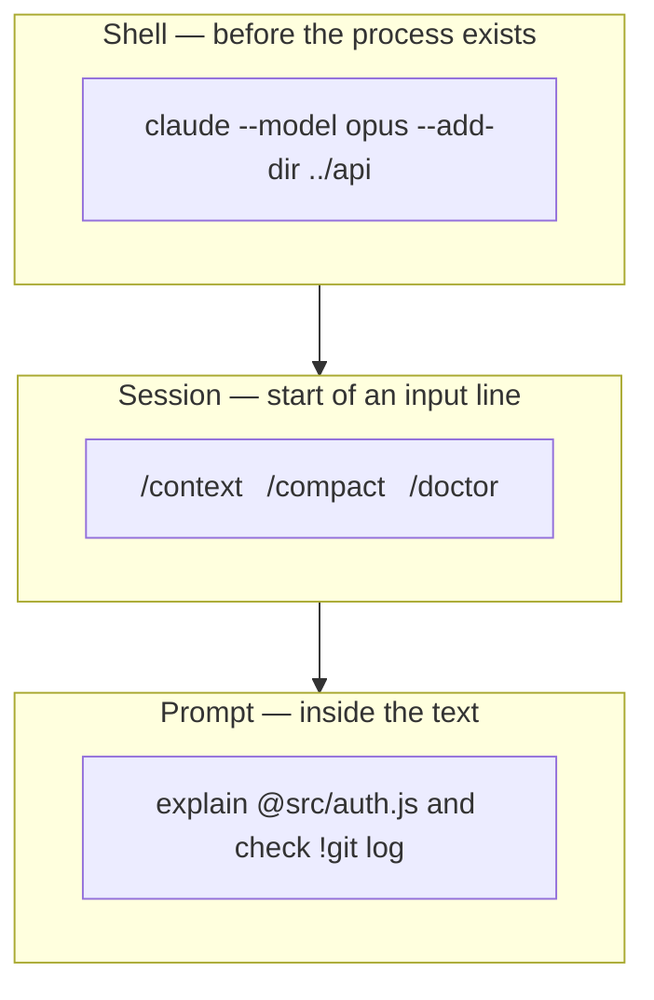
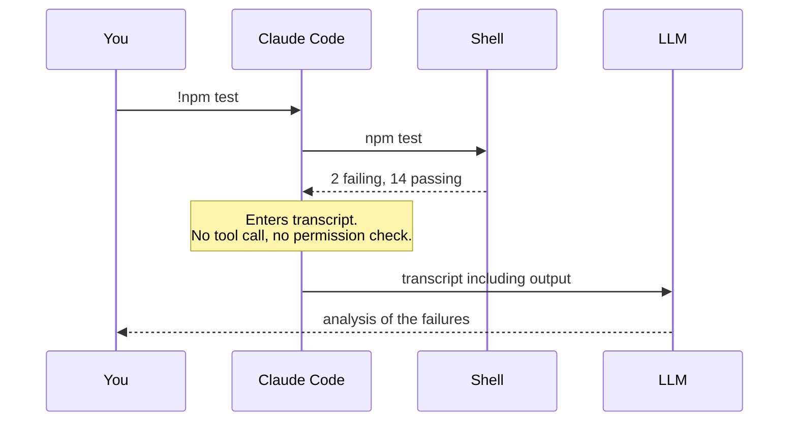

## Overview

This chapter covers:

- The three input channels, separated by when they are parsed and whether the model ever sees them
- Why two of the three cost no tokens at all — and the mistake that gives that saving away
- CLI arguments: print mode as a shell filter, the flags worth memorising, and the pair that debugs your configuration
- Slash commands and sigils — `@` to pass a file in, `!` to run your own shell, and the change that made `!` stop being free
- Editing, queueing and dictating at the prompt

## The three channels

Claude Code takes input through three channels. They differ in *when* they are parsed and *whether the model ever sees them*.

| Channel | Parsed | Reaches the model | Example |
|---|---|---|---|
| CLI arguments | By the shell, before the process starts | No | `claude --model opus --add-dir ../api` |
| Slash commands | By Claude Code, at the start of a line | Mostly no | `/context` |
| Sigils | By Claude Code, inside the prompt | Depends | `explain @src/auth.ts` |



**Two of the three cost nothing.** Channels 1 and 2 are handled locally — no model call, no latency, no tokens. Asking Claude in prose to do something a slash command already does is the most common avoidable expense.

## Channel 1 — CLI arguments

These configure the session *before it exists*, so they control things no in-session command can: the starting permission mode, which directories are in scope, the system prompt.

### The invocation forms

```bash
claude                          # interactive session
claude "fix the login bug"      # interactive, with a first prompt
claude -p "explain this file"   # print mode: one answer on stdout, then exit
claude -c                       # continue the last conversation here
claude -r                       # resume: interactive picker
```

Print mode (`-p`) is the one worth internalising. No REPL, no UI — it reads stdin and writes stdout, which makes Claude Code a shell filter:

```bash
cat error.log | claude -p "what went wrong?"
git diff main --name-only | claude -p "review these for security issues"
```

Every CI integration in Chapter 16 is built on that one property.

### The flags you will actually reach for

| Flag | Effect |
|---|---|
| `--model <alias>` | `sonnet`, `opus`, `haiku`, `fable`, or a full model ID |
| `--permission-mode <mode>` | Where the session starts — Chapter 3 |
| `--add-dir <path>…` | Additional directories Claude may read and edit |
| `--append-system-prompt "<text>"` | Add to the system prompt instead of replacing it |
| `--output-format json` | Structured output, for scripting `-p` runs |
| `--safe-mode` | Start with all customisations disabled |
| `--bare` | Skip auto-discovery of hooks, skills, MCP, `CLAUDE.md`, everything |

`--safe-mode` and `--bare` are the debugging pair: if odd behaviour disappears under either, the cause is your configuration rather than Claude Code. Chapter 22 uses both.

There are roughly forty more flags — session naming and forking, fallback model chains, turn and budget caps, settings-source control. The [CLI reference](https://code.claude.com/docs/en/cli-reference) is the complete list, and it stays current in a way a chapter cannot.

### Not every invocation starts a session

`claude doctor`, `claude update`, `claude mcp`, `claude plugin`, `claude auth`, `claude setup-token` and a few others are subcommands that do a job and exit. `claude doctor` and `claude setup-token` — diagnostics, and a long-lived token for CI — are the two you are most likely to need first.

## Channel 2 — slash commands

A `/` at the start of a line opens the command menu. **Typing `/` and reading the list is the intended discovery mechanism** — it shows everything currently available, including your own skills and plugin commands. What follows is the subset in routine use, not a catalogue.

| Command | Purpose |
|---|---|
| `/context` | What is consuming the context window, as a grid |
| `/clear` | New conversation, empty context |
| `/compact` | Summarise the conversation to reclaim space |
| `/rewind` | Roll code and conversation back to a checkpoint |
| `/resume` | Return to an earlier conversation |
| `/doctor` | Setup checkup, with proposed fixes |
| `/permissions` | Allow, ask and deny rules |
| `/model`, `/effort` | Model and reasoning depth |
| `/memory`, `/init` | Edit `CLAUDE.md`; generate a starting one |
| `/plan` | Enter plan mode |
| `/cost`, `/usage` | Spend |

Beyond these sit the extension points (`/hooks`, `/agents`, `/mcp`, `/plugin` — Chapters 11 to 17) and the workflow commands (`/code-review`, `/security-review`, `/batch`, `/subtask`, `/goal`, `/loop`, `/background`), each covered where it belongs. The [slash command reference](https://code.claude.com/docs/en/slash-commands) lists all of them, and Chapter 12 covers writing your own.

## Channel 3 — sigils

Characters interpreted inside the input line itself.

| Sigil | Position | Effect |
|---|---|---|
| `/` | Start of line | Command menu |
| `!` | Start of line | Shell mode |
| `@` | Anywhere | File reference |
| `?` | Empty input | Toggle the shortcut panel |

### `@` — file references

`@path` passes the file's contents straight in:

```text
Why do tokens expire early in @src/auth/middleware.ts?
```

Path completion works as you type. Against describing the file in prose, this removes a search round trip and removes the chance of Claude opening the wrong file.

### `!` — shell mode

A leading `!` runs the rest of the line in *your* shell. Claude does not choose it, approve it, or interpret it:

```text
!npm test
!git status
```

The output lands in the transcript. `Tab` completes from previous `!` commands in the project, `Ctrl+B` backgrounds a long-running one, and `Esc` on an empty prompt exits shell mode.

Two things about `!` that catch people out:

**It is no longer free.** Older material says shell mode consumes no tokens. That was true when output entered context silently. Since v2.1.186 Claude responds to the output automatically, at the cost of a normal prompt. Set `respondToBashCommands: false` in `settings.json` to get the silent behaviour back.

**It runs outside the Bash sandbox.** In a regular interactive session, sandboxing governs commands *Claude* runs, not commands you run. Background sessions in strict sandbox mode are the exception.

The difference between the two ways to run your test suite is one model round trip and one permission check:



Use `!` when the command is already decided. Use natural language when *choosing* the command is part of the task.

### A note on `#`

Older documentation lists `#` as a memory prefix. It is no longer documented. Say it plainly instead — auto memory captures it:

```text
remember that we use pnpm, not npm
```

Chapter 7 covers what gets stored and where.

### Sort nine inputs

<div class="sorter" id="ct-demo"> <div class="ct-head"> <span class="ct-q" id="ct-q">Where does this go?</span> <span class="ct-score" id="ct-score">0 / 0</span> </div> <div class="ct-item" id="ct-item">—</div> <div class="ct-choices"> <button type="button" class="ct-btn" data-a="cli">CLI flag<small>before the session</small></button> <button type="button" class="ct-btn" data-a="slash">Slash command<small>during the session</small></button> <button type="button" class="ct-btn" data-a="sigil">Sigil<small>inside the prompt</small></button> </div> <p class="ct-feedback" id="ct-feedback">Pick a channel.</p> <button type="button" class="ct-reset" id="ct-reset">Start over</button> </div> <script> (function () { var items = [ { t: "--add-dir ../backend", a: "cli", why: "Working directories are fixed when the session starts. There is a /add-dir too, but the flag is the one that runs before anything loads." }, { t: "/compact", a: "slash", why: "Reclaims context space mid-session. There is no way to compact a session that has not started yet." }, { t: "@src/auth/middleware.ts", a: "sigil", why: "A file reference typed inside a sentence. Claude reads the file immediately instead of hunting for it." }, { t: "-p 'explain this function'", a: "cli", why: "Print mode. It is the flag that means there is no session at all — one answer on stdout, then exit." }, { t: "!npm test", a: "sigil", why: "Shell mode. You run it, not Claude. The output lands in the transcript and Claude responds to it." }, { t: "/doctor", a: "slash", why: "The setup checkup. There is also a claude doctor subcommand outside a session — the same check, from the other side." }, { t: "--permission-mode plan", a: "cli", why: "Sets the mode the session starts in. Shift+Tab changes it later, but the flag decides where you begin." }, { t: "/model", a: "slash", why: "Switches model mid-session. --model does the same job from the terminal before you start." }, { t: "?", a: "sigil", why: "Typed on an empty prompt, it toggles the keyboard shortcut panel. Not a command — a single character." } ]; var order = [], idx = 0, right = 0, done = 0, locked = false; var qEl = document.getElementById("ct-q"), itemEl = document.getElementById("ct-item"), fbEl = document.getElementById("ct-feedback"), scoreEl = document.getElementById("ct-score"), btns = document.querySelectorAll(".ct-btn"); function shuffle(n) { var a = []; for (var i = 0; i < n; i++) a.push(i); for (var i = a.length - 1; i > 0; i--) { var j = Math.floor(Math.random() * (i + 1)); var t = a[i]; a[i] = a[j]; a[j] = t; } return a; } function show() { locked = false; Array.prototype.forEach.call(btns, function (b) { b.className = "ct-btn"; b.disabled = false; }); if (idx >= order.length) { qEl.textContent = "Done"; itemEl.textContent = right === order.length ? "All nine." : right + " of " + order.length + " right."; fbEl.textContent = right === order.length ? "You have the taxonomy." : "The ones you missed are the ones worth re-reading."; fbEl.className = "ct-feedback"; return; } qEl.textContent = "Where does this go?"; itemEl.textContent = items[order[idx]].t; fbEl.textContent = "Pick a channel."; fbEl.className = "ct-feedback"; } function answer(choice, btn) { if (locked || idx >= order.length) return; locked = true; var it = items[order[idx]]; var ok = choice === it.a; if (ok) right++; done++; scoreEl.textContent = right + " / " + done; btn.className = "ct-btn " + (ok ? "ok" : "no"); Array.prototype.forEach.call(btns, function (b) { b.disabled = true; if (b.getAttribute("data-a") === it.a && !ok) b.className = "ct-btn ok-faint"; }); fbEl.textContent = (ok ? "Correct. " : "Not quite. ") + it.why; fbEl.className = "ct-feedback " + (ok ? "good" : "bad"); setTimeout(function () { idx++; show(); }, 2600); } Array.prototype.forEach.call(btns, function (b) { b.addEventListener("click", function () { answer(b.getAttribute("data-a"), b); }); }); document.getElementById("ct-reset").addEventListener("click", function () { order = shuffle(items.length); idx = 0; right = 0; done = 0; scoreEl.textContent = "0 / 0"; show(); }); order = shuffle(items.length); show(); })(); </script>

## Working the prompt

The input line is a readline-style editor. The bindings that earn their keep on day one:

| Key | Effect |
|---|---|
| `Esc` | Interrupt Claude, or close a dialog |
| `Esc` `Esc` | Clear the draft, or open rewind |
| `Ctrl+O` | Toggle the transcript viewer |
| `Ctrl+R` | Reverse-search command history |
| `Ctrl+G` | Open the prompt in `$EDITOR` |
| `Ctrl+V` | Paste an image from the clipboard |
| `Shift+Tab` | Cycle permission modes |
| `?` on empty input | Show every other shortcut |

Line editing follows readline (`Ctrl+A`, `Ctrl+E`, `Ctrl+K`, `Ctrl+W`, `Alt+B`/`Alt+F`), and a full vim mode is available. For a newline rather than a send: `\` then `Enter`, or `Option+Enter`, or `Shift+Enter`, or `Ctrl+J`. If `Shift+Enter` does nothing, that is your terminal, not Claude Code — the [terminal configuration guide](https://code.claude.com/docs/en/terminal-config) has per-terminal settings, and bindings are customisable in `~/.claude/keybindings.json`.

### Queueing

Pressing `Enter` while Claude is mid-turn does **not** interrupt. The message queues above the input box and is sent when the turn ends. Combined with Chapter 1's interrupt semantics, there are three ways to redirect work in flight:

| Action | Effect |
|---|---|
| `Esc` | Cancel the running tool call now |
| Type + `Enter` mid-tool | Read once that tool call finishes, before the next action is chosen |
| Type + `Enter` while generating | Queued, sent at end of turn |

## Voice dictation

`/voice` transcribes speech into the prompt, so you can mix speaking and typing in one message. **Hold mode** (the default) is push-to-talk on `Space`; **tap mode** starts and stops on a tap, with no warm-up delay. Persist your preference rather than toggling each session:

```json
{ "voice": { "enabled": true, "mode": "tap" } }
```

Transcription **costs no tokens** and does not count toward `/usage`. It needs a Claude.ai account (not an API key, Bedrock, Google Cloud or Foundry) and a local microphone, so it does not work over SSH or on the web. Twenty languages, following the same `language` setting as Claude's responses.

## Picking a channel

Three questions, in order:

1. **Does the session exist yet?** No → CLI argument.
2. **Is this Claude Code's job or Claude's?** Claude Code's → slash command.
3. **Is the exact command or path already decided?** Yes → `!` or `@`.

## Summary

- Three channels, separated by when they are parsed: CLI arguments before the process starts, slash commands at the start of a line, sigils inside the prompt. Only sigils mix with prose.
- **Channels 1 and 2 are local and free.** Prose for a job a slash command does costs a round trip and returns a worse answer.
- `claude -p` reads stdin and writes stdout — that is what makes it a shell filter and a CI step.
- `@path` passes file contents directly; `!cmd` runs in your shell, outside the sandbox, and since v2.1.186 is **not** free.
- `Enter` mid-turn queues rather than interrupts. `Esc` is the interrupt.
- Type `/` and read the menu; the [CLI](https://code.claude.com/docs/en/cli-reference) and [slash command](https://code.claude.com/docs/en/slash-commands) references are the exhaustive lists.

Chapter 3 covers the six permission modes and the classifier that decides what runs without asking.
