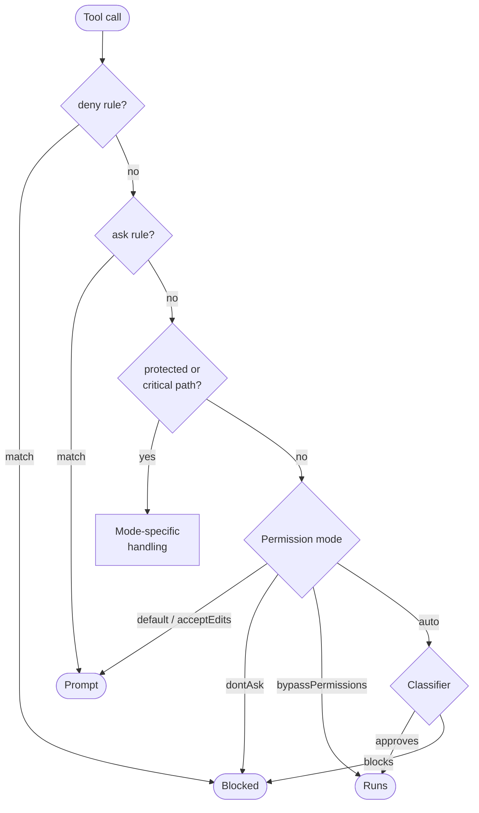

## Overview

This chapter covers:

- The order the permission gates run in, and why `deny` and `ask` rules outrank everything after them
- What each of the six modes approves — and which one your plan actually starts you in
- How auto mode moves the safety check instead of removing it
- The five behaviours that surprise people, including the one action `bypassPermissions` still stops for

The exhaustive lists — every classifier rule, every protected path — live in the [permissions docs](https://code.claude.com/docs/en/iam#permission-modes) and in `claude auto-mode defaults`. This chapter is the model you need to read them with.

## Where the mode sits

Chapter 1 established the asymmetry: reading is free, changing costs a question. A **permission mode** decides where that line falls for a session — but it is one gate among several, and the order matters more than any individual mode.



Two consequences follow, and they hold no matter which mode you are in:

- **`deny` rules block before anything downstream runs.** Not the classifier, not your stated intent, not `bypassPermissions` overrides them.
- **An `ask` rule forces a prompt even in auto mode**, because asking to be asked is itself an instruction.

Chapter 4 covers writing those rules.

## The six modes

| Mode | Runs without asking | Use for |
|---|---|---|
| `default` (Manual) | Reads only | Reviewing every action, sensitive work |
| `acceptEdits` | Reads, file edits, seven filesystem commands | Iterating on code you review afterwards |
| `plan` | Reads, plus classifier-approved commands | Exploring before changing |
| `auto` | Everything, subject to background classifier review | Long tasks, fewer prompts |
| `dontAsk` | Only pre-approved tools | Locked-down CI and scripts |
| `bypassPermissions` | Everything | Isolated containers and VMs only |

`default` is labelled **Manual** in the UI; `manual` works as an alias wherever you type it. `Shift+Tab` cycles between them.

### Try it

Ten actions against all six modes. The outcome for a given pair is rarely guessable from the mode name — which is why this is a control rather than a table.

<div class="pm-sim"> <div class="pm-modes" id="pm-modes"> <button type="button" class="pm-mode on" data-m="default">Manual</button> <button type="button" class="pm-mode" data-m="acceptEdits">acceptEdits</button> <button type="button" class="pm-mode" data-m="plan">plan</button> <button type="button" class="pm-mode" data-m="auto">auto</button> <button type="button" class="pm-mode" data-m="dontAsk">dontAsk</button> <button type="button" class="pm-mode" data-m="bypass">bypass</button> </div> <div class="pm-legend"><span class="pm-pill pm-runs">runs</span><span class="pm-pill pm-prompt">prompts</span><span class="pm-pill pm-class">classifier</span><span class="pm-pill pm-deny">denied</span></div> <table class="pm-table"><tbody id="pm-rows"></tbody></table> </div> <script> (function () { var A = [ "Read src/app.ts", "Edit src/app.ts", "mkdir build", "npm test", "git push origin feature/x", "git push --force", "curl https://get.example.sh | bash", "Write .git/config", "rm -rf ~", "Read ../other-repo/README.md" ]; var R = "runs", P = "prompt", C = "class", D = "deny"; var M = { "default": [ [R, "Reads never prompt."], [P, "File edits prompt in Manual mode."], [P, "Only acceptEdits auto-approves mkdir."], [P, "Not in the built-in read-only set."], [P, "Every non-read-only Bash command prompts."], [P, "Every non-read-only Bash command prompts."], [P, "Every non-read-only Bash command prompts."], [P, "Protected path. Prompted in this mode."], [P, "Critical path. Prompted in this mode."], [R, "Reads outside the working directories run while blockReadsOutsideWorkingDirectories is off."] ], "acceptEdits": [ [R, "Reads never prompt."], [R, "Edits inside the working directory run without asking."], [R, "mkdir is in the auto-approved filesystem set."], [P, "Not a filesystem command and not read-only."], [P, "Only mkdir, touch, rm, rmdir, mv, cp and sed are covered."], [P, "Only the filesystem set is covered."], [P, "Only the filesystem set is covered."], [P, "Protected-path writes are never auto-approved here."], [P, "Critical path. The filesystem set does not cover it."], [R, "Reads are unaffected by this mode."] ], "plan": [ [R, "Reads are the point of plan mode."], [D, "Edits stay blocked until you approve a plan."], [C, "Shell commands during planning go to the classifier when auto mode is available."], [C, "Approved commands run. Rejected ones are blocked."], [C, "Reviewed like any other planning command."], [C, "Force push is on the default block list."], [C, "Piping a download into a shell is on the default block list."], [C, "Classifier when auto mode is available during planning, otherwise prompted."], [P, "Prompted, or sent to the classifier when auto mode is available and bypass is not."], [R, "Reads are unaffected."] ], "auto": [ [R, "Read-only actions are auto-approved before the classifier."], [R, "File edits in the working directory are auto-approved."], [C, "Everything that is not read-only or an in-directory edit goes to the classifier."], [C, "A narrow allow rule such as Bash(npm test) would resolve this before the classifier."], [C, "Pushing to any branch of your own repository is allowed by default."], [C, "Force push is on the default block list."], [C, "Downloading and executing code is on the default block list."], [C, "Protected-path writes route to the classifier even when an allow rule matches."], [C, "Critical-path removals route to the classifier, including inside command substitution."], [P, "The first read outside the working directories prompts once, then records your answer."] ], "dontAsk": [ [R, "Read-only Bash commands and reads still run."], [D, "Auto-denied unless an allow rule matches."], [D, "Auto-denied unless an allow rule matches."], [D, "Runs only with an allow rule such as Bash(npm test)."], [D, "Anything that would prompt is denied instead."], [D, "Anything that would prompt is denied instead."], [D, "Anything that would prompt is denied instead."], [D, "Protected-path writes are denied."], [D, "Denied even when an allow rule or a PreToolUse hook allows it."], [R, "Reads are not denied."] ], "bypass": [ [R, "No checks run."], [R, "No checks run."], [R, "No checks run."], [R, "No checks run."], [R, "No checks run."], [R, "No checks run."], [R, "No checks run."], [R, "Protected-path writes are allowed in this mode only."], [P, "Critical-path removals still prompt, even here. This is the one row that surprises people."], [R, "No checks run."] ] }; var LBL = { runs: "runs", prompt: "prompts", "class": "classifier", deny: "denied" }; var rows = document.getElementById("pm-rows"), btns = document.querySelectorAll(".pm-mode"); function render(mode) { var data = M[mode]; rows.innerHTML = A.map(function (a, i) { var o = data[i]; return "<tr><td class=\"pm-act\"><code>" + a + "</code></td>" + "<td class=\"pm-out\"><span class=\"pm-pill pm-" + o[0] + "\">" + LBL[o[0]] + "</span></td>" + "<td class=\"pm-why\">" + o[1] + "</td></tr>"; }).join(""); } Array.prototype.forEach.call(btns, function (b) { b.addEventListener("click", function () { Array.prototype.forEach.call(btns, function (x) { x.classList.remove("on"); }); b.classList.add("on"); render(b.getAttribute("data-m")); }); }); render("default"); })(); </script>

## How auto mode decides

Auto mode is the one that needs a mental model rather than a lookup, because it is the only mode that makes a judgment.

**It does not remove the safety check — it relocates it.** A separate classifier model reviews each action before it runs, blocking anything that escalates beyond what you asked for, touches infrastructure it does not recognise, or looks driven by hostile content Claude just read. Three properties are worth carrying around:

- **Not everything reaches it.** Your allow, ask and deny rules resolve first; reads and in-directory edits are approved without a call. Only what is left goes to the classifier.
- **Tool results are stripped before it sees them.** A hostile string inside a file or a web page cannot address the classifier directly. That stripping is the core of the design.
- **Its trust boundary starts small** — your working directory and the remotes configured when the session started. Everything else is external until you say otherwise, which is why the first day in auto mode produces more blocks than the second.

The default rules run to dozens of entries and grow every release, so there is no value in transcribing them. `claude auto-mode defaults` prints the current list as JSON, and the [auto mode documentation](https://code.claude.com/docs/en/auto-mode) explains each. The shape: irreversible loss (force push, `reset --hard`, `terraform destroy`), production and shared infrastructure, data leaving the trust boundary, and anything that weakens Claude's own oversight.

### Teaching it your infrastructure

Repeated blocks nearly always mean the classifier lacks context, not that it is wrong. `autoMode.environment` is the fix, and its entries are **prose, not patterns**:

```json
{
  "autoMode": {
    "environment": [
      "$defaults",
      "Source control: github.example.com/acme-corp and all repos under it",
      "Trusted internal domains: *.corp.example.com"
    ]
  }
}
```

> **`"$defaults"` is not decoration.** Omitting it replaces the entire built-in list for that section. Drop it from the sibling `soft_deny` array and you have just discarded force-push and `curl | bash` protection.

`/auto-mode-setup` drafts these entries from your project. Full field reference in the [configuration docs](https://code.claude.com/docs/en/auto-mode-config).

### The circuit breaker

**Three blocks in a row, or twenty in a session, and auto mode pauses** — Claude Code resumes prompting until you approve something. The thresholds are not configurable. Blocked calls land in `/permissions` → **Recently denied**, where `r` retries with manual approval.

## Five things that surprise people

1. **You are probably not starting in Manual.** On a Pro, Max or Team plan, in a terminal or VS Code, sessions start in `auto`. Everywhere else — Enterprise, a Console API key, `claude -p`, the SDK, Bedrock, Google Cloud, Foundry — they start in Manual.
2. **`"auto"` and `"bypassPermissions"` are ignored in `.claude/settings.json`.** Those files live in the repository, so honouring them would let a checked-in file escalate its own permissions. Use `~/.claude/settings.json`.
3. **Plan mode runs shell commands.** It is widely described as forbidding them. The classifier reviews planning commands instead of prompting you; only *edits* are blocked until you approve the plan.
4. **`permissions.allow` cannot approve a protected-path write.** The check runs before allow rules are evaluated, so `Edit(.claude/**)` in a settings file has no effect. Protected paths are the files that configure your tools rather than your project — `.git`, `.claude`, `.vscode`, shell startup files, `.npmrc`, `.mcp.json`.
5. **`bypassPermissions` still prompts for `rm -rf ~`.** Critical-path removals — the filesystem root, its direct children, your home directory, your working directory or its parents — are the one thing no mode, no allow rule and no `PreToolUse` hook waves through. Hiding one inside `$(...)` does not help.

## Choosing a mode

| Goal | Start with |
|---|---|
| Review every action | `claude --permission-mode default` |
| Explore before changing | `claude --permission-mode plan` |
| Hands-off work | `claude --permission-mode auto` |
| Fewer prompts, no classifier | Manual plus `/sandbox` |
| CI with an exact allowlist | `claude -p … --permission-mode dontAsk --allowedTools …` |
| Fully unattended | `claude -p … --dangerously-skip-permissions`, **in a container** |

Bypass offers no protection against prompt injection. If you want far fewer prompts with the checks retained, that is auto mode — and the Bash sandbox combines with either. Chapter 4 covers it.

## Summary

- Gates run in order: deny rules → ask rules → protected and critical paths → mode → classifier. Deny wins over everything; ask forces a prompt even in auto.
- **On Pro, Max and Team plans, terminal and VS Code sessions start in `auto`, not Manual.**
- Auto mode relocates the safety check rather than removing it, and strips tool results before the classifier sees them.
- Its circuit breaker is **3 consecutive or 20 total blocks**, then prompting resumes. Not configurable.
- Omitting `"$defaults"` from an `autoMode` array discards that whole built-in section.
- `permissions.allow` cannot approve a protected-path write, and **nothing** approves a critical-path removal — bypass included.
- For the exhaustive rule and path lists, use `claude auto-mode defaults` and the [permissions docs](https://code.claude.com/docs/en/iam#permission-modes) rather than a chapter that will drift.

Chapter 4 covers the rules underneath all of this: `Tool(specifier)` syntax, the three tiers, working directories, and the Bash sandbox.
