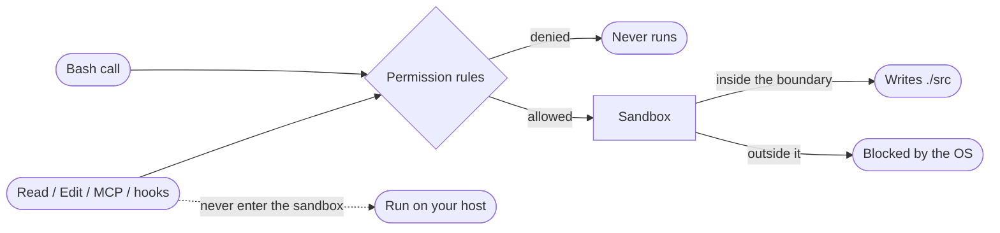

## Overview

This chapter covers:

- The three rule tiers, and why a deny rule cannot carry allowlist exceptions
- `Tool(specifier)` syntax — and the wildcard placement that quietly turns a rule for one command into a rule for every command that program offers
- Why a path rule means something different depending on which settings file you wrote it in
- What `--add-dir` grants that `additionalDirectories` does not
- Where the Bash sandbox draws an OS-level boundary, and the three things it does not cover

## Rules decide whether; the sandbox decides what

Chapter 3 was the mode layer — one dial for the whole session. This chapter is the two layers either side of it, and they answer different questions:

| Layer | Question | Enforced by | Covers |
|---|---|---|---|
| Permission rules | Does this tool call happen at all? | Claude Code, before the call | Every tool — Bash, Read, Edit, WebFetch, MCP |
| The Bash sandbox | What can it touch once it runs? | The operating system | Bash commands and their child processes |



The distinction matters most when it fails. A `Read(./.env)` deny rule stops Claude reading your secrets with the Read tool, with `cat`, and through a `< .env` redirect — because Claude Code recognises all three. It does **not** stop `python -c "print(open('.env').read())"`, because that is an arbitrary subprocess doing its own file I/O. Only an OS boundary stops that.

## The three tiers

| Tier | Effect |
|---|---|
| `allow` | Runs without a prompt |
| `ask` | Prompts, always |
| `deny` | Blocked |

**Rules are evaluated deny → ask → allow, and the first match wins. Specificity is not consulted.** That one sentence has a consequence people repeatedly design around and lose to:

```json
{
  "permissions": {
    "deny":  ["Bash(aws *)"],
    "allow": ["Bash(aws s3 ls)"]
  }
}
```

`aws s3 ls` is blocked. The deny matched first, and the narrower allow never gets a look in. **A deny rule cannot carry exceptions.** The same holds between ask and allow — a matching ask rule prompts even when a more specific allow rule also matches.

The same ordering applies *across* settings scopes, not just within one file. A user-level deny beats a project-level allow, and a managed deny beats `--allowedTools` on the command line. Deny is absolute in every direction.

One more distinction worth internalising, because it changes what Claude even knows exists:

- **A bare tool name in `deny`** — `"Bash"` — removes the tool from Claude's context entirely. It never sees it.
- **A scoped rule** — `"Bash(rm *)"` — leaves the tool available and blocks matching calls when Claude tries them.

## Rule syntax

Every rule is `Tool` or `Tool(specifier)`. Parentheses inside the specifier are literal, so a path like `Edit(./Finance (2024)/**)` needs no escaping.

### Bash: where you put the `*`

Bash rules match against the whole command text, with `*` standing in for any text. The placement is the entire game:

| You write | Matches | Doesn't match |
|---|---|---|
| `Bash(npm run build)` | `npm run build` | `npm run build --watch` |
| `Bash(npm run *)` | `npm run build`, `npm run test --watch`, `npm run` | `npm install` |
| `Bash(git log *)` | `git log --oneline main`, `git log -5 main` | `git push origin main` |
| `Bash(git * main)` | `git merge main`, `git push origin main` | `git log` |
| `Bash(ls *)` | `ls -la`, `ls` | `lsof` |
| `Bash(ls*)` | `ls -la`, `lsof` | |

Three rules produce that table:

- **The `*` stands in for whatever is in its place.** In `Bash(git * main)` it stands in for the subcommand, so the rule covers *every* git subcommand — including `-c`, which makes git run a program you name. Claude Code warns at startup about an allow rule with a `*` before the subcommand, and that warning is worth reading rather than dismissing.
- **A trailing `*` with a space before it also matches the bare command.** `Bash(ls *)` matches plain `ls`. That holds only when the trailing `*` is the rule's only wildcard.
- **The space before a trailing `*` is part of the rule.** `Bash(ls *)` requires a space, so `lsof` misses. `Bash(ls*)` has no space, so `lsof` matches.

The `:*` suffix is an equivalent spelling of a trailing wildcard — `Bash(ls:*)` is `Bash(ls *)` — but it is only recognised at the end. In `Bash(git:* push)` the colon is a literal character and matches nothing.

### Compound commands and wrappers

Claude Code parses shell structure rather than matching the raw string, which cuts both ways.

**Separators split the command**: `&&`, `||`, `;`, `|`, `|&`, `&`, and newlines. An allow rule must match *every* subcommand — `Bash(safe-cmd *)` does not approve `safe-cmd && other-cmd`. A deny or ask rule fires if *any* subcommand matches, including one nested in a subshell or command substitution, so `Bash(git clean *)` in `ask` still prompts for `echo "$(git clean -f)"`.

**Wrappers are stripped before matching**, so `Bash(npm test *)` also matches `timeout 30 npm test`. The list is fixed and not configurable: `timeout`, `time`, `nice`, `nohup`, `stdbuf`, the builtins `command` and `builtin`, zsh's `noglob`, and bare `xargs` with no flags.

> **What is not on that list is the trap.** `direnv exec`, `devbox run`, `mise exec`, `npx` and `docker exec` all run their arguments as a command, but Claude Code does not strip them — so `Bash(devbox run *)` matches whatever follows `run`, up to and including `devbox run rm -rf .`. Write the runner and the inner command together instead: `Bash(devbox run npm test)`, one rule per inner command.

### Read and Edit: four anchors

Path rules use gitignore syntax, and the leading characters decide where the pattern is anchored:

| Pattern | Anchored at | Example |
|---|---|---|
| `//path` | The filesystem root | `Read(//Users/alice/secrets/**)` |
| `~/path` | Your home directory | `Read(~/.zshrc)` |
| `/path` | **The settings file the rule lives in** | `Edit(/src/**)` |
| `path`, `./path` | The current directory | `Read(*.env)` |

The third row is the one that surprises everyone. **A single leading slash is not an absolute path.** `Read(/secrets/**)` written in `~/.claude/settings.json` matches `~/.claude/secrets/**` — not `/secrets`, and not your project's `secrets/` directory. For a rule in user settings that should apply inside every project, use `//` or `~/` instead.

Two more asymmetries worth carrying:

- **Depth depends on the tier.** `Edit(src/**)` as an *allow* rule matches only `<cwd>/src`. The same pattern as a *deny* rule matches a `src` directory at any depth, including `vendor/pkg/src`. Deny rules reach further on purpose.
- **Symlinks are checked twice**, on the link and on its target. An allow rule needs both to match; a deny rule fires if *either* does. A symlink inside an allowed directory pointing at `~/.ssh/id_rsa` is blocked, which is the behaviour you want.

Rules for `Write`, `NotebookEdit`, `Glob` or `MultiEdit` paths are accepted and then **never consulted** — Claude Code checks file access against `Edit(...)` and `Read(...)` only. It warns at startup. Use `Edit(docs/**)` where you were reaching for `Write(docs/**)`.

### Match a rule against a command

Edit either field, or load one of the pairs underneath. It models the documented Bash matching rules — separators, wrapper stripping, wildcard placement — rather than being the real matcher, so treat a surprising verdict as a prompt to check the docs.

<div class="rm-box"> <div class="rm-tiers"><button type="button" class="rm-tier on" data-t="allow">allow rule</button><button type="button" class="rm-tier" data-t="deny">deny / ask rule</button></div> <label class="rm-lbl" for="rm-rule">Rule</label> <input type="text" id="rm-rule" class="rm-in" spellcheck="false" value="Bash(git log *)" /> <label class="rm-lbl" for="rm-cmd">Command Claude wants to run</label> <input type="text" id="rm-cmd" class="rm-in" spellcheck="false" value="git log --oneline main" /> <div class="rm-verdict" id="rm-verdict"></div> <div class="rm-steps" id="rm-steps"></div> <div class="rm-presets" id="rm-presets"></div> </div> <script> (function () { var WRAPPERS = ["timeout", "time", "nice", "nohup", "stdbuf", "command", "builtin", "noglob"]; var SEPS = /\s*(?:&&|\|\||\|&|;|\||&|\n)\s*/; var PRESETS = [ { t: "allow", r: "Bash(git log *)", c: "git log --oneline main" }, { t: "allow", r: "Bash(git * main)", c: "git push origin main" }, { t: "allow", r: "Bash(npm run build)", c: "npm run build --watch" }, { t: "allow", r: "Bash(ls *)", c: "lsof" }, { t: "allow", r: "Bash(ls*)", c: "lsof" }, { t: "allow", r: "Bash(npm test *)", c: "timeout 30 npm test" }, { t: "allow", r: "Bash(devbox run *)", c: "devbox run rm -rf ." }, { t: "allow", r: "Bash(safe-cmd *)", c: "safe-cmd && rm -rf /" }, { t: "deny", r: "Bash(git clean *)", c: "echo \"$(git clean -f)\"" } ]; var tier = "allow"; var ruleEl = document.getElementById("rm-rule"), cmdEl = document.getElementById("rm-cmd"); var vEl = document.getElementById("rm-verdict"), sEl = document.getElementById("rm-steps"); var tiers = document.querySelectorAll(".rm-tier"); function esc(s) { return s.replace(/[&<>"]/g, function (c) { return { "&": "&amp;", "<": "&lt;", ">": "&gt;", "\"": "&quot;" }[c]; }); } function parseRule(raw) { var m = raw.trim().match(/^([A-Za-z_][A-Za-z0-9_]*)\s*(?:\((.*)\)\s*)?$/); if (!m) return null; return { tool: m[1], spec: m[2] === undefined ? null : m[2] }; } function stripWrappers(cmd) { var notes = [], guard = 0; while (guard++ < 6) { var t = cmd.trim(), w = t.split(/\s+/)[0]; if (/^[A-Za-z_][A-Za-z0-9_]*=/.test(w)) { cmd = t.slice(w.length).trim(); notes.push("dropped the leading assignment " + w); continue; } if (w === "xargs") { var rest = t.slice(5).trim(); if (rest.charAt(0) === "-") break; cmd = rest; notes.push("stripped bare xargs"); continue; } if (WRAPPERS.indexOf(w) !== -1) { var rest2 = t.slice(w.length).trim(), tok; /* timeout takes a duration and nice takes -n N before the real command. */ while ((tok = rest2.split(/\s+/)[0]) && (/^-/.test(tok) || /^\d+(?:\.\d+)?[smhd]?$/.test(tok))) { rest2 = rest2.slice(tok.length).trim(); } cmd = rest2; notes.push("stripped the wrapper " + w); continue; } break; } return { cmd: cmd.trim(), notes: notes }; } function subcommands(cmd) { var inner = [], re = /\$\(([^()]*)\)|`([^`]*)`/g, m; while ((m = re.exec(cmd)) !== null) { inner.push((m[1] || m[2]).trim()); } var outer = cmd.replace(re, "").split(SEPS); var all = outer.concat(inner).map(function (s) { return s.trim(); }).filter(Boolean); return { parts: all, nested: inner.length > 0 }; } function toRegex(spec) { var p = spec; if (/:\*$/.test(p)) p = p.slice(0, -2) + " *"; var body = p.replace(/[.+?^${}()|[\]\\]/g, "\\$&").replace(/\*/g, "[\\s\\S]*"); var re = new RegExp("^" + body + "$"); var bare = null; if (/ \*$/.test(p) && (p.match(/\*/g) || []).length === 1) { bare = new RegExp("^" + p.slice(0, -2).replace(/[.+?^${}()|[\]\\*]/g, "\\$&") + "$"); } return { re: re, bare: bare, normalised: p }; } function run() { var rule = parseRule(ruleEl.value), cmdRaw = cmdEl.value.trim(); sEl.innerHTML = ""; if (!rule) { vEl.className = "rm-verdict rm-bad"; vEl.textContent = "That is not a rule. Write Tool or Tool(specifier)."; return; } if (rule.tool !== "Bash") { vEl.className = "rm-verdict rm-warn"; vEl.textContent = "This matcher models Bash rules only. " + esc(rule.tool) + " rules use their own specifier syntax."; return; } if (!cmdRaw) { vEl.className = "rm-verdict rm-warn"; vEl.textContent = "Type a command."; return; } var steps = []; if (rule.spec === null || rule.spec === "*") { vEl.className = "rm-verdict rm-good"; vEl.textContent = "Matches — a bare Bash rule covers every command."; sEl.innerHTML = "<p class=\"rm-step\">In <code>deny</code>, this form also removes the Bash tool from Claude's context entirely.</p>"; return; } var sub = subcommands(cmdRaw); if (sub.parts.length > 1) { steps.push("Split into " + sub.parts.length + " subcommands" + (sub.nested ? ", including one inside a substitution" : "") + "."); } var pat = toRegex(rule.spec); if (pat.normalised !== rule.spec) { steps.push("<code>:*</code> is a trailing wildcard, so the rule reads <code>" + esc(pat.normalised) + "</code>."); } var results = sub.parts.map(function (part) { var st = stripWrappers(part); var hit = pat.re.test(st.cmd) || (pat.bare && pat.bare.test(st.cmd)); return { raw: part, eff: st.cmd, notes: st.notes, hit: hit }; }); var hits = results.filter(function (r) { return r.hit; }).length; var ok = tier === "allow" ? hits === results.length : hits > 0; results.forEach(function (r) { var line = "<code>" + esc(r.raw) + "</code> " + (r.hit ? "<span class=\"rm-y\">matches</span>" : "<span class=\"rm-n\">does not match</span>"); if (r.notes.length) { line += " <span class=\"rm-note\">(" + r.notes.join("; ") + ")</span>"; } steps.push(line); }); if (tier === "allow") { steps.push("An <strong>allow</strong> rule must match <em>every</em> subcommand."); } else { steps.push("A <strong>deny</strong> or <strong>ask</strong> rule fires when <em>any</em> subcommand matches, nested ones included."); } vEl.className = "rm-verdict " + (ok ? (tier === "allow" ? "rm-good" : "rm-bad") : "rm-warn"); vEl.textContent = ok ? (tier === "allow" ? "Runs without a prompt." : "Blocked, or prompted for an ask rule.") : (tier === "allow" ? "No match — this still goes through the normal permission flow." : "No match — the rule does not apply to this command."); sEl.innerHTML = steps.map(function (s) { return "<p class=\"rm-step\">" + s + "</p>"; }).join(""); } document.getElementById("rm-presets").innerHTML = PRESETS.map(function (p, i) { return "<button type=\"button\" class=\"rm-preset\" data-i=\"" + i + "\"><code>" + esc(p.r) + "</code> vs <code>" + esc(p.c) + "</code></button>"; }).join(""); Array.prototype.forEach.call(document.querySelectorAll(".rm-preset"), function (b) { b.addEventListener("click", function () { var p = PRESETS[+b.getAttribute("data-i")]; tier = p.t; ruleEl.value = p.r; cmdEl.value = p.c; Array.prototype.forEach.call(tiers, function (x) { x.classList.toggle("on", x.getAttribute("data-t") === tier); }); run(); }); }); Array.prototype.forEach.call(tiers, function (b) { b.addEventListener("click", function () { tier = b.getAttribute("data-t"); Array.prototype.forEach.call(tiers, function (x) { x.classList.remove("on"); }); b.classList.add("on"); run(); }); }); ruleEl.addEventListener("input", run); cmdEl.addEventListener("input", run); run(); })(); </script>

## Where rules live

Rules follow the normal settings precedence, with one override: **deny wins from any scope**.

| Source | Notes |
|---|---|
| Managed settings | Highest. Nothing overrides it, including CLI flags |
| `~/.claude/settings.json` | Your rules, every project |
| `.claude/settings.json` | Project rules, checked in |
| `.claude/settings.local.json` | Where "don't ask again" saves rules |
| `--allowedTools` / `--disallowedTools` | This run only |

`/permissions` lists every rule and the file it came from, which is the fastest way to answer "why did that prompt". Since v2.1.234 you can open it while Claude is working and the change lands on the next tool call.

**Project allow rules need workspace trust.** `permissions.allow` and `additionalDirectories` in a repository's `.claude/settings.json` grant capability, so Claude Code holds them until you accept the trust dialog for that folder — which lists what it would grant. `deny` and `ask` rules are not gated, because they only restrict. A `claude -p` or SDK run never shows the dialog, so it never applies those allow rules and prints a warning to stderr instead.

## Working directories

Claude starts with access to the directory you launched it in. Three ways to widen that: `--add-dir <path>` at startup, `/add-dir` mid-session, or `additionalDirectories` in settings.

They are not equivalent, and the difference is easy to miss:

| Added via | File access | Skills, commands, subagents |
|---|---|---|
| `--add-dir` / `/add-dir` | Yes | **Loaded** |
| `permissions.additionalDirectories` | Yes | Not loaded |

**Adding a directory extends where Claude can read and edit. It does not make that directory a configuration root** — with the exception above, most `.claude/` configuration is not discovered from added directories. `CLAUDE.md` from an added directory loads only when `CLAUDE_CODE_ADDITIONAL_DIRECTORIES_CLAUDE_MD=1` is set.

`/cd <path>` is different again: it *moves* the session, keeping the conversation but adopting the new directory's settings, hooks, MCP servers, plugins and `CLAUDE.md`. Restrict where it can go with `Cd` rules, which unlike other rules apply only when *you* run `/cd` — Claude cannot call it.

## The Bash sandbox

Everything so far is Claude Code deciding whether to make a call. The sandbox is the operating system deciding what that call can reach: Seatbelt on macOS, [bubblewrap](https://github.com/containers/bubblewrap) on Linux and WSL2. Native Windows is not supported; run it inside WSL2.

`/sandbox` opens the panel and tells you what is missing. The default boundary:

- **Writes** — the working directory, directories you added, and the session temp directory. Nothing else, including `~/.bashrc` and `/bin`.
- **Reads** — the whole machine, minus a denied set. **That still includes `~/.aws/credentials` and `~/.ssh/`**, so use `sandbox.credentials` or `denyRead` if that matters to you.
- **Network** — nothing is pre-allowed. The first command needing a host prompts, or goes to the classifier in auto mode. Pre-allow with `allowedDomains`, and note that `WebFetch(domain:...)` allow rules feed the same list.

```json
{
  "sandbox": {
    "enabled": true,
    "filesystem": {
      "allowWrite": ["~/.kube", "/tmp/build"],
      "denyRead": ["~/"],
      "allowRead": ["."]
    }
  }
}
```

> Sandbox paths use ordinary conventions — `/tmp/build` is absolute. This is **not** the anchoring scheme that Read and Edit rules use, where `//` means the filesystem root. The two syntaxes sit in the same settings file and mean different things.

### Auto-allow mode

The mode that changes your day. When a command can be sandboxed it runs without asking, because the OS boundary substitutes for the prompt. It works independently of your permission mode — sandboxed Bash commands that modify files run without prompting even in Manual mode, where the Edit tool would still ask.

What survives it: explicit deny rules, content-scoped ask rules like `Bash(git push *)`, and critical-path removals. Plan mode is the exception where auto-allow does not widen approvals.

Commands that cannot be sandboxed fall back to the normal permission flow. Claude may retry them with `dangerouslyDisableSandbox`, which runs outside the boundary and is gated normally — set `"allowUnsandboxedCommands": false` to remove that escape hatch entirely.

### What the sandbox does not cover

Three gaps, and they are the reason the sandbox is not sufficient for unattended work on its own:

1. **Only Bash.** Read, Edit and WebFetch run inside the Claude Code process, gated by permission rules rather than the OS.
2. **MCP servers and hooks are separate processes running unconstrained on your host.**
3. **TLS is not inspected by default.** The proxy allows or denies on the client-supplied hostname, so a broad entry like `github.com` leaves room for domain fronting. `network.tlsTerminate` is experimental.

Inside the sandbox there is also a second protected-path list — distinct from Chapter 3's — covering `.claude` settings, `.mcp.json`, `.git/hooks`, shell startup files. A running command could otherwise grant itself permissions or install a hook that runs *outside* the boundary next session. **No `allowWrite` entry lifts it.**

## Choosing an isolation boundary

| Approach | What is isolated | Docker |
|---|---|---|
| Bash sandbox | Bash commands and children | No |
| Sandbox runtime | The whole process — file tools, MCP, hooks | No |
| Dev container | Full dev environment | Yes |
| VM | Full operating system | No |
| Claude Code on the web | Full OS, Anthropic-managed | No |

The rule of thumb: **auto mode is a per-action control, the sandbox is a boundary, and `--dangerously-skip-permissions` needs a real one.** Because file tools, MCP servers and hooks sit outside the Bash sandbox, bypass sessions belong in a container, a VM, or the [sandbox runtime](https://github.com/anthropic-experimental/sandbox-runtime) — as a non-root user, which Claude Code enforces by refusing to start as root with that flag.

## Summary

- Rules decide **whether** a call happens; the sandbox decides **what it can touch**. Neither substitutes for the other.
- Evaluation is **deny → ask → allow, first match wins**, across scopes as well as within a file. A deny rule cannot carry allowlist exceptions.
- **Put the `*` after the subcommand.** `Bash(git * main)` allows every git subcommand, `-c` included.
- Wrapper stripping does not cover `npx`, `docker exec` or `devbox run`, so `Bash(devbox run *)` is a rule for arbitrary commands.
- **`/path` anchors at the settings file, not the filesystem root.** Use `//` for absolute.
- `Edit(src/**)` matches at one depth as an allow rule and at any depth as a deny rule.
- `--add-dir` loads skills, commands and subagents; `additionalDirectories` grants file access only.
- The sandbox reads your credential files by default, covers only Bash, and does not inspect TLS.
- Full reference: [permissions](https://code.claude.com/docs/en/permissions), [sandboxing](https://code.claude.com/docs/en/sandboxing), [sandbox environments](https://code.claude.com/docs/en/sandbox-environments).

That closes Part 1. Part 2 turns to context engineering, starting with settings — the four scopes, their precedence, and `/status` as the debugger for all of it.
