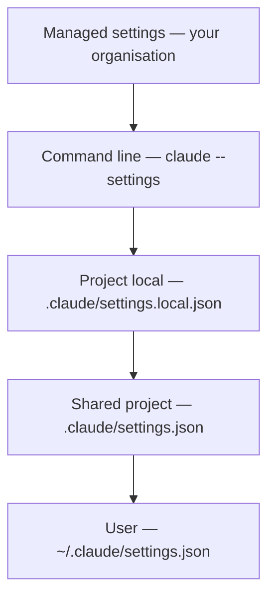

## Overview

This chapter covers:

- Four settings files, what each one reaches, and which of them your teammates get
- The precedence stack — and the three kinds of key that do not obey it
- Why environment variables are not a level, and are decided pair by pair
- Which edits reach a running session and which wait for a restart
- The checklist for "I set this and nothing happened"

## Four files

| Scope | File | Reaches |
|---|---|---|
| User | `~/.claude/settings.json` | You, every project on this machine |
| Shared project | `.claude/settings.json` | Everyone working in that folder — commit it |
| Project local | `.claude/settings.local.json` | You, that one project |
| Managed | `managed-settings.json`, MDM, or the claude.ai console | Everyone your organisation deploys it to |

**Installing Claude Code creates none of them.** The user file appears the first time you change something in `/config`; the local file appears the first time you answer "Yes, and don't ask again" on a permission prompt.

Two properties of the local file are worth knowing before you go looking for it:

- **Claude Code writes it, and keeps it out of git for you.** The first time it writes the file in a repository that does not already ignore it, it adds `**/.claude/settings.local.json` to your *global* git excludes. Create the file by hand and that never happens — gitignore it yourself.
- **In a repository, it lives at the root.** Start a session in a subdirectory and Claude Code still reads and writes the root file, so an approval you give in `packages/api` applies repository-wide. Before v2.1.211 it stayed in the starting directory.

There is a fifth file, `~/.claude.json`, that Claude Code maintains for itself — sign-in, MCP servers, per-project trust decisions. You don't edit it.

Settings files are **strict JSON**. A `//` comment or a trailing comma is a syntax error, and the file is reported as a Settings Error at the next start. Add `"$schema": "https://json.schemastore.org/claude-code-settings.json"` at the top for autocomplete and validation in your editor.

## Precedence

When the same key appears in more than one file, the highest level that sets it wins.



Read it top-down: **managed beats the command line, which beats project local, which beats shared project, which beats user.** The two that catch people out are next to each other in that list — your team's committed `.claude/settings.json` outranks your personal `~/.claude/settings.json`, and the way to get your own value back is `.claude/settings.local.json`, not the user file.

Managed is absolute. `--settings` does not override a managed key, and `--model` picks only from the models your organisation allows.

### Lists merge instead of overriding

`permissions.allow` set in three files does not resolve to one file's list — the entries combine. This is what makes shared and personal permission rules coexist: your team's file adds rules, yours adds more, and neither erases the other.

Model keys are the exception, because position carries meaning. `fallbackModel` is an ordered chain, so the highest file that defines it supplies the whole value. `availableModels` in managed settings replaces your entries rather than merging with them — that is the key an administrator uses to actually constrain model choice, not `model`.

### Resolve a key

<div class="sp-box"> <div class="sp-keys" id="sp-keys"></div> <p class="sp-hint" id="sp-hint"></p> <table class="sp-table"><tbody id="sp-rows"></tbody></table> <div class="sp-result" id="sp-result"></div> <p class="sp-why" id="sp-why"></p> </div> <script> (function () { var LEVELS = [ { id: "managed", name: "Managed", file: "managed-settings.json" }, { id: "cli", name: "Command line", file: "claude --settings" }, { id: "local", name: "Project local", file: ".claude/settings.local.json" }, { id: "project", name: "Shared project", file: ".claude/settings.json" }, { id: "user", name: "User", file: "~/.claude/settings.json" } ]; var KEYS = { "model": { label: "model", mode: "normal", values: ["opus", "sonnet", "haiku"], hint: "An ordinary key. The highest level that sets it wins, and nothing below is consulted.", preset: { project: "sonnet", user: "opus" } }, "permissions.defaultMode": { label: "permissions.defaultMode", mode: "defaultMode", values: ["default", "plan", "auto"], hint: "Same stack, with one carve-out: \"auto\" and \"bypassPermissions\" do not take effect from a repository file.", preset: { local: "auto", user: "plan" } }, "permissions.allow": { label: "permissions.allow", mode: "merge", values: ["Bash(npm test)", "Bash(git commit *)", "Read(~/docs/**)"], hint: "A list key. Files do not compete — their entries combine.", preset: { project: "Bash(npm test)", user: "Bash(git commit *)" } }, "useAutoModeDuringPlan": { label: "useAutoModeDuringPlan", mode: "strict", values: ["true", "false"], hint: "A security key. The restrictive value wins from a lower scope, so here the stack runs backwards.", preset: { managed: "true", user: "false" } } }; var current = "model", state = {}; var keysEl = document.getElementById("sp-keys"), rowsEl = document.getElementById("sp-rows"); var hintEl = document.getElementById("sp-hint"), resEl = document.getElementById("sp-result"), whyEl = document.getElementById("sp-why"); function esc(s) { return String(s).replace(/[&<>"]/g, function (c) { return { "&": "&amp;", "<": "&lt;", ">": "&gt;", "\"": "&quot;" }[c]; }); } function loadKey(k) { current = k; state = {}; var p = KEYS[k].preset; for (var id in p) { state[id] = p[id]; } render(); } function resolve() { var spec = KEYS[current], set = LEVELS.filter(function (l) { return state[l.id]; }); if (!set.length) { return { value: null, winner: null, why: "No file sets this key, so Claude Code uses its built-in default." }; } if (spec.mode === "merge") { var vals = set.map(function (l) { return state[l.id]; }); return { value: vals.join("  +  "), winner: "*", merged: true, why: "Every entry applies. " + set.length + " files set the key and Claude Code combined them, so no file's rules were discarded." }; } if (spec.mode === "strict") { var strict = set.filter(function (l) { return state[l.id] === "false" && l.id !== "project"; })[0]; if (strict) { return { value: "false", winner: strict.id, why: "The restrictive value wins. <code>false</code> in " + strict.name + " settings is honoured over every higher level, including managed. A <code>false</code> in <code>.claude/settings.json</code> would be ignored — that one file cannot make the claim." }; } } for (var i = 0; i < LEVELS.length; i++) { var l = LEVELS[i], v = state[l.id]; if (!v) { continue; } if (spec.mode === "defaultMode" && v === "auto" && (l.id === "project" || l.id === "local")) { var rest = LEVELS.slice(i + 1).filter(function (x) { return state[x.id]; })[0]; return { value: rest ? state[rest.id] : "the built-in default", winner: rest ? rest.id : null, skipped: l.id, why: "<code>auto</code> is silently ignored in " + l.file + ". Both project files live in the repository, so honouring the value would let a checked-in file escalate its own permissions. Resolution continues below it." }; } return { value: v, winner: l.id, why: l.name + " is the highest level that sets this key" + (i < LEVELS.length - 1 ? ", so nothing below it is consulted." : ".") }; } return { value: null, winner: null, why: "" }; } function render() { var spec = KEYS[current]; keysEl.innerHTML = Object.keys(KEYS).map(function (k) { return "<button type=\"button\" class=\"sp-key" + (k === current ? " on" : "") + "\" data-k=\"" + esc(k) + "\">" + esc(KEYS[k].label) + "</button>"; }).join(""); hintEl.textContent = spec.hint; var r = resolve(); rowsEl.innerHTML = LEVELS.map(function (l) { var v = state[l.id] || ""; var cls = "sp-row"; if (r.winner === l.id || (r.merged && v)) { cls += " win"; } if (r.skipped === l.id) { cls += " skip"; } var opts = ["<option value=\"\">not set</option>"].concat(spec.values.map(function (o) { return "<option value=\"" + esc(o) + "\"" + (o === v ? " selected" : "") + ">" + esc(o) + "</option>"; })).join(""); return "<tr class=\"" + cls + "\"><td class=\"sp-lvl\"><strong>" + l.name + "</strong><code>" + esc(l.file) + "</code></td>" + "<td class=\"sp-val\"><select class=\"sp-sel\" data-l=\"" + l.id + "\">" + opts + "</select></td>" + "<td class=\"sp-mark\">" + (r.winner === l.id ? "wins" : (r.merged && v ? "applies" : (r.skipped === l.id ? "ignored" : ""))) + "</td></tr>"; }).join(""); resEl.innerHTML = r.value === null ? "<span class=\"sp-none\">no value</span>" : "<code>" + esc(current) + "</code> resolves to <strong>" + esc(r.value) + "</strong>"; whyEl.innerHTML = r.why; Array.prototype.forEach.call(keysEl.querySelectorAll(".sp-key"), function (b) { b.addEventListener("click", function () { loadKey(b.getAttribute("data-k")); }); }); Array.prototype.forEach.call(rowsEl.querySelectorAll(".sp-sel"), function (s) { s.addEventListener("change", function () { var id = s.getAttribute("data-l"); if (s.value) { state[id] = s.value; } else { delete state[id]; } render(); }); }); } loadKey("model"); })(); </script>

## Environment variables are not a level

They sit outside the stack entirely, and **each variable–key pair has its own rule**:

- `ANTHROPIC_MODEL` exported in your shell applies over the `model` key from *any* file.
- `ANTHROPIC_DEFAULT_MODEL` applies only when no file sets `model`.

Same subject, opposite behaviour. There is no general rule to memorise here; check the variable's row in the [environment variables reference](https://code.claude.com/docs/en/env-vars) for the pair you are setting.

An `env` block *inside* a settings file is an ordinary key and follows the normal stack. It is also the right place for variables background agents need — a shell export does not reach them.

```json
{
  "env": {
    "API_TIMEOUT_MS": "1200000",
    "HTTPS_PROXY": "http://proxy.corp.example.com:8080"
  }
}
```

## Changing a setting

Three routes, for three different intentions:

| Intention | Route |
|---|---|
| Change a personal option | `/config`, or `/config verbose=true` for one key |
| Set anything, durably | Edit the file for the scope you want |
| Try a value without saving | `claude --settings '{"model": "claude-opus-4-8"}'` |

`/config` lists a short set of personal options — theme, editor mode, verbose — not every key. It is not a view of your `settings.json`.

### Which edits reach a running session

Claude Code watches the settings files and reloads them, so most edits — `permissions`, `hooks`, credential helpers — apply without a restart. A few keys are read once at session start:

| Key | Change it with |
|---|---|
| `model` | `/model` |
| `effortLevel`, `modelSettings` | `/effort` |
| `outputStyle` | `/clear` or a restart — it is part of the system prompt |

Managed settings delivered by MDM or the console arrive on a schedule rather than on save, so restart before concluding a policy has not shipped.

## The debugger

Two commands, and they answer different questions:

- **`/status`** — the `Setting sources` line lists every file loaded for this session. It confirms *which files were read*. It does not say which file supplied a given key.
- **`claude doctor`** — lists the entries Claude Code *rejected*: malformed permission rules, unknown hook events, values the schema refused.

A broken file is not silent, but it degrades in three different ways worth telling apart. **Settings Error**: invalid JSON or a rejected value, and an interactive session offers to fix it. **Settings Warning**: individual entries failed and were skipped; the rest of the file is live. **Configuration error**: `~/.claude.json` cannot be parsed — Claude Code backs it up to `~/.claude/backups/` and offers a reset.

`claude -p` shows no dialog. It skips the broken file or values and continues, so a `-p` run that ignored your setting needs `claude doctor` to explain itself.

## When a setting doesn't apply

The checklist, in the order worth trying:

1. **A higher level sets it.** `/status` first, then the stack above.
2. **A variable or flag overrides it independently**, decided per pair.
3. **The file cannot set that value.** `permissions.defaultMode` values `auto` and `bypassPermissions` do not take effect from `.claude/settings.json` or `.claude/settings.local.json` — both live in the repository, so honouring them would let a checked-in file escalate its own permissions. User or managed settings, or `--permission-mode` for one session.
4. **A security key keeps its strict value.** For a short list — `disableClaudeAiConnectors`, `isolatePeerMachines`, `enableArtifact`, `crossSessionInbound`, `useAutoModeDuringPlan`, `syncClaudeAiSkills` — Claude Code honours the *restrictive* value from a lower scope, over managed. This is the one place the stack runs backwards, and it runs backwards on purpose.
5. **The key waits for trust.** `permissions.allow`, `additionalDirectories`, `extraKnownMarketplaces` and most `env` values from a committed file apply only after each teammate trusts the folder. `deny` and `ask` rules apply immediately.
6. **The file is broken.** `claude doctor`.

There is a related failure that looks like precedence and isn't: **a change you made inside Claude Code vanishes in new sessions.** `/model` and `/config` write to `~/.claude/settings.json`; if that file is read-only or generated by another tool, the change applies now and is gone next time. Set it in whatever generates the file.

## Cloud sessions read a different set

A session on [Claude Code on the web](https://code.claude.com/docs/en/claude-code-on-the-web) or `claude --cloud` runs on a fresh clone, not your machine:

| Source | Reaches a cloud session |
|---|---|
| `.claude/settings.json` | **Yes** — it is in the clone |
| `~/.claude/settings.json` | No |
| `.claude/settings.local.json` | No |
| Managed | Server-managed only, not a local `managed-settings.json` or MDM profile |

If a setting must hold in a cloud session, it belongs in the committed project file.

## Model configuration

The model is a setting like any other, with the usual four routes — `/model`, `--model`, the `model` key, `ANTHROPIC_MODEL` — plus aliases that track the current release rather than pinning a version:

| Alias | Resolves to |
|---|---|
| `default` | Your account's default — Opus 5 on Max and Enterprise, Sonnet 5 on Pro |
| `opus`, `sonnet`, `haiku` | The latest of each |
| `fable`, `best` | The latest Fable, for the hardest and longest tasks |
| `opusplan` | Opus while planning, Sonnet while executing |
| `opus[1m]`, `sonnet[1m]` | The same model with a 1M-token context window |

**Effort** is the separate dial — how much the model reasons per step — set with `/effort` or `--effort`, from `low` through `high` (the default) to `xhigh`, `max` and `ultracode`. `max` applies to the current session only unless you set it through the environment. Per-model defaults live in `modelSettings`:

```json
{
  "modelSettings": {
    "claude-opus-5":   { "effortLevel": "xhigh" },
    "claude-sonnet-5": { "effortLevel": "medium" }
  }
}
```

One behaviour that reads as a bug and isn't: **`claude --resume` keeps the model saved in the transcript**, ignoring your current default. Details and the rest of the model surface are in the [model configuration docs](https://code.claude.com/docs/en/model-config).

## Summary

- Four files. Precedence, highest first: **managed → command line → project local → shared project → user.**
- **Your team's committed file outranks your user file.** `.claude/settings.local.json` is how you get your own value back.
- Lists like `permissions.allow` **merge** across files rather than overriding. `fallbackModel` and a managed `availableModels` do not.
- Environment variables are not a level; each variable–key pair has its own rule. `ANTHROPIC_MODEL` beats any file, `ANTHROPIC_DEFAULT_MODEL` yields to one.
- Most edits reload into a running session; `model`, `effortLevel` and `outputStyle` do not.
- **`/status` says which files loaded, `claude doctor` says what was rejected.** Neither says which file supplied a key.
- A short list of security keys honours the *stricter* value from a lower scope, over managed.
- Cloud sessions read the committed project file and server-managed settings — nothing else from your machine.
- Full reference: [settings](https://code.claude.com/docs/en/settings), [every key](https://code.claude.com/docs/en/settings-reference), [example files](https://code.claude.com/docs/en/settings-example).

Chapter 6 is `CLAUDE.md` — the file that tells Claude how your project works, where it can live, and what never belongs in it.
