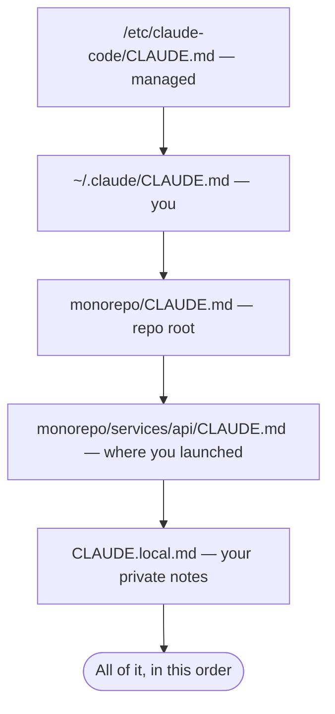

## Overview

This chapter covers:

- The trigger for writing something down: you typed the same correction twice
- Every location a `CLAUDE.md` can live, and how several of them combine rather than override
- `@path` imports, the four-hop limit, and the approval dialog that guards them
- Why "context, not configuration" is the property that explains every troubleshooting step
- The test that decides whether an instruction belongs in `CLAUDE.md`, a rule, a skill, or a hook

## The problem it solves

Every session starts with an empty context window. Whatever you explained yesterday — that the build is `pnpm`, that API handlers live in `src/api/handlers/`, that the integration tests need Redis running — is gone.

`CLAUDE.md` is the file you write once and Claude reads at the start of every session. The useful trigger for adding to it is behavioural rather than architectural:

- Claude made the same mistake a **second** time.
- You typed a correction you also typed last session.
- A review caught something Claude should have known about this codebase.
- A new teammate would need the same context to be productive.

That last one is the sharpest test, because it also tells you what to leave out. A new teammate can read your directory structure; they cannot guess that you deploy from `release/*` and never from `main`.

## Where it lives

Four scopes, listed in load order — broadest first, so the most specific instruction lands last:

| Scope | Location | Shared with |
|---|---|---|
| Managed policy | `/Library/Application Support/ClaudeCode/CLAUDE.md` (macOS), `/etc/claude-code/CLAUDE.md` (Linux, WSL) | Everyone in the organisation |
| User | `~/.claude/CLAUDE.md` | Just you, every project |
| Project | `./CLAUDE.md` or `./.claude/CLAUDE.md` | Your team, through source control |
| Local | `./CLAUDE.local.md` | Just you, this project — gitignore it |

An organisation can also put the content directly in `managed-settings.json` under `claudeMd`, and a managed file **cannot be excluded** by any personal setting.

### Several files, concatenated

This is the part that behaves differently from settings. In Chapter 5 the highest scope *won*. Here **nothing overrides anything** — every discovered file is concatenated into context.



Claude Code walks from your working directory **up** through every parent, then orders the content **root-first**, so instructions closest to where you launched are read last. Within a directory, `CLAUDE.local.md` is appended after `CLAUDE.md`.

Two consequences:

- **Contradictions are not resolved for you.** If a parent file says 4-space indent and yours says 2, Claude may pick either. Periodically re-read what actually loads.
- **Subdirectory files load on demand**, not at launch. A `CLAUDE.md` in `src/payments/` enters context when Claude reads a file there.

In a monorepo where other teams' files get swept up, `claudeMdExcludes` skips them by glob. Put it in `.claude/settings.local.json` so the exclusion stays yours:

```json
{
  "claudeMdExcludes": ["**/monorepo/other-team/**"]
}
```

`/context` is how you check what actually loaded — the **Memory files** list. `/memory` opens any of them for editing, including ones that don't exist yet.

## Imports

`@path/to/file` pulls another file in. Relative paths resolve against the file containing the import, not your working directory, and imports can nest **four hops deep**.

```text
See @README for the project overview and @package.json for the npm scripts.

- git workflow @docs/git-instructions.md
```

Two details that bite:

- **Import parsing skips code spans and fenced blocks.** To write `@README` without importing it, put it in backticks.
- **An import that resolves outside your working directory triggers an approval dialog**, once, listing the files. That guard exists because a project file is something *other people commit*. Imports in your own user-scope files are trusted without it.

**Imports do not save context.** The imported file is expanded and loaded at launch exactly as if you had pasted it. Splitting a large `CLAUDE.md` into imports buys organisation, not tokens. Path-scoped rules — Chapter 7 — are what actually reduce what loads.

### If your repo already has AGENTS.md

Claude Code reads `CLAUDE.md`, not `AGENTS.md`. Import it rather than duplicating it, and put Claude-specific additions underneath:

```markdown
@AGENTS.md

## Claude Code

Use plan mode for changes under `src/billing/`.
```

A symlink works too if you need nothing extra — though on Windows that requires Administrator or Developer Mode, so prefer the import. `/init` also reads Cursor and Copilot rule files and folds the relevant parts in.

## Writing instructions that land

`CLAUDE.md` is delivered as a user message after the system prompt. **It is context, not enforced configuration** — Claude reads it and tries to comply, and that is the whole ballgame. Every piece of advice below follows from that one fact.

**Size.** Target under 200 lines. Longer files consume more context *and* reduce adherence — the second effect is the one people miss. Claude Code loads a file up to 4 MiB and skips anything larger, but nothing about that limit is a target.

**Specificity.** Write what you could verify:

| Instead of | Write |
|---|---|
| "Format code properly" | "Use 2-space indentation" |
| "Test your changes" | "Run `npm test` before committing" |
| "Keep files organised" | "API handlers live in `src/api/handlers/`" |

**Structure.** Headers and bullets. Claude scans structure the way you do; a dense paragraph is harder to follow than a grouped list.

One small mechanic worth knowing: **block-level HTML comments are stripped before the content reaches context.** `<!-- maintainer note -->` costs you nothing, so notes to human maintainers are free.

### Where does this instruction belong?

`CLAUDE.md` is one of four mechanisms, and putting an instruction in the wrong one is the most common reason it doesn't take.

<div class="wb-box"> <div class="wb-list" id="wb-list"></div> <div class="wb-panel" id="wb-panel"></div> </div> <script> (function () { var DEST = { claudemd: { name: "CLAUDE.md", cls: "wb-c", note: "Always in context. Facts that hold for every session." }, rule: { name: "Path-scoped rule", cls: "wb-r", note: ".claude/rules/ with paths: frontmatter. Loads only when Claude touches matching files." }, skill: { name: "Skill", cls: "wb-s", note: "Loads when invoked or when Claude judges it relevant. For procedures." }, hook: { name: "Hook", cls: "wb-h", note: "A shell command at a fixed lifecycle event. Runs regardless of what Claude decides." } }; var ITEMS = [ { t: "Use pnpm, not npm", d: "claudemd", why: "A one-line fact that applies to every file in the project. This is exactly what CLAUDE.md is for.", fix: null }, { t: "Format code properly", d: "claudemd", why: "Right destination, wrong wording. An instruction you cannot verify is followed vaguely, because it gives Claude nothing to check itself against.", fix: "Use 2-space indentation. Run `prettier --write` on changed files." }, { t: "All API endpoints must validate input and return the standard error shape", d: "rule", why: "It only matters under src/api/. In CLAUDE.md it would cost context in every session that never opens an API file.", fix: "---\npaths:\n  - \"src/api/**/*.ts\"\n---\n\n- Validate input on every endpoint\n- Return the standard error shape" }, { t: "Never commit without running the test suite", d: "hook", why: "It has to happen at a specific moment. CLAUDE.md is context, so Claude can decide not to; a hook runs whatever Claude decides.", fix: "PreToolUse hook matching Bash(git commit *), exiting non-zero when the suite fails." }, { t: "How to cut a release: bump, tag, changelog, publish, announce", d: "skill", why: "A multi-step procedure needed a few times a month. In CLAUDE.md it burns context in every session for a task you rarely run.", fix: ".claude/skills/cut-a-release/SKILL.md — loads when you ask for a release." }, { t: "The project uses React, TypeScript and Vite", d: "claudemd", why: "Derivable from package.json, so it earns nothing. /doctor proposes cutting exactly this kind of line.", fix: "Cut it. Write what the code does not say: \"Vite dev server must run on 5173 — the OAuth callback is registered against that port.\"" }, { t: "Deploy from release/*, never from main", d: "claudemd", why: "The single best kind of entry: a convention that contradicts what the repository implies, and that a new teammate would get wrong.", fix: null }, { t: "Prefix every commit message with the ticket ID", d: "hook", why: "Workable in CLAUDE.md, reliable as a hook. If a rule must hold every time rather than usually, enforcement beats instruction.", fix: "CLAUDE.md if occasional drift is fine; a PreToolUse hook if it is not." } ]; var idx = 0; var listEl = document.getElementById("wb-list"), panEl = document.getElementById("wb-panel"); function esc(s) { return String(s).replace(/[&<>"]/g, function (c) { return { "&": "&amp;", "<": "&lt;", ">": "&gt;", "\"": "&quot;" }[c]; }); } function render() { listEl.innerHTML = ITEMS.map(function (it, i) { return "<button type=\"button\" class=\"wb-item" + (i === idx ? " on" : "") + "\" data-i=\"" + i + "\">" + esc(it.t) + "</button>"; }).join(""); var it = ITEMS[idx], d = DEST[it.d]; panEl.innerHTML = "<div class=\"wb-head\"><span class=\"wb-tag " + d.cls + "\">" + esc(d.name) + "</span>" + "<span class=\"wb-dnote\">" + esc(d.note) + "</span></div>" + "<p class=\"wb-why\">" + esc(it.why) + "</p>" + (it.fix ? "<div class=\"wb-fix\"><span class=\"wb-fixlbl\">Write it as</span><pre>" + esc(it.fix) + "</pre></div>" : "<p class=\"wb-ok\">Nothing to change — write it exactly like that.</p>"); Array.prototype.forEach.call(listEl.querySelectorAll(".wb-item"), function (b) { b.addEventListener("click", function () { idx = +b.getAttribute("data-i"); render(); }); }); } render(); })(); </script>

## Generating and maintaining it

`/init` analyses your codebase and writes a starting file — build commands, test instructions, discovered conventions. If one already exists it proposes improvements rather than overwriting. Set `CLAUDE_CODE_NEW_INIT=1` for an interactive flow that explores with a subagent, asks follow-up questions, and shows you a proposal before writing anything.

Then refine it with what `/init` *cannot* discover. A generated file describes your repository; the valuable half is the part that contradicts what the code implies.

`/doctor` proposes trims for a checked-in `CLAUDE.md`, and its heuristic is the right one to internalise: **cut what Claude can derive from the codebase** — directory layouts, dependency lists, architecture overviews — **and keep pitfalls, rationale, and conventions that differ from tool defaults.**

## When it isn't being followed

In order:

1. **Run `/context`.** If the file is not under **Memory files**, Claude cannot see it, and nothing else you try matters.
2. **Check the location is one that loads** for where you launched the session.
3. **Make it specific.** Vague instructions are followed vaguely.
4. **Look for a contradiction** across parent files, nested files and rules.

If none of that fixes it, the instruction may be in the wrong mechanism. Something that must happen at a specific moment — before every commit, after each edit — is a hook, because hooks run regardless of what Claude decides. For system-prompt-level instruction there is `--append-system-prompt`, though it must be passed every invocation, which suits scripts rather than interactive work.

> Debugging tip: the `InstructionsLoaded` hook logs exactly which instruction files loaded, when, and why. It is the only way to see path-scoped and lazily-loaded files resolve in real time.

### After `/compact`

A project-root `CLAUDE.md` **survives compaction** — Claude re-reads it from disk and re-injects it. Nested files and path-scoped rules reload as Claude touches matching files again.

So if an instruction vanished after a compact, it was almost certainly given **in conversation only**. That is the signal to write it down.

## Summary

- Write to `CLAUDE.md` when you correct the same thing twice, not when you think of something.
- Four scopes — managed, user, project, local — and unlike settings, they **concatenate rather than override**, ordered root-first with `CLAUDE.local.md` last.
- Subdirectory files load on demand when Claude reads files there.
- `@path` imports nest four deep, skip backticked text, and prompt once for anything resolving outside the working directory. **They do not reduce context.**
- **It is context, not configuration.** Under 200 lines, specific enough to verify, structured. HTML comments are free.
- Cut what Claude can derive from the code; keep what contradicts the defaults.
- `/context` says what loaded, `/memory` edits it, `/init` generates it, `/doctor` trims it.
- An instruction that must fire at a fixed moment is a **hook**, not a line in this file.
- Full reference: [memory](https://code.claude.com/docs/en/memory), [the `.claude` directory](https://code.claude.com/docs/en/claude-directory).

Chapter 7 covers the two mechanisms this one kept deferring to: `.claude/rules/` for instructions scoped to paths, and auto memory — the notes Claude writes for itself.
