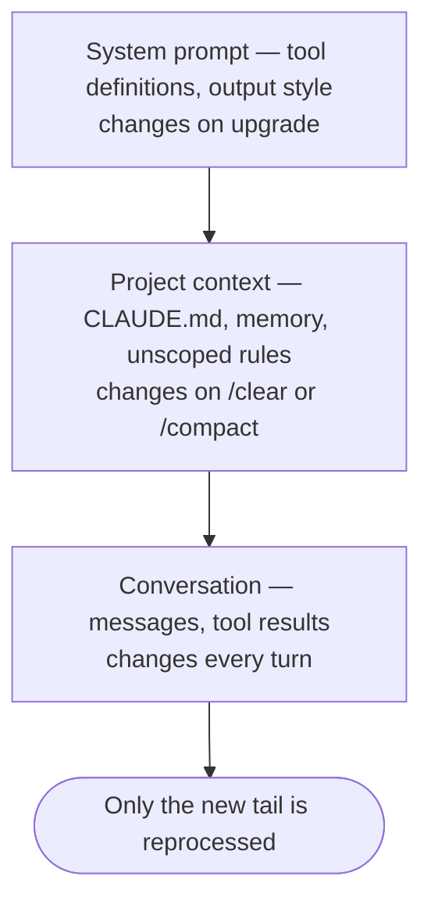

## Overview

This chapter covers:

- What is already occupying the window before you type a character
- Why a subagent is the cheapest way to read a lot of files
- Exactly what compaction re-injects, summarises and drops — including the **five-file** rule
- Why the prompt cache means changing model mid-task costs more than the switch itself
- The difference between `/compact`, `/clear` and `/rewind`, and when each is right

## The window is not empty when you start

Before your first prompt, a session has already spent tokens. Representative figures for a modest setup:

| What | Roughly |
|---|---|
| System prompt — instructions, tool definitions, output style | 4,200 |
| Project `CLAUDE.md` | 1,800 |
| `~/.claude/CLAUDE.md` | 320 |
| Auto memory (`MEMORY.md`) | 680 |
| Skill descriptions | 450 |
| Environment info — cwd, platform, shell, git state | 280 |
| MCP tool names, schemas deferred | 120 |

Two of those numbers are the ones you control, and Chapters 6 and 7 were about both. A 4,000-token `CLAUDE.md` is not just costly — it also reduces adherence, so the incentive points the same way twice.

The MCP line is worth noticing because of what it *isn't*. By default only tool **names** load; the full schemas stay deferred until a task needs them. Ten connected servers therefore do not blow up your window. `ENABLE_TOOL_SEARCH=false` loads everything upfront, which is the setting that undoes this.

## What fills it as you work

Then the session runs, and everything appends:

- **Every file Claude reads** — a mid-size source file is 1,000–2,500 tokens.
- **Path-scoped rules**, as their matching files are read (Chapter 7).
- **Tool results** — a `grep`, a test run, a hook's output.
- **Every message**, yours and Claude's.

The one thing that does **not** land in your window is a subagent's work. It runs in its own context and returns only a summary, which is why "send the research to a subagent" is the standard advice for anything that means reading twenty files.

### Watch it fill

<div class="cw-box"> <div class="cw-controls" id="cw-controls"></div> <div class="cw-barwrap"> <div class="cw-bar" id="cw-bar"></div> <div class="cw-mark" id="cw-mark"><span>auto-compact</span></div> </div> <div class="cw-legend" id="cw-legend"></div> <div class="cw-read" id="cw-read"></div> <div class="cw-acts"><button type="button" class="cw-btn" id="cw-compact">Run /compact</button><button type="button" class="cw-btn" id="cw-reset">Reset</button></div> <div class="cw-after" id="cw-after"></div> </div> <script> (function () { var MAX = 200000, TRIGGER = 0.8; var FIXED = [ { k: "system", n: "System prompt", t: 4200, c: "#64748b" }, { k: "env", n: "Environment info", t: 280, c: "#64748b" }, { k: "mem", n: "Auto memory", t: 680, c: "#f59e0b" }, { k: "skilld", n: "Skill descriptions", t: 450, c: "#0ea5e9" }, { k: "mcp", n: "MCP tool names", t: 120, c: "#8b5cf6" } ]; var SLIDERS = [ { k: "claudemd", n: "Project CLAUDE.md", unit: "tokens", min: 0, max: 8000, step: 200, val: 1800, per: 1, c: "#7c3aed" }, { k: "files", n: "Files Claude read", unit: "files", min: 0, max: 60, step: 1, val: 12, per: 1700, c: "#2563eb" }, { k: "turns", n: "Conversation turns", unit: "turns", min: 0, max: 120, step: 1, val: 20, per: 900, c: "#0d9488" }, { k: "skills", n: "Skills invoked", unit: "skills", min: 0, max: 10, step: 1, val: 2, per: 2500, c: "#0ea5e9" } ]; var state = {}; SLIDERS.forEach(function (s) { state[s.k] = s.val; }); var compacted = false; var cEl = document.getElementById("cw-controls"), barEl = document.getElementById("cw-bar"); var legEl = document.getElementById("cw-legend"), readEl = document.getElementById("cw-read"); var markEl = document.getElementById("cw-mark"), afterEl = document.getElementById("cw-after"); function fmt(n) { return n >= 1000 ? (n / 1000).toFixed(n >= 10000 ? 0 : 1) + "K" : String(n); } function segments() { var out = FIXED.map(function (f) { return { n: f.n, t: f.t, c: f.c }; }); SLIDERS.forEach(function (s) { var t = state[s.k] * s.per; if (t > 0) { out.push({ n: s.n, t: t, c: s.c }); } }); return out; } function render() { cEl.innerHTML = SLIDERS.map(function (s) { return "<label class=\"cw-ctl\"><span class=\"cw-cname\">" + s.n + "<b id=\"cw-v-" + s.k + "\">" + state[s.k] + (s.unit === "tokens" ? "" : " " + s.unit) + "</b></span>" + "<input type=\"range\" class=\"cw-range\" data-k=\"" + s.k + "\" min=\"" + s.min + "\" max=\"" + s.max + "\" step=\"" + s.step + "\" value=\"" + state[s.k] + "\" /></label>"; }).join(""); var segs = segments(), total = segs.reduce(function (a, b) { return a + b.t; }, 0); var pct = Math.min(total / MAX, 1); barEl.innerHTML = segs.map(function (s) { return "<span class=\"cw-seg\" style=\"width:" + (s.t / MAX * 100) + "%;background:" + s.c + "\" title=\"" + s.n + "\"></span>"; }).join("") + (pct < 1 ? "<span class=\"cw-free\" style=\"width:" + ((1 - pct) * 100) + "%\"></span>" : ""); markEl.style.left = (TRIGGER * 100) + "%"; legEl.innerHTML = segs.filter(function (s) { return s.t > 0; }).map(function (s) { return "<span class=\"cw-key\"><i style=\"background:" + s.c + "\"></i>" + s.n + " <b>" + fmt(s.t) + "</b></span>"; }).join(""); var over = total >= MAX * TRIGGER; readEl.className = "cw-read " + (over ? "cw-hot" : ""); var startup = segs.slice(0, 5).reduce(function (a, b) { return a + b.t; }, 0) + state.claudemd; readEl.innerHTML = total > MAX ? "<strong>" + fmt(total) + "</strong> against a 200K window — over the limit. The automatic pass would have compacted well before you got here." : "<strong>" + fmt(total) + " of 200K</strong> — " + Math.round(pct * 100) + "% full. " + (over ? "Past the trigger: the automatic pass would compact this whenever it happens to fill, which is usually mid-task." : "Below the trigger. The startup block alone is " + fmt(startup) + "."); afterEl.innerHTML = ""; Array.prototype.forEach.call(cEl.querySelectorAll(".cw-range"), function (r) { r.addEventListener("input", function () { state[r.getAttribute("data-k")] = +r.value; compacted = false; render(); }); }); } document.getElementById("cw-compact").addEventListener("click", function () { var segs = segments(), before = segs.reduce(function (a, b) { return a + b.t; }, 0); var keptFiles = Math.min(state.files, 5); var after = 4200 + 280 + 680 + 450 + 120 + state.claudemd + 1200 + keptFiles * 1700 + Math.min(state.skills * 2500, 25000); afterEl.innerHTML = "<div class=\"cw-aft\"><strong>After /compact: " + fmt(after) + "</strong>, down from " + fmt(before) + "." + "<ul><li>Re-injected from disk: CLAUDE.md, auto memory, the plan</li>" + "<li>Re-read: <b>" + keptFiles + "</b> of " + state.files + " files" + (state.files > 5 ? " — the cap is five, most recently modified first. The other " + (state.files - 5) + " are gone until Claude reads them again." : " — under the five-file cap, so all of them.") + "</li>" + "<li>Skill bodies: capped at 5,000 tokens each and 25,000 total</li>" + "<li>Everything else — " + state.turns + " turns of conversation — becomes a ~1,200-token summary</li></ul>" + "<span class=\"cw-note\">And the conversation cache is now cold: the next turn rebuilds it.</span></div>"; }); document.getElementById("cw-reset").addEventListener("click", function () { SLIDERS.forEach(function (s) { state[s.k] = s.val; }); render(); }); render(); })(); </script>

## Compaction

As you approach the limit, Claude Code summarises the conversation and continues. Your session does not end. But **compaction is not uniform** — what happens to a piece of context depends on how it got there.

| Loaded by | After compaction |
|---|---|
| System prompt, output style | Untouched — never part of message history |
| Project-root `CLAUDE.md`, unscoped rules, auto memory | **Re-injected from disk** |
| The plan from plan mode | Re-injected from disk |
| Files Claude read or edited | **Up to five re-read**, most recently modified first |
| Path-scoped rules, nested `CLAUDE.md` | Reload when Claude next reads a matching file |
| Invoked skill bodies | Re-injected — capped at 5,000 tokens each, 25,000 total, oldest dropped first |
| Anything said only in conversation | **Summarised away** |

Three practical consequences fall out of that table:

- **Five files.** A file over 5,000 tokens comes back as a path reference rather than content, shown as `Referenced file`. Everything read beyond the five is gone until Claude reads it again.
- **Skill truncation keeps the start of the file.** Put the instructions that matter at the top of a `SKILL.md`, not the bottom.
- **A `paths:` rule that must survive should not have `paths:`.** Drop the frontmatter or move it into the project-root `CLAUDE.md`.

### Three ways to reclaim space, and they are not interchangeable

| Command | What it does | Use when |
|---|---|---|
| `/compact` | Replaces history with a summary | Between tasks — and give it a focus: `/compact focus on the auth bug` |
| `/clear` | Empties the conversation entirely | Switching to unrelated work |
| `/rewind` | Truncates back to an earlier turn | You went down a path you want to abandon |

`/rewind` is the underused one, and the reason is in the next section: it truncates back to a prefix that is **already cached**, where compaction builds a new one.

You can also move the trigger point — `/autocompact 500k` — or compact part of the conversation from `/rewind` with **Summarize from here**.

### Making the focus permanent

`/compact focus on the auth bug` steers one compaction. For a project where the same thing always matters, put a **Compact Instructions** section in your `CLAUDE.md` instead:

```markdown
## Compact Instructions

When compacting, always retain the current migration plan, any failing
test names, and decisions about the API contract. Drop exploratory
file reads and tool output that has been superseded.
```

That survives every compaction in every session, including the automatic pass that fires while you are mid-task and not thinking about what to keep. Which is the general lesson of this section: **anything that must outlive a compact belongs in a file, not in the conversation.**

## The other budget: the prompt cache

Every turn re-sends the whole conversation. The API avoids reprocessing it by matching the **prefix** of the request against what it recently processed — and the match is exact, so a change anywhere invalidates everything after it.

Claude Code orders each request to make that work in your favour:



Cache reads bill at roughly **10% of the standard input rate**, so a good hit ratio is most of why a long session stays affordable. Which makes the invalidation list worth knowing:

| Invalidates the cache | Keeps it |
|---|---|
| Switching model — **each model has its own cache** | Editing files in your repo |
| Changing effort level | Editing `CLAUDE.md` mid-session |
| Turning on fast mode (once per conversation) | Changing permission mode |
| Connecting or disconnecting an MCP server, when its tools are not deferred | Invoking a skill or command |
| Denying an entire tool by bare name | `/recap` |
| `/compact` | **`/rewind`** |
| Upgrading Claude Code | Spawning a subagent |

Two entries deserve expanding.

**`opusplan` makes every plan-mode toggle a model switch.** It resolves to Opus while planning and Sonnet while executing, so entering and leaving plan mode each start a fresh cache. That is a real cost against a real convenience.

**Editing `CLAUDE.md` mid-session keeps the cache — because the edit does not apply.** The file is read once at session start and held in memory. Your change loads on the next `/clear`, `/compact` or restart. The same is true of `outputStyle`. This is the mechanism behind Chapter 5's "some keys are read once at session start"; it is a caching decision, not an oversight.

### Cache lifetime

Cached prefixes expire after inactivity, and each hit resets the timer. The API offers a five-minute and a one-hour TTL. Where you land by default:

| | Claude subscription, within plan usage | API key, credits, or cloud provider |
|---|---|---|
| Main conversation | **One hour** | Five minutes |
| Subagents, workflows, compaction | Five minutes | Five minutes |

Set it yourself with `promptCacheTtl` (`5m` or `1h`) and `subagentPromptCacheTtl`, both v2.1.242+. On an API key, `"promptCacheTtl": "1h"` is the single most useful line for a working day with breaks in it.

Cache scope is worth one sentence: **effectively one machine and one directory.** The system prompt embeds your working directory, so two worktrees of the same repository never share a cache.

`/usage` reports a `Prompt cache (main)` line with your hit ratio and, since v2.1.260, the likely cause of the last miss.

## Habits

The five that do the work, in rough order of payoff:

1. **Pick your model and effort at the start.** Both are cache keys. Mid-task switching costs a full re-read of the conversation.
2. **`/clear` between unrelated tasks.** Old conversation crowds out the files you need next and is re-sent on every message.
3. **Delegate large reads to a subagent.** Twenty files land in its window, and a summary lands in yours.
4. **`/compact` at a natural break, with a focus.** You choose what the summary keeps instead of letting the automatic pass guess mid-task.
5. **`/rewind` rather than `/compact`** when abandoning a direction — it returns to a cached prefix instead of building a new one.

`/context` shows the live breakdown by category, with suggestions. It is the first thing to run when a session feels sluggish or expensive.

### Or stop asking, and put it on screen

`/context` answers "how full am I" once. A **status line** answers it continuously — a strip at the bottom of the session showing whatever you choose.

The contract is small: **Claude Code sends your script a JSON object on stdin** — model, cost, context percentage, git directory, session ID — **your script prints one line to stdout**, and that line is displayed. Any language; it is just a program that reads stdin and writes stdout.

You do not have to write it. Describe what you want and Claude Code generates the script, drops it in `~/.claude/`, and wires up the setting:

```text
/statusline show model name and context percentage with a progress bar
```

The manual form is a settings key:

```json
{ "statusLine": { "type": "command", "command": "~/.claude/statusline.sh", "padding": 2 } }
```

It is also where the `prompt_cache` fields from the previous section surface, so a cache hit ratio can sit on screen next to the context gauge.

If you need a bigger window rather than a smaller conversation, Fable 5.1, Fable 5, Sonnet 5, and Opus 4.6+ / Sonnet 4.6+ support **1M tokens** — a `[1m]` model variant, except Sonnet 5, which runs at 1M with nothing to select.

## Summary

- A session starts with roughly 8,000 tokens already spent. Your `CLAUDE.md` is the part you control.
- MCP schemas are **deferred by default**, so many servers cost little. `ENABLE_TOOL_SEARCH=false` undoes that.
- Compaction re-injects `CLAUDE.md`, auto memory and the plan from disk, **re-reads only five files**, truncates skills to 5,000 tokens each, and summarises everything else.
- A `paths:` rule does not survive compaction until its file is read again. Drop the frontmatter if it must.
- The prompt cache matches an **exact prefix**, so a change anywhere invalidates everything after it. Reads bill at about 10% of input rate.
- **Each model and effort level has its own cache.** `opusplan` makes every plan-mode toggle a model switch.
- Editing `CLAUDE.md` mid-session is cache-safe **because the edit does not apply** until `/clear`, `/compact` or restart.
- `/rewind` returns to a cached prefix; `/compact` builds a new one. Prefer rewinding when abandoning a path.
- A **Compact Instructions** section in `CLAUDE.md` makes your focus survive every compaction, including the automatic one.
- A **status line** turns `/context` from a question into a gauge: JSON in on stdin, one line out on stdout, and `/statusline <description>` writes the script for you.
- Full reference: [context window](https://code.claude.com/docs/en/context-window), [prompt caching](https://code.claude.com/docs/en/prompt-caching), [statusline](https://code.claude.com/docs/en/statusline), [costs](https://code.claude.com/docs/en/costs).

Chapter 9 closes Part 2 with the machinery underneath all of this: sessions on disk, checkpoints, and what `/rewind` can and cannot restore.
