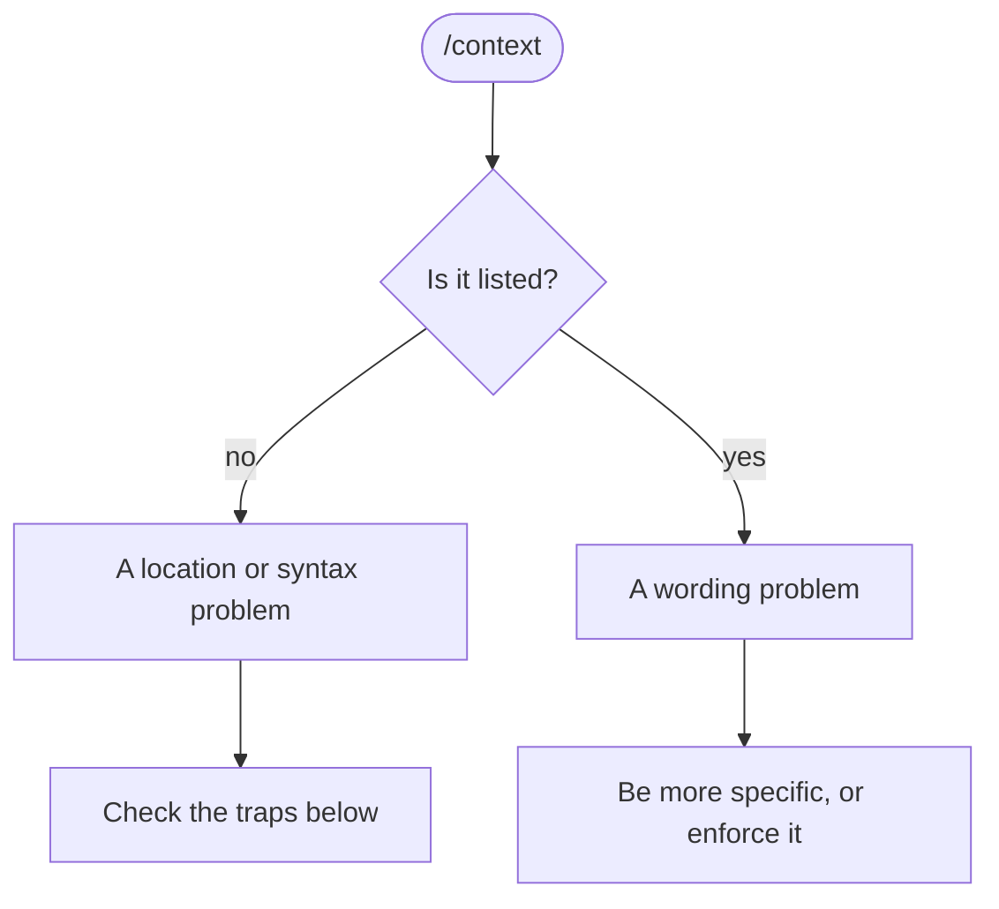

## Overview

This chapter covers:

- The one question that routes a symptom to the right documentation page
- The commands that show what Claude Code *actually* loaded, rather than what you wrote
- Narrowing a configuration problem in two steps, without deleting anything
- The location and syntax mistakes behind most "my hook never fires"
- Performance, hangs and search failures — and the one command whose output you must not share

## Start by routing

Failures split into four groups, and each has its own page. Getting this wrong is how an afternoon disappears: hunting a settings problem in the install guide finds nothing, because nothing is there.

The question that sorts them: **how far did it get?**

| It got as far as | Group | Page |
|---|---|---|
| Not to a prompt at all | Install and login | [troubleshoot-install](https://code.claude.com/docs/en/troubleshoot-install) |
| A session, but your config isn't taking effect | Configuration | [debug-your-config](https://code.claude.com/docs/en/debug-your-config) |
| Running, but slow, stuck, or not finding files | Performance | [troubleshooting](https://code.claude.com/docs/en/troubleshooting) |
| A specific message on screen | Errors | [errors](https://code.claude.com/docs/en/errors) |

And two commands to run before anything else, because they often answer it for you:

```bash
claude doctor    # from your shell — read-only,
                 # and works when claude won't start
```

```text
/doctor          # inside a session — checks installation, settings,
                 # extensions and context, then offers fixes
```

`/doctor` also catches things you would never think to look for: invalid settings files, **duplicate subagent names in one directory**, and `CLAUDE.md` content Claude could have derived from the codebase anyway.

<div class="tb-look"> <div class="tb-head"> <span class="tb-title">Symptom lookup</span> <span class="tb-sub">Which page, which command, and what it usually is</span> </div> <input type="search" id="tb-q" class="tb-q" placeholder="Type a symptom — hook, ripgrep, 403, slow…" autocomplete="off"> <div class="tb-tabs" id="tb-tabs"></div> <ul class="tb-list" id="tb-list"></ul> <div class="tb-panel" id="tb-panel"></div> </div> <script> (function () { var DATA = [ { s: "command not found: claude", g: "install", c: "The install directory is not on your PATH — or the VS Code extension is all you installed, and it bundles a private copy it never exports.", f: "Add <code>~/.local/bin</code> to PATH, then <code>which -a claude</code> to check for a second install.", cmd: "which -a claude" }, { s: "Two versions of Claude Code disagree", g: "install", c: "More than one install: the native one, a legacy <code>~/.claude/local</code>, an npm global, Homebrew or WinGet.", f: "Keep the native install at <code>~/.local/bin/claude</code> and remove the rest.", cmd: "which -a claude" }, { s: "403 Forbidden right after logging in", g: "install", c: "An inactive subscription, a Console account without the Claude Code role, or a corporate proxy interfering.", f: "Check the subscription, or ask an admin for the role under Settings &rarr; Members.", cmd: "/login" }, { s: "“Organization disabled” but my subscription is fine", g: "errors", c: "An <code>ANTHROPIC_API_KEY</code> in your environment is overriding the subscription. Under <code>-p</code> it always wins.", f: "<code>unset ANTHROPIC_API_KEY</code>, then remove it from your shell profile.", cmd: "unset ANTHROPIC_API_KEY" }, { s: "Browser login never completes over SSH or WSL", g: "install", c: "The browser opens on a different host, so its redirect cannot reach the local callback server.", f: "Press <code>c</code> to copy the OAuth URL and open it yourself, or use <code>claude auth login</code>.", cmd: "claude auth login" }, { s: "My hook never fires", g: "config", c: "The matcher, nearly always: an array instead of a string, a lowercase tool name, or hooks in a standalone file. An array is a schema error that rejects the whole settings file.", f: "One string, <code>|</code> to separate, capitalised tool names, under the <code>hooks</code> key in <code>settings.json</code>.", cmd: "/hooks" }, { s: "Permissions or env set globally do nothing", g: "config", c: "They went into <code>~/.claude.json</code>, which holds app state and UI toggles.", f: "Move them to <code>~/.claude/settings.json</code>. Two different files.", cmd: "/status" }, { s: "A settings.json value seems ignored", g: "config", c: "The same key is set in a closer scope. Local beats project beats user, and env vars and flags beat all three.", f: "Check <code>settings.local.json</code> first.", cmd: "/status" }, { s: "My skill never shows up", g: "config", c: "It is a bare <code>.md</code> file rather than a folder.", f: "<code>.claude/skills/name/SKILL.md</code>, not <code>.claude/skills/name.md</code>.", cmd: "/skills" }, { s: "The skill is listed but Claude never uses it", g: "config", c: "<code>disable-model-invocation: true</code>, or a description that does not match how you phrase the request.", f: "Look for the <strong>user-only</strong> badge in <code>/skills</code>; otherwise rewrite the description.", cmd: "/skills" }, { s: "My MCP server never loads", g: "config", c: "<code>.mcp.json</code> under <code>.claude/</code>, servers under <code>servers</code> instead of <code>mcpServers</code>, a dismissed approval prompt, or a relative path in <code>command</code>.", f: "Repository root, <code>mcpServers</code> key, absolute paths, then approve it from <code>/mcp</code>.", cmd: "/mcp" }, { s: "MCP server connects but lists zero tools", g: "config", c: "It started but is not returning a tool list.", f: "Reconnect from <code>/mcp</code>. If it stays at zero, read its stderr in the debug log.", cmd: "claude --debug=mcp" }, { s: "Claude ignores my CLAUDE.md", g: "config", c: "If <code>/context</code> does not list it, it is a location problem. If it does, it is a wording problem.", f: "Subdirectory files load on demand. Explore and Plan skip CLAUDE.md entirely.", cmd: "/context" }, { s: "A deny rule did not block the command", g: "config", c: "Prefix rules match the literal command string, not the executable underneath, so <code>/bin/rm</code> walks past <code>Bash(rm *)</code>.", f: "For a guarantee use a PreToolUse hook or the sandbox, not a rule.", cmd: "/permissions" }, { s: "High CPU or memory", g: "perf", c: "A large codebase, or one of your own customisations.", f: "<code>/compact</code>, restart between tasks, <code>.gitignore</code> build directories, then safe mode to find out whose fault it is.", cmd: "claude --safe-mode" }, { s: "Autocompact is thrashing", g: "perf", c: "Compaction worked, and something refilled the window immediately, several times over.", f: "Read the oversized file in ranges, compact with a focus, or move it to a subagent.", cmd: "/compact keep only the plan and the diff" }, { s: "Search and @file mentions find nothing", g: "perf", c: "The bundled ripgrep will not run on your system.", f: "Install your platform's ripgrep and set <code>USE_BUILTIN_RIPGREP=0</code>; <code>claude doctor</code> should then show its path.", cmd: "claude doctor" }, { s: "Search returns fewer results than it should on WSL", g: "perf", c: "Cross-filesystem reads on <code>/mnt/c/</code>. There is no error &mdash; <code>claude doctor</code> reports Search as OK.", f: "Move the project onto the Linux filesystem, or narrow each search.", cmd: "claude doctor" }, { s: "It hangs and stops responding", g: "perf", c: "A stuck operation, not a lost session.", f: "<code>Ctrl+C</code>, and close the terminal if that fails. Nothing is lost.", cmd: "claude --resume" }, { s: "Prompt is too long", g: "errors", c: "The conversation exceeds the context limit.", f: "<code>/compact</code>, or <code>/clear</code> when it is one huge exchange that cannot be compacted.", cmd: "/compact" }, { s: "529 Overloaded, or a dropped connection", g: "errors", c: "Transient. Retried for you, up to ten attempts.", f: "Send <code>continue</code> to resume a response cut off mid-stream.", cmd: "continue" } ]; var GROUPS = [ { k: "all", n: "Everything" }, { k: "install", n: "Install &amp; login" }, { k: "config", n: "Configuration" }, { k: "perf", n: "Performance" }, { k: "errors", n: "Errors" } ]; var PAGE = { install: "troubleshoot-install", config: "debug-your-config", perf: "troubleshooting", errors: "errors" }; var q = document.getElementById("tb-q"), tabs = document.getElementById("tb-tabs"), list = document.getElementById("tb-list"), panel = document.getElementById("tb-panel"); var group = "all", picked = null; tabs.innerHTML = GROUPS.map(function (g) { return '<button type="button" class="tb-tab" data-g="' + g.k + '">' + g.n + '</button>'; }).join(""); function matches() { var t = q.value.trim().toLowerCase(); return DATA.filter(function (d) { if (group !== "all" && d.g !== group) return false; if (!t) return true; return (d.s + " " + d.c + " " + d.f + " " + d.cmd).toLowerCase().indexOf(t) > -1; }); } function render() { Array.prototype.forEach.call(tabs.children, function (b) { b.classList.toggle("on", b.getAttribute("data-g") === group); }); var rows = matches(); if (!rows.length) { list.innerHTML = '<li class="tb-none">Nothing matches. The four pages between them cover every documented failure — start from the routing table above.</li>'; panel.innerHTML = ""; return; } list.innerHTML = rows.map(function (d) { var on = picked && picked.s === d.s ? " on" : ""; return '<li><button type="button" class="tb-row' + on + '" data-s="' + d.s.replace(/"/g, "&quot;") + '">' + '<span class="tb-g tb-g-' + d.g + '"></span><span class="tb-s">' + d.s + '</span></button></li>'; }).join(""); if (picked && rows.indexOf(picked) === -1) picked = null; panel.innerHTML = picked ? '<div class="tb-p-head"><span class="tb-p-s">' + picked.s + '</span>' + '<a class="tb-p-doc" href="https://code.claude.com/docs/en/' + PAGE[picked.g] + '">' + PAGE[picked.g] + '</a></div>' + '<p class="tb-p-l"><span>Usually</span><span>' + picked.c + '</span></p>' + '<p class="tb-p-l"><span>Fix</span><span>' + picked.f + '</span></p>' + '<p class="tb-p-l"><span>Start with</span><span><code class="tb-cmd">' + picked.cmd + '</code></span></p>' : '<p class="tb-hint">Pick a symptom to see where it lives.</p>'; } list.addEventListener("click", function (e) { var b = e.target.closest(".tb-row"); if (!b) return; var s = b.getAttribute("data-s"); picked = (picked && picked.s === s) ? null : DATA.filter(function (d) { return d.s === s; })[0]; render(); }); tabs.addEventListener("click", function (e) { if (!e.target.classList.contains("tb-tab")) return; group = e.target.getAttribute("data-g"); render(); }); q.addEventListener("input", render); render(); })(); </script>

## Configuration: see what loaded

The rule that saves the most time here: **a configuration problem is almost never the content, and almost always the location.** The file didn't load, it loaded from somewhere else, or something overrode it.

So don't reason about it. Look.

| Command | Shows |
|---|---|
| `/context` | **Everything in the context window**, by category — memory files, skills, MCP tools, subagents and the source each came from |
| `/memory` | Where every memory file lives, across user and project scope |
| `/skills` | Skills from project, user and plugin sources |
| `/hooks` | Every hook registered this session, grouped by event |
| `/mcp` | Servers, connection status, and approval state |
| `/permissions` | The **resolved** allow and deny rules |
| `/status` | Which settings sources are active, managed settings included |
| `/debug [issue]` | Turns on debug logging and asks Claude to diagnose from it |

**Run `/context` first, every time.** It answers the only question that matters at this stage — is the thing there at all — and the answer forks the whole investigation:



If it loaded and Claude still ignores it, no amount of file-moving will help. Adherence drops when an instruction is vague, when two files disagree, or when the file has grown long enough that nothing in it gets much attention — Chapter 6's territory. And if it must never happen, `CLAUDE.md` was the wrong tool: **permissions and hooks give a guarantee, `CLAUDE.md` gives guidance.**

### Narrowing it, in two steps

Don't start deleting files. Start subtracting whole layers.

```bash
claude --safe-mode
```

Runs with every customisation off — `CLAUDE.md`, skills, plugins, hooks, MCP servers, custom commands and agents — while authentication, model, built-in tools and permissions keep working. If the problem disappears, it's one of yours; go back and check them individually. It is also the fastest test for *"is a plugin eating my CPU"*.

If the problem survives safe mode, subtract your configuration directory too:

```bash
cd /tmp && CLAUDE_CONFIG_DIR=/tmp/claude-clean claude
```

Nothing from `~/.claude`, nothing from the project. You'll get the first-run theme picker — which is how you know it worked — and you'll have to log in again.

> Neither step escapes **managed settings**. Those come from MDM profiles, registry policy and `managed-settings.json`, all outside the configuration directory, and a clean session fetches server-managed settings again as soon as it has credentials. If a problem survives both steps, `/status` is the next call.

### The traps

Most configuration surprises are one of a small number of mistakes, and they share a shape: the file is fine, it's just not where something reads it.

| Symptom | Cause |
|---|---|
| Permissions, hooks or `env` set globally do nothing | They went in **`~/.claude.json`**, which holds app state. They belong in `~/.claude/settings.json` — two different files |
| A `settings.json` value seems ignored | The same key is in `settings.local.json`, which wins |
| A hook never fires | `matcher` is an array instead of a string; or lowercase (`"bash"` — matching is case-sensitive); or the hooks live in a standalone file. Only *plugins* get a separate `hooks/hooks.json` |
| A skill never appears | It's `skills/name.md` instead of `skills/name/SKILL.md` |
| A skill appears but is never used | `disable-model-invocation: true` — `/skills` shows it as **user-only** — or the description doesn't match how you phrase the request |
| A subdirectory `CLAUDE.md` seems ignored | Those load **on demand**, when Claude *reads* a file in that directory. Not at launch, and not when writing one |
| A subagent ignores `CLAUDE.md` | The built-in **Explore and Plan agents skip it**. Restate it in the delegating prompt |
| `.mcp.json` never loads | It belongs at the repository root, not under `.claude/`, with servers under `mcpServers` — not `servers`, which is VS Code's shape |
| An MCP server fails from some directories | A relative path in `command` or `args`. Those resolve against your launch directory, not against `.mcp.json` |
| `Bash(rm *)` doesn't block `/bin/rm` | **Prefix rules match the command string, not the executable.** Chapter 4's point, restated: for a guarantee, use a hook or the sandbox |

Two more worth carrying. An **array where a string belongs is a schema error**, and Claude Code rejects the *whole settings file* — so one bad matcher can silently disable every hook you have. And a connected MCP server listing **zero tools** is a different failure from one that won't connect: reconnect from `/mcp`, and if it stays at zero, `claude --debug=mcp` puts the server's stderr in `~/.claude/debug/<session-id>.txt`.

## Performance, hangs and search

**High CPU or memory** — the ladder is `/compact`, restart between major tasks, put build directories in `.gitignore`, then `--safe-mode` to find out whether it's yours. If it survives all four, `/heapdump` writes a snapshot and a diagnostics file to your Desktop.

> The `.heapsnapshot` file contains **every string in the process — your whole conversation, and your credentials.** Never attach it to a public issue. The `-diagnostics.json` beside it carries the statistics with none of the content; that is the one to send.

**Auto-compaction thrashing** (`Autocompact is thrashing: the context refilled to the limit…`) means compaction worked and something immediately refilled the window, repeatedly. Claude Code gives up rather than burn calls on a loop. The fix is upstream: read the oversized file in ranges, `/compact keep only the plan and the diff`, move the work to a subagent, or `/clear`.

**A hang** is `Ctrl+C`, then close the terminal if that fails. Nothing is lost — `claude --resume` in the same directory picks the session back up.

**Search finding nothing** — `@file` mentions, agents and skills all going quiet together — usually means the bundled `ripgrep` won't run on your system. Install your platform's package, then:

```json
{ "env": { "USE_BUILTIN_RIPGREP": "0" } }
```

`claude doctor` confirms it: the Search line should show your system binary's path instead of `OK (bundled)`.

> On WSL, search across `/mnt/c/` returns **fewer results than it should**, and `claude doctor` still reports Search as OK — there is no error to find. Move the project onto the Linux filesystem, or narrow your searches.

## Errors

The [error reference](https://code.claude.com/docs/en/errors) is a lookup table, not a read. What's worth knowing in advance is the shape of the four families:

| Family | Recognise it by | The move |
|---|---|---|
| **Transient** | `529 Overloaded`, `500`, connection dropped, "went to sleep" | Mostly retried for you — up to 10 attempts. Sending `continue` resumes a response cut off mid-stream |
| **Context** | `Prompt is too long`, `Context limit reached` | `/compact`, or `/clear` when the conversation is a single huge exchange that cannot be compacted |
| **Auth** | `401`, `403 Forbidden`, OAuth or token messages | Nearly all of them: `/login` |
| **Config** | Malformed rules, invalid settings, unrecognised model | `claude doctor`, then fix the file it names |

Three knobs behind the retry behaviour, useful on a bad network: `CLAUDE_CODE_MAX_RETRIES` (10, capped at 15), `API_TIMEOUT_MS` (10 minutes), and `CLAUDE_CODE_RETRY_WATCHDOG=1`, which retries `429` and `529` indefinitely.

And one error whose cause is never where you look. **`This organization has been disabled` while your subscription is perfectly active** means an `ANTHROPIC_API_KEY` in your environment is overriding it — often left behind by another tool. Under `-p` the key is always used when present. `unset ANTHROPIC_API_KEY`, then check your shell profile so it stays gone.

## Install and login

Two checks cover most of it. **`which -a claude`** — more than one result is the problem, and the native install at `~/.local/bin/claude` is the one to keep. And **is `~/.local/bin` on your `PATH`** — the usual cause of `command not found` right after a successful install.

> The VS Code extension bundles its own private copy of the CLI and puts nothing on your `PATH`. If that is all you installed, `claude` in a terminal is genuinely not there.

For login, the reset is `/logout`, close, restart. In **WSL2, over SSH, or in a container**, the browser opens on the wrong host and its redirect can't reach the local callback — press `c` to copy the OAuth URL and open it yourself, or fall back to `claude auth login`.

On macOS, credentials go in the login Keychain; when it's locked, Claude Code falls back to a file and `claude doctor` says so with a `macOS Keychain is not writable` warning. `security unlock-keychain` fixes it, then `/logout` and `/login` moves the credentials back.

## Reporting it

`/feedback` from inside a session sends it to Anthropic directly. Otherwise: [GitHub issues](https://github.com/anthropics/claude-code/issues) for bugs, with your OS, the command you ran and the full error — but **account, billing and subscription problems go to support, not GitHub.**

And the one that gets forgotten: Claude Code has its documentation built in. Asking it is often faster than searching.

## Summary

- **Route first.** How far did it get — install, configuration, performance, or a specific message? Four groups, four pages.
- `claude doctor` from the shell, `/doctor` inside a session. Then `/context`.
- A configuration problem is a **location** problem far more often than a content one — so look at what loaded instead of reasoning about what you wrote.
- Narrow by subtraction: **`--safe-mode`**, then a clean `CLAUDE_CONFIG_DIR`. Managed settings survive both.
- The common traps: `~/.claude.json` instead of `settings.json`, an array matcher, `skills/name.md` instead of `name/SKILL.md`, `.mcp.json` under `.claude/`. **One bad matcher rejects the whole settings file.**
- `/heapdump`'s `.heapsnapshot` contains your conversation and credentials. Send the `-diagnostics.json` instead.
- WSL search quietly returns fewer results, and `claude doctor` reports it as fine.
- `This organization has been disabled` on a live subscription is a stray `ANTHROPIC_API_KEY`.

Chapter 23 is the capstone: one repository configured end to end, and what to do after this handbook.
