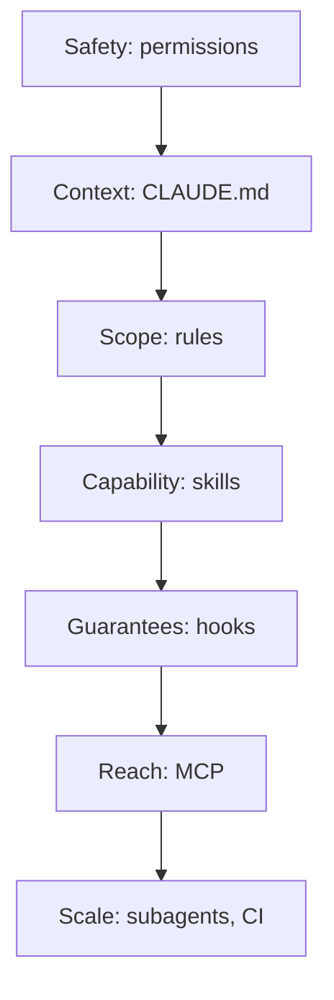

## Overview

This chapter covers:

- One repository configured end to end, in the order that makes each layer cheap
- The single question underneath nearly every decision in this handbook
- The habits that separate people who use Claude Code from people who are good at it
- A checklist to audit what you have actually set up
- Where the road continues once the CLI stops being enough

## The build order

Configuring a repository is not a list of files to create. It is a sequence, and the sequence matters — **each layer is cheaper once the one before it exists.** Writing skills before you have a `CLAUDE.md` means writing the project's conventions into every skill.

| Step | What to do |
|---|---|
| **1. Safety** | Pick a permission mode deliberately, and add deny rules for secrets and infrastructure before anything runs unattended — [Ch 3](/2026/09/permission-modes/), [Ch 4](/2026/09/permissions-and-sandboxing/) |
| **2. Context** | `/init`, then delete everything Claude could work out by reading the code. Under 200 lines — [Ch 6](/2026/09/claude-md/) |
| **3. Scope** | Anything that applies to one directory becomes a rule with `paths:`, not a paragraph everyone pays for — [Ch 7](/2026/09/rules-and-auto-memory/) |
| **4. Capability** | The third time you paste the same instructions, they are a skill — [Ch 11](/2026/09/claude-code-skills/) |
| **5. Guarantees** | What must *never* happen stops being an instruction and becomes an exit code — [Ch 12](/2026/09/claude-code-hooks/) |
| **6. Reach** | An MCP server only where a CLI tool cannot do the job; every server costs window before it earns any — [Ch 14](/2026/09/mcp-fundamentals/), [Ch 15](/2026/09/mcp-in-practice/) |
| **7. Scale** | Subagents for verbose work, CI for the unattended kind — [Ch 16](/2026/09/github-gitlab-and-ci/), [Ch 17](/2026/09/subagents/) |

Two orderings people get wrong. **Permissions come first**, not last — they are the layer you regret configuring after the fact. And **hooks come after skills**, because the point of writing something down first is finding out whether guidance was enough.

## The question underneath everything

If you keep one thing from twenty-three chapters, keep this. Almost every configuration decision in Claude Code is the same question wearing different clothes:

> **Do you need guidance, or a guarantee?**

Guidance is context: `CLAUDE.md`, rules, skills, output styles. Claude reads it, weighs it against everything else in the window, and usually follows it. Usually.

A guarantee is enforcement: permission rules, hooks, the sandbox. Claude's opinion is not consulted. A `PreToolUse` hook returning exit code 2 stops the tool call whether or not Claude agrees.

The failure mode is always the same direction — writing a guarantee into a file that only offers guidance:

| You wrote | Where it belongs |
|---|---|
| "Never commit directly to main" in `CLAUDE.md` | A `PreToolUse` hook |
| "Don't touch the migrations directory" | A deny rule |
| "Always run the linter before committing" | A hook, if it truly is *always* |
| "We use tabs, not spaces" | `CLAUDE.md` — this one is genuinely guidance |

Ask it of every line you write into a config file, and most of this handbook's advice falls out on its own.

## What experts actually do differently

Less configuration than you would expect. Mostly it is a handful of reflexes.

**Plan before anything non-trivial.** `Shift+Tab` into plan mode. Reading and planning cost a fraction of what rework costs, and a wrong approach found in the plan is free.

**`/clear` between unrelated tasks.** The single largest lever on both quality and cost. Stale context does not just cost money, it actively misleads.

**Correct instead of re-prompting.** When Claude goes the wrong way, say so in the same session — the context from the failed attempt is what makes the correction land. Starting over throws that away.

**Steer without stopping.** `Esc` cancels the running tool call. Typing while it works does not interrupt anything; the text is read before the next action is chosen. Most people only know the first.

**Delegate anything verbose.** Test output, log spelunking, doc trawling — a subagent's window absorbs it and yours never sees it.

**Look, don't reason.** When something is not taking effect, `/context` and `/permissions` show you what actually loaded. Every minute spent theorising about why a file is not working is a minute you could have spent reading the answer.

And one that is really a mindset: **specify the target and the symptom, not the procedure.** "The checkout flow fails for expired cards, relevant code is in `src/payments/`" beats a prescribed sequence of steps, because a prescription bakes in your assumption about where the bug is — and if that assumption is wrong, it sends Claude away from the actual problem.

## Audit what you have

Work down this. Anything you cannot tick is a chapter worth revisiting.

 
 Setup audit <button type="button" id="ck-reset" class="ck-reset">Clear</button> 
 
  0 / 18 
 

 

 
 

## Where this goes next

At some point the CLI stops being the right shape. Not because it runs out of features, but because what you want is not a session — it's an application: something triggered by a webhook, running for a customer, with its own interface.

That is the **[Agent SDK](https://code.claude.com/docs/en/agent-sdk/overview)**: the same agent loop, the same tools and the same context management, as a library in Python or TypeScript. Everything in this handbook carries over — hooks, subagents, MCP, permissions, sessions — and **skills, commands and memory still load from `.claude/` and `~/.claude/`** exactly as they do here.

Four things sit next to each other, and the choice is genuinely about what you are doing rather than how advanced you are:

| If you are | Use |
|---|---|
| Working interactively, or scripting one-off tasks | **The CLI** |
| Building an agent, without writing the tool loop yourself | **The Agent SDK** |
| Calling the API and writing your own loop | The Client SDK |
| Running long jobs without operating a sandbox | Managed Agents |

Two practical notes. The SDK is **Python and TypeScript only** — from any other language, run the CLI as a subprocess with `-p` and `--output-format json`, which is Chapter 2's print mode doing exactly what it was built for. And products built on the SDK **authenticate with API keys**, not claude.ai logins.

## Where to keep reading

- **[The official documentation](https://code.claude.com/docs)** — the authority. This handbook teaches the concepts; the docs hold the complete reference for every one of them.
- **[The changelog](https://github.com/anthropics/claude-code/blob/main/CHANGELOG.md)** — this tool moves fast enough that a habit formed six months ago may already have a better answer.
- **Claude itself.** It has its documentation built in. "How do I scope a rule to one directory?" is often faster asked than searched.

And the one nobody suggests: **read your own `~/.claude/settings.json` every few months.** Configuration accumulates. Half of what is in there was for a problem you no longer have.

## Summary

- Build in order: **permissions, context, scope, capability, guarantees, reach, scale.** Each layer is cheaper once the one before it exists.
- The recurring question is **guidance or guarantee** — `CLAUDE.md` for how the project works, permissions and hooks for what must never happen.
- The habits matter more than the configuration: **plan first, `/clear` between tasks, correct rather than restart, delegate verbose work, and look at what loaded instead of reasoning about it.**
- Specify the target and the symptom. Leave the procedure to Claude.
- When you need an application rather than a session, the **Agent SDK** is the same loop as a library — and your `.claude/` directory comes with it.

That's the handbook. Twenty-three chapters, from a model that cannot read files to a repository that configures itself for you.

The tool will keep changing. The question underneath it — *guidance, or guarantee?* — will not.
