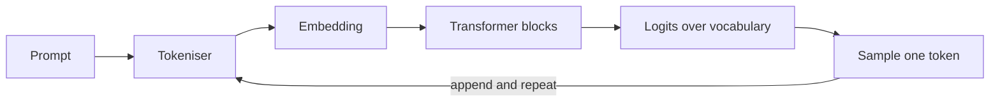

**This is a template, not an article.** It is `draft: true`, so `hugo --minify` leaves it out of the built site and `hugo server -D` shows it. Copy it, gut the prose, keep the shapes.

## Diagrams

Fence a diagram with ` ```mermaid `. It renders client-side and picks up the site's violet palette in both light and dark mode.



Two rules, both learned the hard way:

- **No semicolons inside a label.** Mermaid reads `;` as a statement separator, so `A --> B: joined; you lead` truncates at the `;` and the whole diagram renders as nothing, with no error on the page.
- **Count the output.** Because a broken diagram is invisible, compare the number of ` ```mermaid ` blocks in the source against the number of rendered SVGs in the built page. Count `id="mermaid-svg-` — the `<pre>` stores the diagram source in `data-src`, and that source contains `-->`, so any regex that ends the tag at the first `>` silently matches nothing.

Every diagram is clickable: it opens full screen with wheel or pinch zoom.

## Interactive widgets

Raw HTML in the page. **Goldmark ends an HTML block at the first blank line**, so anything after a blank line inside the markup is parsed as Markdown and the widget breaks apart. Keep the whole thing free of blank lines.

<div class="tok-demo"> <div class="tok-row"> <label for="tok-temp">Temperature</label> <input id="tok-temp" type="range" min="0" max="200" value="70"> <output id="tok-temp-out">0.70</output> </div> <div class="tok-bars" id="tok-bars"></div> <p class="tok-note" id="tok-note"></p> </div> <script> (function () { var words = [["mat", 2.4], ["floor", 1.2], ["roof", 0.5], ["bed", 0.1]]; var slider = document.getElementById("tok-temp"), out = document.getElementById("tok-temp-out"), bars = document.getElementById("tok-bars"), note = document.getElementById("tok-note"); function draw() { var t = Math.max(0.01, slider.value / 100); out.textContent = t.toFixed(2); var exp = words.map(function (w) { return Math.exp(w[1] / t); }); var sum = exp.reduce(function (a, b) { return a + b; }, 0); bars.innerHTML = words.map(function (w, i) { var p = exp[i] / sum; return '<div class="tok-bar"><span class="tok-word">' + w[0] + '</span>' + '<span class="tok-track"><span class="tok-fill" style="width:' + (p * 100).toFixed(1) + '%"></span></span>' + '<span class="tok-pct">' + (p * 100).toFixed(1) + '%</span></div>'; }).join(""); var top = exp[0] / sum; note.textContent = t < 0.3 ? "Near-greedy: the top token takes " + (top * 100).toFixed(0) + "% of the mass." : t > 1.2 ? "Flattened: the tail is now genuinely reachable." : "Balanced: the top token holds " + (top * 100).toFixed(0) + "%."; } slider.addEventListener("input", draw); draw(); })(); </script>

Styles go in `static/assets/css/custom-styles.css` under a short prefix (`tok-` here), with a `[data-theme="dark"]` variant and a single-column fallback under `40em`. The narrator skips anything whose class ends in `-demo`, `-calc`, `-sim`, `-explorer` or `-check`, so reading a widget's labels aloud is not part of the audio.

## Front matter

`description` is not decoration — the RSS feed, the search index, the OpenGraph card and the JSON-LD all read it.

`series` and `series_order` drive the previous/next chapter links and the "Part 1 · Chapter 1 of N" badge. Keep `series_order` in step with the `PART n · CH n` badge baked into the cover, and list the parts in `params.series_sequence` in `config.toml`.

## Before publishing

1. `python3 tools/gen_covers.py <slug>` — add an `art_*()` motif and a `COVERS` entry first.
2. `python3 tools/gen_social.py` — regenerates the 1200×630 JPEG share cards.
3. Drop `draft: true`.
4. Add the article to `content/pages/guide.md`.
